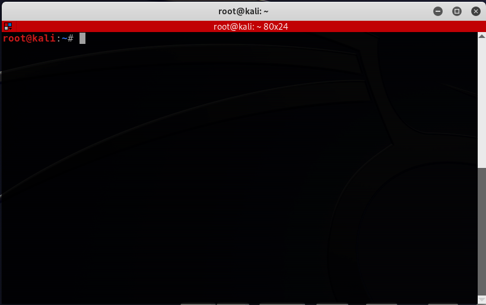

# CLI, Terminal, Shell

|  |
|:--:|
| *터미널 에뮬레이터 중 하나인 Terminator* |

 
 

## CLI?
>CLI(Command-line Interface)란 텍스트로 사용자가 명령어를 입력하고 결과를 화면에 텍스트로 출력해주는 인터페이스를 가진 컴퓨팅 인터페이스를 의미합니다.  

텍스트를 입력한다는 의미에서, Character User Interface의 줄임말이기도 합니다.

MS-DOS나 Linux 초기 컴퓨팅 환경은 CLI가 유일한 인터페이스였습니다.  
현재는 이와 대비되는 GUI(Graphical User Interface)를 보편적으로 사용합니다. 우리가 macOS나 Windows, Linux에서 화면의 그래픽을 클릭함으로써 컴퓨터와 소통하는 방식이 바로 GUI 방식입니다. 
GUI는 사용자가 노력을 들여 명령어를 외우거나 사용하지 않아도 되기에 사용자 경험(User Experience)이 크게 향상되었습니다.

 
 

## 왜 불편한 CLI를 사용해야 하나?
CLI 환경은 GUI 환경에 비해 매우 불친절한 환경이지만, 개발 환경이나 서버 관리 용도로는 여전히 CLI가 많이 사용되고 있습니다.  

**CLI는 GUI에서 쉽게 제어할 수 없는 부분들을 다룰 수 있습니다.**  
또한 CLI는 프로세스간 입출력 전달이나 자동화에 최적화되어있으며, 텍스트 입출력만으로 프로그램을 작성할 수 있기 때문에 개발이 매우 간단하다는 장점이 있습니다.  
원격으로 작업할 때 안정적으로 작업할 수 있으며 사용되는 데이터 양 역시 적습니다.

맥OS는 [BSD기반](https://ko.wikipedia.org/wiki/BSD)의 운영체제로 리눅스와 거의 비슷한 커맨드라인 환경을 사용할 수 있습니다.

 
 

## 터미널(Terminal)?
> 터미널(terminal)은 사용자와 컴퓨터의 인터페이스를 의미합니다.

넓은 의미의 터미널은 문자 입출력 기능을 가진 물리 장비를 의미하지만, 현재 시점에서 물리 하드웨어를 지칭하는 단어로는 거의 사용되지 않습니다.

 

### 터미널 어플과 다른 의미인가?
리눅스, 맥OS에는 터미널이라는 어플리케이션이 기본적으로 탑재되어 있습니다.  
이 터미널은 물리 하드웨어를 소프트웨어로 구현한 어플입니다. 그래서 터미널이라고도 하지만, **'가상 터미널' 혹은 '터미널 에뮬레이터'라는 이름이 더 정확한 표현**입니다.  
즉, 입출력이 가능한 가상 터미널과 OS 커널을 연결해, 컴퓨팅(연산작업)을 수행할 수 있습니다.  
이후부터, 편의상 '가상 터미널'을 '터미널'이라 칭하겠습니다.

터미널은 명령줄에 액세스 할 수 있도록 하는 인터페이스입니다.  
명령어를 입력받고 출력하는 곳이자 명령을 입력하는 쉘을 실행하기 위한 껍데기라고 생각하면 편합니다.

>정리하면, CLI 방식으로 운영체제에 직업 명령을 내릴 수 있는 창구라고 생각하면 됩니다. 텍스트 입출력 환경입니다.  
>하지만 명령을 처리하거나 결과를 출력할 수는 없는 그냥 인터페이스 그 자체입니다.

그렇다면, 명령을 처리하고 출력을 밷는 것은 어느곳에서 담당하는 것일까요?

 
 

## 쉘(Shell)?
> command-line interpreter(해석기)로, CLI 명령을 해석하는 프로그램입니다.  
> 실제로 명령을 처리하고 결과를 출력하는 프로그램입니다.

쉘은 CLI로 구현된 가장 대표적인 프로그램입니다.  
셸은 특정한 목적을 가지고 실행되는 프로그램이라기보다, 컴퓨터에 명령을 내리기 위한 인터페이스 역할을 합니다.

 

### 터미널과 쉘의 관계
터미널은 쉘을 실행하고 명령을 입력할 수 있게 하는 wapper 프로그램입니다.
터미널은 그래픽 인터페이스를 표시하고 쉘과 상호 작용할 수 있는 프로그램인 셈입니다.  

관계를 문장으로 표현해보겠습니다.  
아래와 같은 문장이 성립될 수 있습니다.  
* 터미널에서 쉘을 사용한다.
* 쉘을 터미널에서 실행할 수 있고, 쉘은 터미널 없이도 실행할 수 있다.
* 터미널은 쉘에 대한 그래픽 인터페이스이다.

 

### 쉘의 종류
쉘에도 다양한 종류가 있습니다.  
Bash와 쉘은 리눅스 환경에서 표준이라고 할 수 있습니다. 편의 기능 때문에 다른 셸을 사용하더라도 셸 스크립팅은 Bash와 하는 게 일반적입니다.  

Bash와 함께 가장 많이 사용 되는 쉘은 Zsh이 있습니다. Bash와 Zsh은 크게 다르지는 않습니다만, 기본 설정상 Zsh이 좀 더 사용자 친화적이며 Oh My Zsh과 같은 설정 프레임워크가 인기를 끌면서 많이 사용되고 있습니다.

* bash, fishk, zsh, ksh
* Power Shell, pwsh
* cmd

 
 

## Reference
* [커맨드라인 인터페이스, 셸, 터미널이란?](https://www.44bits.io/ko/keyword/command-line-interface-cli-shell-and-terminal)
* [What is the difference between shell, console, and terminal?](https://superuser.com/questions/144666/what-is-the-difference-between-shell-console-and-terminal)
* [Difference between Terminal, Console, Shell, and Command Line](https://www.geeksforgeeks.org/difference-between-terminal-console-shell-and-command-line/)
* [터미널(Terminal)과 쉘(Shell)](https://velog.io/@cataiden/terminal-shell)
* [터미널, 콘솔, 쉘, 명령줄(Terminal, Console, Shell, Command line)의 차이](https://hanamon.kr/%ED%84%B0%EB%AF%B8%EB%84%90-%EC%BD%98%EC%86%94-%EC%89%98-%EB%AA%85%EB%A0%B9%EC%A4%84terminal-console-shell-command-line%EC%9D%98-%EC%B0%A8%EC%9D%B4-2/)