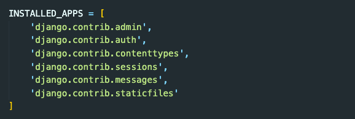
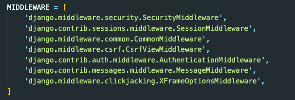
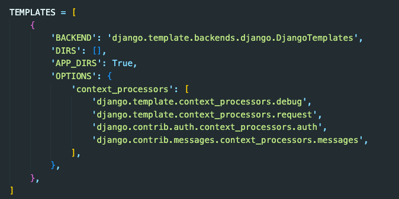
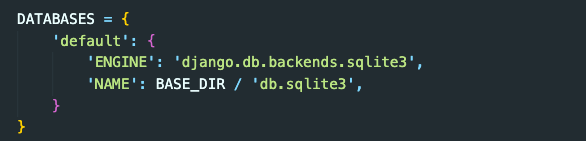
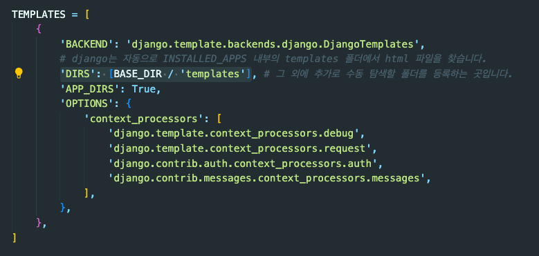

# Django Basics

## Django 설치
장고를 설치하고 프로젝트를 생성하기 위해 아래와 같은 명령어를 입력합니다.
```bash
# 장고 패키지를 설치합니다.
pip install django
# 프로젝트를 시작하기 원하는 경로로 이동한 뒤, 아래 명령어로 프로젝트를 생성합니다.
django-admin startproject <project-name>
```

`startproject`를 하면 기본적으로 `<project-name>`으로 되어 있는 폴더 내부에 파일이 세팅되어 있는 것을 볼 수 있습니다.  
이 폴더는 '마스터 앱 폴더'입니다.
- settings.py: 프로젝트를 설정할 수 있습니다.
- urls.py: url 패턴을 등록할 수 있습니다.

`<project-name>` 폴더와 같은 위치에 아래와 같은 파일도 설정되어 있습니다.
- manage.py: 프로젝트의 매니저라고 생각하면 됩니다. 서버를 돌릴때나 새로운 앱을 만들 때에도 사용할 수 있습니다.

앞으로 이 프로젝트 안에 새로운 앱들을 생성하면, 생성된 앱 디렉토리들은 마스터 앱 디렉토리와 같은 위치에 존재할 것입니다.

<br>

### settings.py
settings.py 파일 내부를 보면, all caps로 되어 있는 변수들을 볼 수 있습니다.  
파이썬에서 all caps는 상수(변하지 않는 값)를 나타내는 컨벤션입니다. django에서도 또한 all caps로 되어있는 이 상수들은 값은 변경하지 말아야 합니다.  

settings.py 파일 내부를 간단하게 살펴보면 아래와 같습니다.  
`INSTALLED_APPS`는 파이썬 프로젝트에 연결할 여러 앱들이 적혀있는 곳입니다.


`MIDDLEWARE`에는 미들웨어들이 적혀 있습니다. 요청이 들어오면 이 모든 미들웨어들을 통과할 수 있어야 작업이 정상적으로 완료될 수 있습니다.


`TEMPLATES`에는 html 관련된 설정이 적혀 있습니다.


`DATABASES`는 DB관련된 설정이 적혀 있습니다.


<br>

### urls.py
url 패턴을 작성하는 곳입니다.  
마스터앱의 urls.py에서는, 각각의 앱의 url 경로와 그에 맞는 urls.py 파일을 연결합니다. 앱의 urls.py 파일에서는 url 경로와 그 경로에서 실행될 함수를 연결합니다.(view의 함수와 연결)  
파일을 간결하고 보기 쉽게 작성하기 위해, 함수를 직접 urls.py 파일 안에 작성하지 않고 패턴만 등록을 합니다.

<br>
<br>

## Django 서버
아래의 명령어로 서버를 작동시킬 수 있습니다.
```bash
python manage.py runserver
```

<br>

### 서버에서 하는 것
서버에서 하는 일은 크게 보면 아래와 같습니다.
1. url 설정
2. 함수 설정(ex. html 반환)
3. url과 함수 연결

<br>

### 서버와 클라이언트 소통 프로세스
서버과 클라이언트가 소통을 할 때 대략적으로 아래의 예시와 같은 프로세스를 가집니다.
1. 클라이언트: `/hello/` 접속
2. 서버: `/hello/` url 패턴 확인
3. 서버: `/hello/`와 연결되어 있는 함수 실행
4. 서버: 응답할 html 반환
5. 클라이언트: html 응답 수령

<br>
<br>

## Django 기초

### Django에서 url과 함수 설정
내부에 새로운 앱을 만든다고 가정하고 url과 함수를 설정해보겠습니다.  
1. `python manage.py startapp first_app` 명령어를 입력해 내부에 앱을 추가합니다.
2. 마스터앱의 settings.py 파일에서 INSTALLED_APPS에 `first_app`을 추가합니다. 새로운 앱의 이름을 추가한 것입니다.
3. `first_app`의 views.py 파일에서 http를 반환하는 함수를 생성합니다.
4. `first_app`의 urls.py 파일에서 url과 함수를 연결하여 새로운 path를 추가합니다.
5. 마스터앱의 urls.py 파일에서 `first_app`이 사용할 경로와 `first_app`의 urls.py 파일을 연결하여 새로운 path를 추가합니다.

<br>

### 뷰 파일과 템플릿 폴더
views.py에서 render는 HttpResponse를 반환합니다.  
views.py 함수를 작성하기에 앞서, 앱의 하위폴더로 templates라는 폴더를 만들어 그 안에 html 파일을 넣어줍니다.   
반환할 html 파일이 준비되었으니, 함수를 작성할 수 있습니다. render의 첫 인자에 request를 넣어주고, 두번째 인자로 templates 폴더 안에 있는 html파일의 이름을 넣어주면 html 파일이 연결됩니다.  

<br>

### urlpatterns 관리
앱을 다른 곳에 사용하게 될 때를 대비해, less config가 가능하도록 url 패턴을 관리하는 것이 좋습니다.  
각각의 앱 안에 urls.py를 생성하고, 이것을 마스터앱의 urls.py와 이어지도록 할 것입니다.
1. 앱 안에 urls.py 파일 생성
2. 앱 urls.py 파일에 urlpatterns 작성
    ```python
    from django.urls import path
    from . import views

    # 반드시 아래 이름의 list 필요
    urlpatterns = [
        path('hello/', views.say_hello),
        path('home/', views.home)
    ]
    ```
3. 마스터앱의 urls.py에 앱 urls.py 연결
    ```python
    from django.contrib import admin
    from django.urls import path, include

    urlpatterns = [
        path('admin/', admin.site.urls),
        path('first/', include('first_app.urls'))
    ]
    ```

+주의: 일반적으로 패턴을 만들 때 `/something/something` 처럼 앞에 슬래시가 붙는데, 장고는 `something/something/` 와 같이 뒤에 슬래시가 붙는 독특한 특징이 있습니다.

<br>

### [Django Template Language](https://docs.djangoproject.com/en/4.2/ref/templates/builtins/)(DTL)
장고는 템플릿에서 DTL이라는 언어를 사용할 수 있습니다.  
예를 들어, 반복적으로 html을 생성하지 않기 위해 base.html을 생성하고 다른 html에서는 이것을 가져다 씁니다. 변경되는 부분에는 DTL `block`을 사용해 컨텐츠를 유연하게 넣을 수 있습니다.  
```html



<h1>Hello World!</h1>

```
base.html을 만들기 위해, 앱들과 동등한 위치에 templates 디렉토리를 생성합니다. 이 곳에 기본으로 사용할 base.html을 넣어둡니다.  
여러 앱들의 탬플릿에서 base.html을 DTL `extends`로 불러와 사용하면 됩니다.

<br>

### 장고가 템플릿(html)을 찾는 방법
1. INSTALLED_APPS에 적힌 앱들이 대상입니다. 찾는 방법은 여기에 앱이 적힌 순서대로 진행됩니다.
2. 앱 안에 있는 /templates/ 라는 이름의 디렉토리를 자동으로 검색합니다.
3. 그 외에 수동으로 등록하려면, settings.py -> TEMPLATES -> 'DIRS' 에서 직접 등록해야 합니다.


<br>
