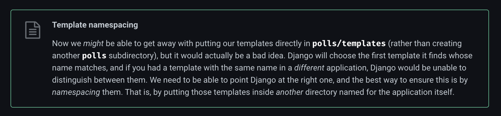

# Django 템플릿

## 템플릿 파일 정리
다른 앱에서 같은 이름의 html파일을 가지고 있다면, INSTALLED_APPS 에 작성된 앱의 순서에 따라 템플릿을 찾게 됩니다.  
즉, 다른 앱에서 각각 `home.html` 템플릿을 가지고 있다면, INSTALLED_APPS에 먼저 작성된 한 앱의 `home.html` 템플릿만이 `home.html` 템플릿을 출력하는 모든 다른 앱에서도 출력될 것입니다. 장고가 작동하는 방식이 그렇습니다.  
이러한 네임스페이스 문제를 방지하려면, 템플릿 파일을 추가하기 전에 template폴더 아래에서 앱 이름을 반복해 폴더를 생성한 뒤 템플릿을 넣어야 합니다.  

아래는 대략적인 프로젝트 구조입니다.  
앱 안에 템플릿 폴더가 있고 바로 그 밑에 템플릿이 있는 것이 아니라, 앱의 이름을 가진 폴더가 하나 더 있는 것을 볼 수 있습니다.  
```bash
example_project
│
├── master_app
│   ├── __init__.py
│   ├── settings.py
│   ├── urls.py
│   ├── wsgi.py
│   └── asgi.py
│
├── app_name_1
│   ├── templates
│   │  └── app_name_1  # templates 폴더 내부에 해당 앱 이름으로 폴더 생성
│   │      └── home.html
│   ├── __init__.py
│   ├── apps.py
│   ├── urls.py
│   ├── models.py
│   ├── tests.py
│   └── views.py
│
├── app_name_2
│   ├── templates
│   │  └── app_name_2  # templates 폴더 내부에 해당 앱 이름으로 폴더 생성
│   │      └── home.html
│   ├── __init__.py
│   ├── apps.py
│   ├── urls.py
│   ├── models.py
│   ├── tests.py
│   └── views.py
│
├── templates
│   └── base.html
└── manage.py
```

이렇게 구조를 설정하는 것을 [장고는 권장](https://docs.djangoproject.com/en/dev/intro/tutorial03/#write-views-that-actually-do-something)하고 있습니다.  


<br>
