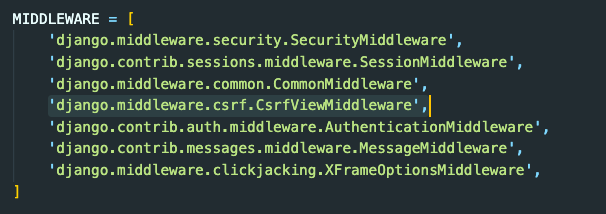

# Django 사용자 입력 & GET/POST

## 사용자 입력

<br>

### Variable Routing
Variable Routing은 사용자의 입력(변수명)을 url로 받아서 사용하는 것입니다.  
url 패턴을 정의할 때, `<type:variable>`와 같이 입력해 사용할 수 있습니다.(ex. `<str:name>`)  
게시글이나 제품의 상세페이지에서 id값으로 많이 사용합니다.  

urls.py
```python
urlpatterns = [
    # input/greeting/user-name 경로로 설정되기 원한다면 아래와 같이 입력합니다.
    path('greeting/<str:name>', views.greeting),
]
```

views.py
```python
# 호출되는 함수에서 variable을 두번째 파라미터로 받아줘야 합니다.
def greeting(request, name):
    return render(request, 'input/greeting.html', {
        'name': name
    })
```

greeting.html
```html



<!-- html에서 DTL인 중괄호로 변수를 사용할 수 있습니다. -->
<h1>Hello, {{name}}</h1>

```

<br>
<br>

### `<form>` 태그와 `<input>` 태그
`<form>` 태그에서 `GET` 방식으로 요청을 보내면 url에 그대로 드러나게 됩니다.  
따라서, `<form>` 태그로 요청되는 url과 똑같이 url을 직접 타이핑해 엔터를 누르면 똑같은 효과가 나타나게 됩니다.  
`<input>` 태그의 `name` 값을 설정해주면 그 값이 submit된 다음, url에 '쿼리 파라미터'으로 붙는 것이기 때문입니다.  

`GET` 방식을 일반적으로 사용할 때는 검색할 때 입니다.  
그 외에는 잘 사용하기 어렵습니다. 만약 `<form>`에서 password 같은 인풋을 `GET` 요청으로 넘기게 되면, url에도 그대로 드러나고 브라우저 히스토리에도 그대로 남아있을 것이기 때문입니다.  

반면, `POST` 방식으로 요청하면 url에 쿼리 파라미터로 남지 않습니다.  
`POST` 방식 요청은 `<form>` 테이터를 전송용으로 인코딩하고 서버로 전송합니다. 데이터를 제출할 때 `POST` 방식이 적합합니다.  
정리하면, **DB 상태 변화와 관련있는, 서버시스템의 상태를 변화시킬 수 있는 요청들은 `POST` 방식을 쓰는 것이 규칙입니다.**

<br>
<br>

### CSRF(Cross-site request forgery)
대형 사이트(ex. 구글)와 유사하게 url을 만들고, 유사한 로그인 화면을 만든 페이지가 있다고 합시다.  
사용자가 로그인 버튼을 누를 때, id와 pw를 가져오면 이건 그저 구글의 유사 사이트일 뿐입니다. id와 pw가 맞는지 틀린지도 알 수 없습니다.  

CSRF, 즉 사이트 간 요청 위조는 가짜로 만든 사이트의 `<form>`이 `action`을 실제 구글로 보내는 것을 말합니다.  
구글로부터 로그인의 ok 사인이 떨어지고 그때 유저의 정보를 가져올 수 있다면, 이 요청이 성공한 것입니다.  
이를 방지하기 위해 사이트틀은 데이터를 넘길 때 토큰을 함께 넘기도록 하고, 토큰이 유효한지 검사를 한 뒤 로그인이 가능한지 확인합니다.

Django에서는 middleware에서 CSRF 관리를 합니다.  
`<form>`에서 `method="POST"`로 요청을 보냈지만 'CSRF 검증에 실패'라는 오류가 뜬다면, 요청이 들어왔을 때 이 middleware들을 지나가면서 걸린 것입니다.


Django에서는 이 문제를 쉽게 해결할 수 있습니다. `POST`일 때는 `<form>` 안에 `` 를 작성해 사용하면 됩니다. 그럼 Django는 서버로 보내고자 하는 인풋들과 함께, csrf_token을 값으로 하는 input을 생성해 `POST` 요청을 보냅니다.

<br>
