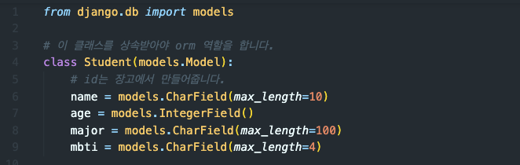
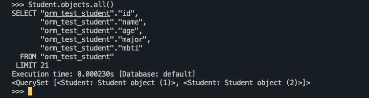

# Django with Database

## Database 패러다임
[7 Database Paradigms](https://www.youtube.com/watch?v=W2Z7fbCLSTw&ab_channel=Fireship)
1. Key-value: radis
2. Wide column
3. Document
4. Relational => SQL
5. Graph
6. Search  
7. Multi-model  

<br>
<br>

## 시작
시트가 있어야 엑셀을 시작할 수 있듯, 데이터베이스에도 테이블이 있어야 저장을 시작할 수 있습니다.  
컬럼을 지정하는 것을 스키마(Schema)를 작성한다고 합니다. 즉, 컬럼 값들과 데이터 타입을 지정하는 것을 말합니다.  

장고 프로젝트에서 DB를 다룰 때, SQL을 직접 작성하지 않고 파이썬 클래스를 활용합니다.  
레코드 한개는 클래스의 인스턴스라고 생각하면 쉽습니다.  

데이터베이스가 다른 제품군으로 바뀌어도 ORM이 알아서 적용해주기 때문에, 파이썬으로 작성한 장고 프로젝트를 수정하지 않아도 됩니다.  

<br>
<br>

## 클래스로 테이블 생성
`django.db` 에서 제공하는 `models`를 사용해 모델을 생성할 수 있습니다.
일반적인 파이썬 클래스를 모델로 만들어 주는 역할은 `models.Model` 클래스가 담당합니다. 새로 생성하려는 클래스가 이 클래스를 상속받도록 해야 합니다.


스키마를 작성할 때 유사하기에 헷갈리는 두가지 데이터 타입이 있는데, `CharField()`와 `TextField()`입니다.  
아래와 같이 생각하면 쉽게 작성할 수 있습니다.  
- `input` 태그로 작성하기 원한다면: `CharField()` 사용
- `text area` 태그로 작성하기 원한다면: `TextField()` 사용
`CharField()` 를 사용하려면, 첫번째 인자로 `max_length=`로 최댓값을 설정해줘야 합니다.

<br>

테이블이 생성되는 상세한 순서는 다음과 같습니다.
1. 앱의 models.py에 클래스를 작성하고(스키마 작성)
2. `python manage.py makemigrations <app-name>`
3. 앱에 migrations 폴더가 생깁니다. 그 안에 xxxx_inital.py 파일이 생길 것입니다.
4. 파일을 확인하고 아래 명령어를 입력합니다.
5. `python manage.py migrate <app-name>`
6. 'SQLite Viewer' extension을 설치합니다.
7. db.sqlite3 파일을 클릭하면 테이블이 보입니다.
8. 추가로, 원한다면 `python manage.py shell_plus ` or `python manage.py shell_plus --print-sql`를 활용해 조작해볼 수 있습니다.
      ```python
      s = Student()
      s.name = 'anko'
      s.age = 200
      s.major = 'KTC'
      s.mbti = 'ENTJ'
      s.save()
      ```
<br>

아래는 `django_extensions`에서 제공하는 `shell_plus` 실제 창입니다.  
앞으로 계속 다루겠지만, 위의 명령어 외에도 사용할 수 있는 명령어는 많습니다.  
Student 테이블의 모든 레코드를 가져오기 위해서 `Student.objects.all()` 명령어를 사용했고, 맨 마지막 줄에 결과로 2개의 레코드가 출력되는 것을 볼 수 있습니다.


<br>

### `choices` 옵션
스키마를 작성하며 `choices` 옵션을 줄 수도 있습니다.  
`choices`를 사용하면 유저가 정해진 선택지 안에서만 필드를 작성 가능하도록 제한을 줄 수 있습니다.  
```python
class User(AbstractUser):
    MBTI_CHOICES = [
        # 첫번째 자리는 DB에 저장할 코드, 두번째는 유저에게 보여줄 코드
        ('entj', 'ENTJ'),
        ('isfp', 'ISFP'),
        ('enfp', 'ENFP'),
        ('infj', 'INFJ'),
    ]

    mbti = models.CharField(max_length=4, choices=MBTI_CHOICES)
```
위처럼 모델 파일에서 설정할 수도 있고, 모델폼에서도 설정할 수 있습니다.  

변경 후 `makemigrations`을 하게 되면 Alter field 라고 뜹니다.  
이처럼 변경 사항이 있는 경우, `migrate` 해야 합니다.  
반면 No Changes 라고 하는 경우, 당연히 `migrate`을 할 필요가 없습니다.

변경 사항으로 받아들여질 수 있는 부분이 추가되었는지, 아닌지는 판단하기 어려울 수 있습니다.  
**즉, 모델에서 어떤 변경이든 일어나면 `makemigrations`을 해보는 것이 안전하다는 의미입니다.**

<br>
<br>

## 요약
전체적인 그림은 다음과 같습니다.
1. 스키마를 구상합니다.
2. models.py에 Model 클래스를 작성합니다.
3. `makemigrations` 합니다. 버전 파일이 생성됩니다.
4. `migrate`해 실제 테이블을 생성합니다.

<br>
