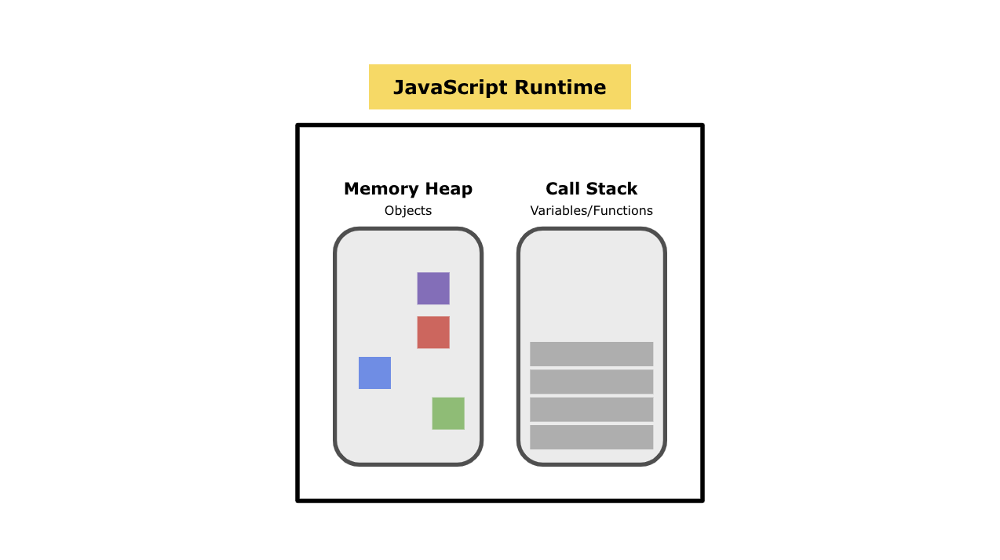
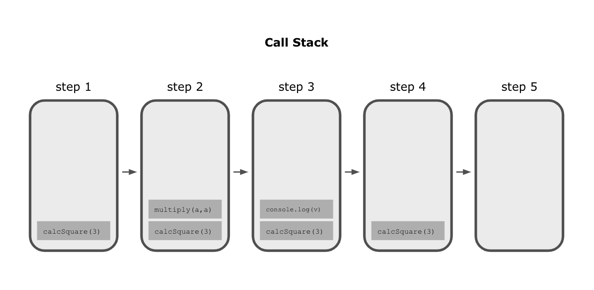
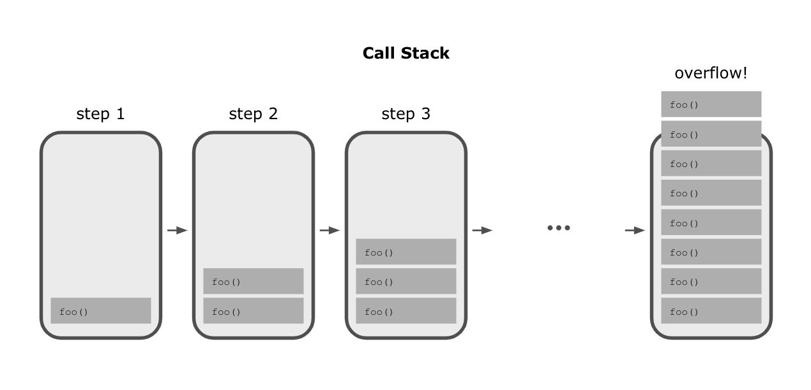
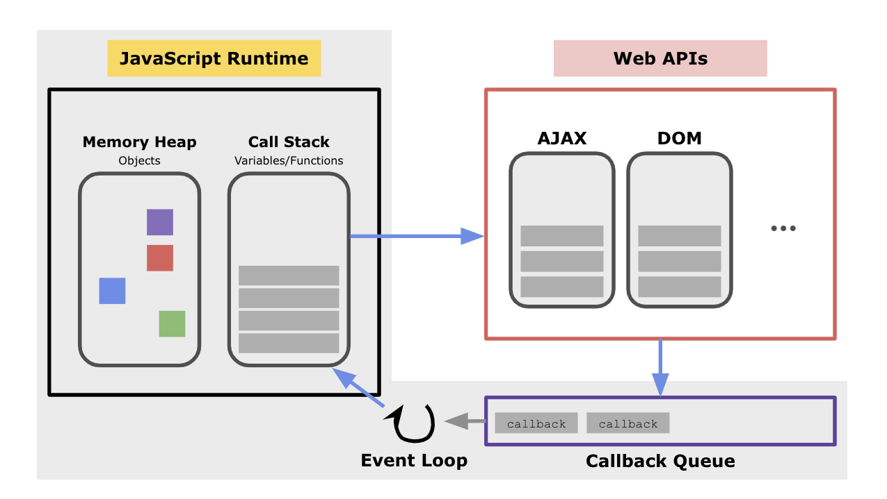
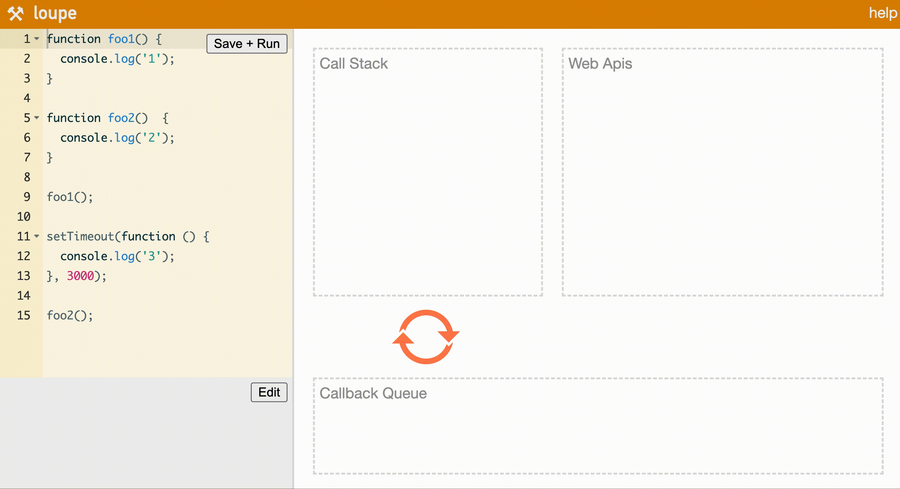

# 자바스크립트는 어떻게 작동하는가?

## 자바스크립트 엔진
자바스크립트 엔진은 자바스크립트를 실행하기 위해 필요한 엔진입니다.  
자바스크립트 코드를 해석하고 실행하는 프로그램 및 인터프리터의 역할을 합니다.

대표적인 자바스크립트 엔진으로는 V8이 있습니다. 구글에서 개발했고 가장 대중적인 오픈소스 자바스크립트 엔진입니다. 자바스크립트를 바이트코드로 컴파일하고 실행합니다.  

모든 브라우저는 자바스크립트 코드를 실행하는 자바스크립트 엔진을 제공합니다.  
크롬 브라우저 외에도 Chromium 프로젝트, Electron.js, 서버측 자바스크립트 런타임인 Node.js 또한 V8 엔진을 사용합니다.  

자바스크립트 엔진의 주요 구성 요소
- 메모리 힙(Memory Heap): 메모리 할당이 일어나는 곳
- 콜 스택(Call Stack): 호출 스택이 쌓이는 곳

<br>
<br>

## 자바스크립트 런타임이란?
런타임이란 프로그래밍 언어가 구동되는 환경을 의미합니다.  
Node.js나 크롬 등의 여러 브라우저들은 자바스크립트가 구동되는 환경이기 때문에, 이것들을 자바스크립트 런타임이라고 합니다.  

<br>
<br>

## 자바스크립트 런타임 구조
자바스크립트 런타임에는 힙 저장소 하나와, 스택이 하나 있습니다.  
힙은 랜덤한 순서로 메모리를 저장할 수 있는 메모리 저장 장치입니다. 변수나 함수가 선언되면 이 곳에 값들이 저장된다고 생각하면 됩니다. 힙은 자바스크립트 런타임에 의해 관리됩니다. ([힙에 대한 자세한 설명](https://hashnode.com/post/does-javascript-use-stack-or-heap-for-memory-allocation-or-both-cj5jl90xl01nh1twuv8ug0bjk))  



<br>
<br>

## 실행 스택(Execution Stack)
실행 스택(Execution Stack)은 자바스크립트의 실행 컨텍스트를 저장하는 곳입니다. 콜스택(Call Stack)이라고도 부르며 그 외에도 Program Stack, Runtime Stack 등이 있는데 모두 같은 것을 칭하는 다른 이름입니다. 스택은 LIFO(Last In First Out: 후입선출) 자료구조를 가집니다.   

그렇다면, 아래와 같은 코드는 실행 스택에 어떻게 쌓일까요?
```javascript
const multiply = (a, b) => {
    return a * b;
}

const calcSquare = (a) => {
    const v = multiply(a, a);
    console.log(v);
}

calcSquare(3);
```


함수가 호출될 때다 실행 스택에 한 단계씩 쌓이는 것들을 스택 프레임(Stack Frame)이라고 합니다.  
스택 프레임이 쌓이는 것을 순서대로 보면, 어떻게 함수가 실행스택에서 쌓이고 사라지는지 쉽게 확인할 수 있습니다.  

<br>

실행 스택은 정해진 스택 사이즈가 있습니다. 이것을 초과하면 stack overflow 라고 하는 현상이 일어납니다. 말 그대로 스택이 넘쳐난겁니다. 무한루프의 발생한 경우가 바로 이 stack overflow 되어 일어나는 것입니다.

```javascript
const foo = () => {
    foo();
}

foo();
```
위와 같은 코드를 보면 마지막 줄 foo()로 함수가 실행됩니다. 그런데 이 함수는 스스로를 호출하는 재귀함수 입니다. 따라서 무한으로 foo()가 호출되게 됩니다.  

실행 스택에는 어떤 일이 생길까요?  


스택 프레임이 과도하게 쌓여 정해진 스택의 사이즈를 초과하게 되었습니다. stack overflow는 이런 현상을 말합니다.

<br>
<br>

## 싱글스레드와 단점
자바스크립트는 기본적으로 싱글 스레드(Single Thread) 기반 언어입니다. 이 말이 뜻하는 것은 위에서 봤듯 가지는 호출 스택이 하나라는 겁니다. 프로세스당 하나의 스택과 하나의 힙만 있습니다. 따라서, 한 번에 한 작업만 처리 할 수 있습니다.  

호출 스택이 하나라면, 한 작업이 완료되어야 다른 작업을 차례대로 작업하게 됩니다. 즉, 다른 작업 수행하려면 지금 수행중인 작업이 끝나야 하는 문제가 있습니다.  
사용자가 HTTP 요청을 보내는 경우라면 어떻게 될까요? 요청이 완료될 때까지 브라우저가 정지될 겁니다. 그럼 매우 나쁜 사용자 경험을 하게 됩니다. 시간이 많이 걸리는 작업을 하면 프로그램이 느려질 가능성 존재한다는 겁니다.

자바스크립트 런타임은 이것을 해결하는 효율적인 방법이 있습니다.  
Web API, Callback Queue, Event Loop를 이용해 오래 걸리는 작업을 백그라운드에서 처리하고, 간단한 작업은 콜스택에서 처리하는 것입니다.

<br>
<br>

## 다시 정리하는, 자바스크립트 런타임
사실 브라우저의 내부에서 자바스크립트 런타임은 이렇게 동작합니다.  
2개의 추가 구성요소를 더 가집니다. 바로 Callback Queue, Event Loop 입니다.


<br>
<br>

## Web API
먼저 Web API 부터 살펴보겠습니다.  
Web API는 웹 브라우저에서 제공하는 기능들을 말합니다. 자바스크립트 엔진 외에도 브라우저에는 Ajax, DOM 이벤트 듣기, setTimeout(), 이벤트 핸들러 등과 같은 다양한 작업을 할 수 있는 프로그램이 포함되어 있습니다.  
개발자 도구 window 찍으면 제공하는 기능들을 볼 수 있습니다.  
Web API를 사용해 백그라운드에서 비동기적으로 작업을 처리할 수 있습니다. 이 작업들이 끝나면 자바스크립트 콜스택에게 끝난것을 알려줍니다. 그럼 계속 작업을 할 수 있습니다.  

setTimeout 처리는 여기서 일어납니다. Web API 영역에서 작업이 끝나면(예시로 setTimeout의 경우 시간이 끝나면) 콜백 큐로 보내집니다.  

<br>
<br>

## 콜백 큐(Callback Queue / Message Queue / Task Queue)
비동기 함수의 콜백 함수 또는 이벤트 핸들러가 일시적으로 보관되는 곳입니다.  
쉽게 말해, 처리가 끝난 함수가 콜 스택에 들어가기 위해서 대기하고 있는 곳입니다.

<br>
<br>

## 이벤트 루프(Event Loop)
콜 스택에 실행중인 컨텍스트 있는지, 콜백 큐에 대기중인 함수가 있는지 반복해서 계속 확인하는 것이 이벤트 루프입니다.
콜 스택 비어있으면, 이벤트 루프는 FIFO(First In First Out)로 콜백 큐에 대기중인 함수를 콜 스택으로 이동시킵니다.

<br>
<br>

## 전체적인 흐름 정리 및 예시
### 전체적인 흐름 정리
브라우저가 HTTP 요청과 같은 이런 작업을 실행하기 위해 자바스크립트 스레드를 사용해야 한다면, 위에서 말했듯 나쁜 사용자경험을 하게 될 것입니다. 한참을 기다리는 동안 다른 작업은 정지될 것이기 때문입니다.  

따라서 이런 작업을 수행하기 위해 브라우저는 자체 논리를 구현합니다. 이 작업은 브라우저에서 따로 관리하는 다른 스레드에 생성되고 이것을 자바스크립트는 모르게 하기 때문에, 자바스크립트의 스레드를 차단하지 않도록 합니다.

Web API는 비동기식입니다. 백그라운드에서 작업을 수행하고 완료되면 데이터를 반환하도록 할 수 있고 그 동안 자바스크립트 코드를 계속 실행할 수 있습니다.

함수를 호출하면 함수가 스택으로 push 됩니다. 이 함수에 Web API 호출이 포함되어 있으면 자바스크립트는 콜백 함수를 사용해 Web API 제어를 위임하고 무언가 반환할 때까지 다음줄로 이동합니다.

함수가 return 에 도달하면 해당 함수가 스택에서 pop 되고 다음 스택 항목으로 이동합니다. 한편 Web API는 백그라운드에서 작업을 수행하고, 또한 그 작업과 관련된 콜백함수를 기억하고 있습니다. 작업이 완료되면 Web API는 해당 결과를 콜백함수에 바인딩하고 콜백함수를 사용해 콜백큐(메세지큐)에 메세지를 보냅니다.

이벤트 루프는 콜백큐를 살펴보고 스택이 비어있으면 콜백큐에 있는 콜백 함수를 한 번에 하나씩 스택으로 push 합니다. 그럼 나중에 스택은 콜백 함수를 실행합니다. 콜백큐와 스택 사이에서 계속 살펴보고 옮기는 것이 이벤트루프가 하는 일의 모든 것 입니다.

### 예시
```javascript
function foo1() {
  console.log('1');
}

function foo2()  {
  console.log('2');
}

foo1();

setTimeout(function () {
  console.log('3');
}, 3000);

foo2();
```
몇초 후에 어떤 함수를 실행시키고자 할 때, 위와 같은 `setTimeout` Web API를 씁니다.
위와 같은 코드를 쓰면 콘솔에 1, 3, 2 순서대로 출력될 것 같지만, 사실은 1, 2, 3 순서대로 나오게 됩니다.

그 이유는, 아래와 같은 순서로 작동하기 때문입니다.

1. `foo1()` 함수가 호출되는 줄에서, 콜스택에 가장 처음으로 `foo1()`이 쌓입니다.
2. `foo1()` 안에 있는 `console.log()`가 콜스택에 쌓입니다.
3. 콘솔창에 '1'이 출력됩니다. 출력되면서 콜스택 맨 위의 `console.log()`가 pop 됩니다.
4. `foo1()` 함수가 모두 끝났으니, 콜스택에서 `foo1()`도 pop 됩니다.
5. 콜백함수를 담은 setTimeout이 비어있는 스택에 쌓입니다.
6. 스택에 있던 setTimeout은 Web API로 보내져 3초를 세기 시작합니다.
7. `foo2()` 함수가 호출되는 줄에서, 비어있는 콜스택에 `foo2()`가 쌓입니다.
8. `foo2()` 안에 있는 `console.log()`가 콜스택에 쌓입니다.
9. 콘솔창에 '2'이 출력됩니다. 출력되면서 콜스택 맨 위의 `console.log()`가 pop 됩니다.
10. `foo2()` 함수가 모두 끝났으니, 콜스택에서 `foo2()`도 pop 됩니다. **콜스택이 비었습니다.**
11. Web API에서 3초를 세던 setTimeout은 시간이 모두 지나면 콜백큐로 가지고 있던 콜백함수 `anonymous()`를 보냅니다.
12. 이벤트 루프가 콜스택이 비었는지 확인하고, 비었으니 콜백함수 `anonymous()`를 콜스택에 push 합니다.
13. 콜백함수에 있는 `console.log()`가 콜스택에 쌓입니다.
14. 콘솔창에 '3'이 출력됩니다. 출력되면서 콜스택 맨 위의 `console.log()`가 pop 됩니다.
15. 콜백함수 `anonymous()`도 pop 됩니다.

<br>

[loupe](http://latentflip.com/loupe/) 툴을 통해 위의 과정을 시각화하여 더 쉽게 볼 수 있습니다.


<br>
<br>

## 결론
자바스크립트 엔진은 싱글 스레드로 동작합니다.  
브라우저는 멀티스레드로 동작합니다. 싱글 스레드로 동작하는 건 브라우저에 내장된 자바스크립트 엔진입니다.  
비동기 처리가 가능한 것은 web API, Callback Quese, Event Loop 때문에 가능한 것입니다.

<br>
<br>

## Reference.
- [How does JavaScript and JavaScript engine work in the browser and node?](https://medium.com/jspoint/how-javascript-works-in-browser-and-node-ab7d0d09ac2f)
- [[JavaScript] 자바스크립트 런타임](https://beomy.github.io/tech/javascript/javascript-runtime/)
- [자바스크립트의 동작원리: 엔진, 런타임, 호출 스택](https://joshua1988.github.io/web-development/translation/javascript/how-js-works-inside-engine/)