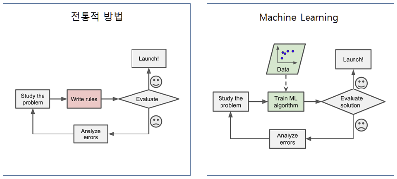
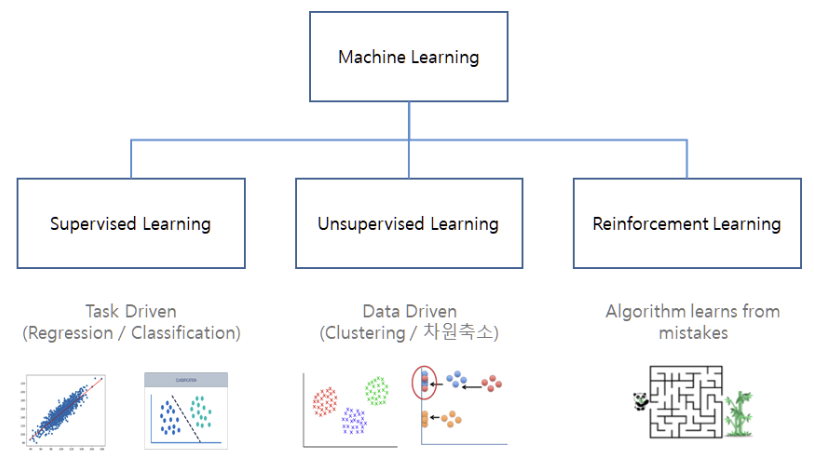
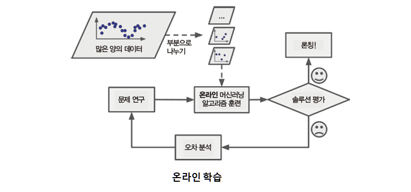
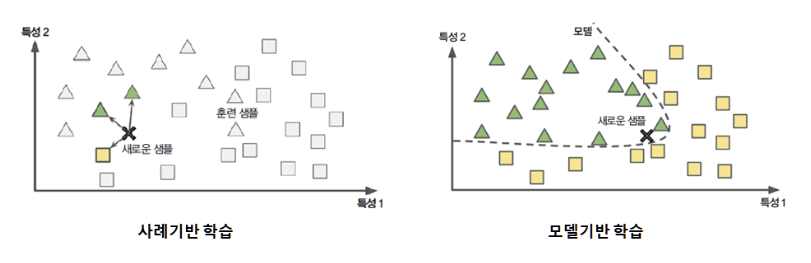

# Machine Learning, 기계학습
- 컴퓨터 프로그램이 데이터와 처리 경험을 이용한 학습을 통해 정보 처리 능력을 향상시키는 것 또는 이와 관련된 연구 분야
- 기계 학습은 자율 주행 자동차, 필기체 문자 인식 등과 같이 알고리즘 개발이 어려운 문제의 해결에 유용

## 머신러닝과 전통적 방식과 차이

- 전통적 방법의 경우 사소한 문제가 아닌 경우 규칙이 점점 길고 복잡해져 유지보수가 매우 어려움
- 기존 솔루션으로는 많은 수동 조정과 규칙이 필요한 경우, 머신러닝 모델 코드를 간단하게 만들 수 있음
- 전통적인 방식으로 해결할 수 없는 복잡한 문제를 머신러닝으로 해결

## 어플리케이션 사례
- 이미지 분류 작업: 생산 라인에서 제품 이미지를 분석해 자동으로 분류
- 시맨틱 분할 작업: 뇌를 스캔하여 종양 진단
- 텍스트 분류(자연어 처리)
    - 자동으로 뉴스 기사 분류
    - 토론 포럼에서 부정적인 코멘트를 자동으로 구분
- 텍스트 요약
    - 긴 문서를 자동으로 요약
- 자연어 이해 : 챗봇(chatbot) 또는 개인 비서 만들기
- 회사의 내년도 수익을 예측하기 : 회귀분석
- 음성 인식 : 음성 명령에 반응하는 앱
- 이상치 탐지: 신용 카드 부정 거래 감지
- 군집 작업 : 구매 이력을 기반으로 고객을 나누고 각 집합마다 다른 마케팅 전략을 계획
- 데이터 시각화 : 고차원의 복잡한 데이터셋을 명확하고 의미 있는 그래프로 표현하기
- 추천 시스템 : 과거 구매 이력을 기반으로 고객이 관심을 가질 수 있는 상품 추천하기
- 강화 학습 : 지능형 게임 봇(bot) 만들기

## 머신러닝 종류

### 넓은 범주의 분류
감독 하에 훈련하는가?
- 지도(Supervised) 학습
- 비지도(Unsupervised) 학습
- 준지도(Semi-supervised) 학습
- 강화(Reinforcement) 학습
- 전이(Transfer) 학습

실시간으로 점진적인 학습을 하는지?
- 온라인 학습
  - 개별적 또는 소그룹(mini batch)으로 데이터를 순차적으로 공급하여 점진적으로 훈련
- 배치 학습
  - 시스템이 점진적으로 학습할 수 없음
  - 모든 데이터를 사용해 학습
  - 오프라인으로 수행 (많은 시간과 리소스 사용)

데이터 비교 vs 모델 기반인지?
- 인스턴스 기반 학습(사례기반)-KNN 등
- 모델 기반 학습-Random Forest 등

### 지도 학습(Supervised Learning)
- 학습 데이터에 입력값(특성)에 대한 출력값(레이블)이 함께 제시됨
    - 입력으로 훈련 데이터 세트가 있고 출력으로 각 훈련 세트에 대한 레이블 또는 "정답" 세트가 있음
- 알고리즘은 입력값과 출력값 사이의 관계를 가장 잘 설명할 수 있는 "모델"을 찾음
- "모델"을 사용하여 새로운 입력값에 대한 예측 수행
- 출력값이 수치형인 회귀와 범주형인 분류 문제로 나누어 짐
- 알고리즘
    - k-최근접이웃(K-Nearest Neightbor: KNN)
    - 선형 회귀(Linear Regression)
    - 로지스틱 회귀(Logistic Regression)
    - 서포트 벡터 머신(Support Vector Machine)
    - 의사결정트리(Decision Tree)
    - 랜덤 포레스트(Random Forest)
    - 신경망

### 비지도 학습(Unsupervised Learning)
- 학습 데이터에 레이블이 지정되거나 분류되지 않은 테스트 데이터에서 학습  
- 알고리즘은 학습 데이터의 특징만을 활용하여 목표한 결과를 산출  
- 적절한 군집을 찾거나, 변수의 복잡성을 낮추기 위한 차원 축소 등  
- GAN(Generative Adversarial Nets) 등과 같은 새로운 기법이 등장하고 있음
- 알고리즘
    - 군집분석(Clustering)
        - K-평균(K-Means)
        - 계층적 군집 분석(Hierarchical Cluster Analysis,HCA)
        - DBSCAN
    - 시각화와 차원축소
        - 주성분 분석(Principal Component Analysis, PCA)
        - 커널(Kernel) PCA
        - 지역적 선형 임베딩(Locally-Linear Embedding, LLE)
        - t-SNE(t-distributed Stochastic Neighbor Embedding)
    - 이상치 탐지
        - 가우스 분포를 이용한 이상치 탐지
    - 연관규칙(Association Rule)
        - Apriori
        - Eclat

## 머신러닝에서 사용되는 주요 패키지
머신러닝 패키지
- 사이킷런(Scikit-Learn)

배열/선형대수/통계 패키지
- NumPy
- SciPy

데이터 핸들링
- Pandas

시각화
- Matplotlib
- Seaborn

딥러닝
- 텐서플로(Tensorflow)
- 케라스(Keras)