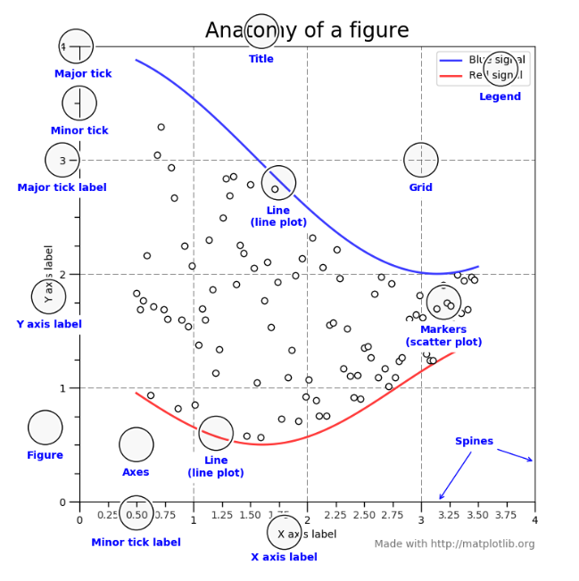
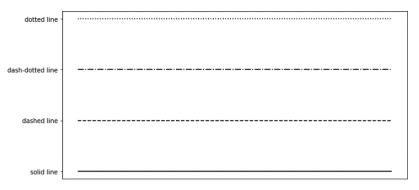
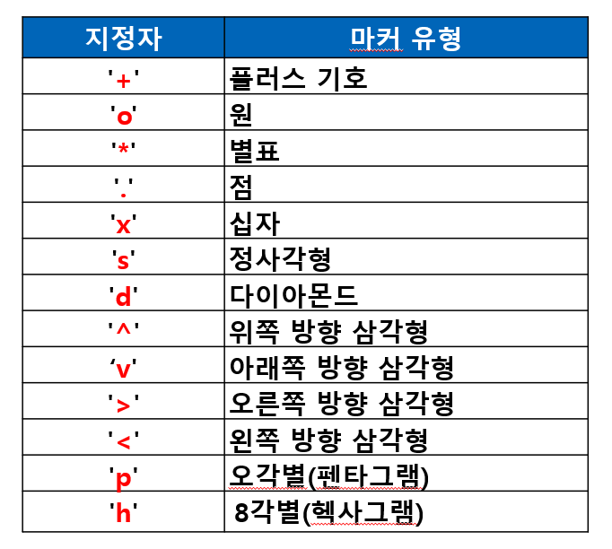
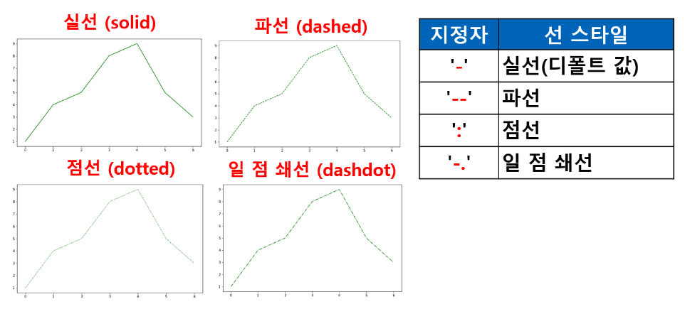
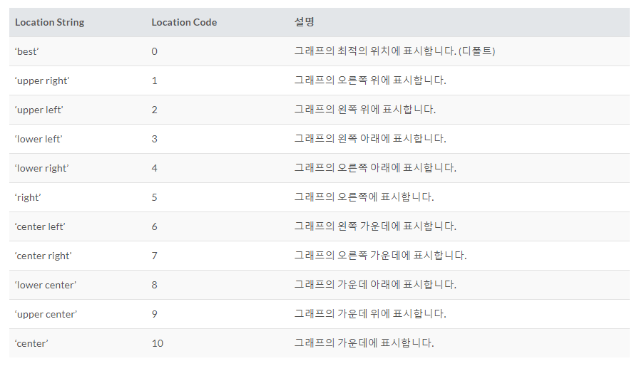

# Matplotlib
시각화 패키지
파이썬 표준 시각화 도구로 불림
2D 평면 그래프에 관한 다양한 포맷과 기능 지원
데이터 분석 결과를 시각화 하는데 필요한 다양한 기능을 제공

## 패키지 사용 법
1.matplotlib 주 패키지 사용시
`import matplotlib as mpl`
2.pylab 서브 패키지 사용시 : 주로 사용 한다.
`import matplotlib.pyplot as plt`
- 매직 명령어 `%matplotlib inline`
  - 주피터 노트북 사용시 노트북 내부에 그림을 표시하도록 지정하는 명령어
- 지원 되는 플롯 유형
    - 라인플롯(line plot) : plot()
    - 바 차트(bar chart) : bar()
    - 스캐터플롯(scatter plot) : scatter()
    - 히스토그램(histogram) : hist()
    - 박스플롯(box plot) : boxplot()
    - 파이 차트(pie chart) : pie()
    - 기타 다양한 유형의 차트/플롯을 지원 : 관련 홈페이지를 참고



### 한글문제
matplotlib의 기본 폰트에서 한글 지원되지 않기 때문에, matplotlib의 폰트 변경 필요
```python
import platform

from matplotlib import font_manager, rc
plt.rcParams['axes.unicode_minus'] = False

if platform.system() == 'Darwin':  # 맥OS 
    rc('font', family='AppleGothic')
elif platform.system() == 'Windows':  # 윈도우
    path = "c:/Windows/Fonts/malgun.ttf"
    font_name = font_manager.FontProperties(fname=path).get_name()
    rc('font', family=font_name)
else:
    print('Unknown system...')
```


## plot()
기본으로 선을 그리는 함수
데이터가 시간, 순서 등에 따라 변화를 보여주기 위해 사용

- show()
각화명령(그래프 그리는 함수) 후 실제로 차트로 렌더링 하고 마우스 이벤트등의 지시를 기다리는 함수
주피터 노트북 에서는 셀 단위로 플롯 명령을 자동으로 렌더링 주므로 show 명령이 필요 없지만 일반 파이썬 인터프리터(파이참)로 가동되는 경우를 대비해서 항상 마지막에 실행하도록 한다.

- 관련 함수 및 속성
figure(x,y) : 그래프 크기 설정 : 단위 인치 - figsize=(x눈금, y눈금)
title() : 제목 출력
xlim : x 축 범위
ylim : y 축 범위
xticks():yticks() : 축과 값을 잇는 실선
legend() : 범례. `loc='위치'`로 표현
xlabel() : x축라벨(값)
ylabel() : y축라벨(값)
grid() : 그래프 배경으로 grid 사용 결정 함수

```python
import matplotlib.pyplot as plt #그래프 패키지 모듈 등록
%matplotlib inline 
#그래프는 show()함수를 통해서 독립창에서 실행되는 것이 원칙
#그래프를 콘솔에서 바로 작동되록 하는 설정

#plt.plot([]) 기본 문법 : []에 y 축값, x축값은 자동 생성
t=[0,1,2,3,4,5,6]
y=[1,4,5,8,9,5,3]
# 그래프 크기 설정 : plt.figure(figsize=(가로,세로))
plt.figure(figsize=(10,6))
plt.title('test graph')
# plt.plot(x축데이터,y축데이터)
plt.plot(t, y)
```

- line plot 에서 자주 사용되는 스타일 속성(약자로도 표기 가능)
color(c): 선색깔
linewidth(lw): 선 굵기
linestyle(ls): 선스타일
marker: 마커 종류
markersize(ms): 마커크기
markeredgecolor(mec): 마커선색깔
markeredgewidth(mew): 마커선굵기
markerfacecolor(mfc): 마커내부색깔







```python
t=[0,1,2,3,4,5,6]
y=[1,4,5,8,9,5,3]
plt.figure(figsize=(10, 6))
plt.plot(t, y, color='green', linestyle='dashed', marker='o', markerfacecolor='blue', markersize='12', markeredgecolor='red', markeredgewidth='3')

t=[0,1,2,3,4,5,6]
y=[1,4,5,8,9,5,3]
plt.figure(figsize=(10, 6))
plt.plot(t, y, c='b', lw=5, ls='--', marker='o', ms=15, mec='g', mfc='r', mew=5)
```

## 여러 개의 그래프 그리기
여러 데이터를 하나의 그래프에 여러 선 으로 표현
plot() 여러번 사용 가능

```python
t=np.arange(0.,5.,0.2)
t
plt.figure(figsize=(10,6))
plt.title('여러개의 선 그래프')

plt.plot(t, t, 'r--')
plt.plot(t, 0.5*t**2, 'bs:')
plt.plot(t, 0.2*t**3, 'gs:')

==

plt.plot(t, t, 'r--', t, 0.5*t**2, 'bs:', t, 0.2*t**3, 'gs:')
```

## tick()
tick()으로 tick을 설정할 수 있다. tick은 축상의 위치 표시 지점-축에 간격을 구분하기 위해 표시하는 눈금.
```python
xticks([x축값1,x축값2, ...]) #튜플,리스트등 이용해서 축 값(위치 나열)
yticks([y축값1,y축값2, ...]) #튜플,리스트등 이용해서 축 값(위치 나열)
```

```python
x=[10,20,30,40,50,60]
y=[11,15,40,40,20,10]
plt.plot(x,y,c='g',ls='--',marker='o')
plt.xticks(x)
plt.yticks(y)
```

### tick label
레이블을 지정할 수도 있다.
```python
xticks([x축값1,x축값2, ...], [x축값1레이블, x축값2레이블, ...]) #튜플,리스트등 이용해서 축 값(위치 나열), 레이블 값
yticks([y축값1,y축값2, ...], [y축값1레이블, y축값2레이블, ...]) #튜플,리스트등 이용해서 축 값(위치 나열), 레이블 값
```
```python
x=[10,20,30,40,50,60]
y=[11,15,40,40,20,10]

plt.plot(x,y,c='g',ls='--',marker='o')
plt.xticks(x,['10대','20대','30대','40대','50대','60대'])
plt.yticks(y,[y[i] for i in range(6)])
```

## title()
plt.title(data, loc=, pad=, fontsize=)

loc: `loc='right'|'left'|'center'`로 설정할 수 있으며 디폴트는 `'center'`
pad: `pad=point`는 타이틀과 그래프와의 간격 (오프셋)을 포인트(숫자) 단위로 설정
fontsize: 제목폰트크기
```python
x=[10,20,30,40,50,60]
y=[11,15,40,40,20,10]

plt.title('그래프제목',pad=30, fontsize=20)
plt.plot(x,y,color='green',marker='o')
plt.xticks(x,('10대','20대','30대','40대','50대','60대'))
```

### 그래프 Title 폰트 관련 지정
딕셔너리형식으로 fontsize 및 fontwegith 등 지정 가능
```python
plt.title('그래프제목',loc='right',pad=20)
title_font = {
    'fontsize':16,
    'fontweight' : 'bold'
}
plt.title('그래프제목',loc='left',pad=20, fontdict=title_font)
```


## xlabel(), ylabel()
`xlabel()`, `ylabel()`로 축제목을 변경할 수 있다.
```python
plt.xlabel("연령대")
plt.ylabel("소득(단위:천만)")
```

## grid(True)
배경 그리드 표시
```python
plt.grid(True) # ticks 선을 연장해 grid 표현
```

## subplot()
하나의 윈도우(figure)안에여러개의 플롯을 배열 형태로 표시

- 그리드 형태의 Axes 객체들 생성
- 형식 : `subplot(row, col, position)`
- `row`, `col`는 각각 전체 그리드의 행과 열의 수를 지시
- `position`은 그래프 위치 번호  
  ex.  
  subplot(2,2,1) 가 원칙이나 줄여서 221로 쓸 수 있음  
  subplot(221) 2행 2열의 그리드에서 첫번째 위치  
  subplot(224) 2행 2열의 그리드에서 마지막 위치  

- `tight_layout(pad=)` : 플롯간 간격을 설정. `pad=간격값(실수)`

```python
# 2 x 2 형태의 네개의 플롯
np.random.seed(0) # 항상 같은 난수가 발생
plt.subplot(221)
plt.plot(np.random.rand(5))
plt.title('axes1')

plt.subplot(222)
plt.plot(np.random.rand(5))
plt.title('axes2')

plt.subplot(223)
plt.plot(np.random.rand(5))
plt.title('axes3')

plt.subplot(224)
plt.plot(np.random.rand(5))
plt.title('axes4')
```

### plt.subplots(행,열)
위의 방식이 아닌 이 방식으로도 간단하게 생성할 수 있다.
`subplots()`는 여러개의 Axes 객체를 동시에 생성해주는 함수. 행렬 형태의 객체로 반환.

두개의 반환값이 있음 :
- 첫번째 반환은 그래프 객체 전체 이름 - 거의 사용하지 않음
- 두번째 반환값에 Axes 객체를 반환 함. 두번째 반환값이 필요하므로 반환 값 모두를 반환받아 두번째 값을 사용해야 함.
  ex. `fig, axes = plt.subplots(2,2)`

```python
#subplots() : 여러개의 Axes 객체 동시 생성해주는 함수
fig, ax = plt.subplots(2,2)

ax[0,0].plot(np.random.rand(5))
# axex 객체에 제목 설정 axes.set_title('제목')
ax[0,0].set_title('axes1')

ax[0,1].plot(np.random.rand(5))
ax[0,1].set_title('axes2')

ax[1,0].plot(np.random.rand(5))
ax[1,0].set_title('axes3')

ax[1,1].plot(np.random.rand(5))
ax[1,1].set_title('axes4')

plt.tight_layout(pad=1.5)
```

## legend()
범례 표시. 
plot에 label 속성이 추가되어 있어야 함(`plt.plot(x, y, label='a')`)
```python
plt.legend(loc=, ncol= ) #범례표시

# 범례표시 위치값
# loc=1/2/3/4/5/6/7/8/9/10 또는 loc=(x, y)
# ncol= 열갯수
```



```python
import matplotlib.pyplot as plt

# label 값이 범례로 뜨게 됨
plt.plot([1, 2, 3, 4], [2, 3, 5, 10], label='Price ($)')
plt.xlabel('X-Axis')
plt.ylabel('Y-Axis')

plt.legend(loc=0) # best
plt.legend(loc=10) # center(x,y축의 중앙)

# 범례의 위치 좌표는 0.0~1.0 사이의 실수를 사용할 수 있음
plt.legend(loc=(0.0,0.0)) #왼쪽 하단
plt.legend(loc=(0.5,0.5)) # 그래프의 가운데 좌표에 범례의 왼쪽 하단이 위치
plt.legend(loc=(1.0,1.0)) # 그래프의 오른쪽 상단 좌표에 범례의 왼쪽 하단이 위치
plt.legend(loc=(0.5,1.0)) # x축의 0.5위치 y축의 1.0위치에 범례의 왼쪽 하단이 위치

plt.legend(loc='center right')
```

그래프가 2개 이상인 경우
```python
import matplotlib.pyplot as plt

plt.plot([1, 2, 3, 4], [2, 3, 5, 10], label='Price ($)')
plt.plot([1, 2, 3, 4], [3, 5, 9, 7], label='Demand (#)')
plt.xlabel('X-Axis')
plt.ylabel('Y-Axis')

plt.legend(loc='best') # 1개의 열로 범례 표시
plt.legend(loc='best', ncol=2) # 2개의 열로 범례 표시
```

## bar(), barh()
### bar()
bar()를 이용해 세로 막대 그래프를 그릴 수 있다. `bar(x, y, color=[], alpha=)`
- `color=[]` : 색상값 설정
- `alpha=` : 투명도 설정
  
```python
y=[2,3,1,4]
x=np.arange(len(y)) # array([0, 1, 2, 3])

z=[2,3]
s=[0,1]

e=[1,4]
h=[2,3]

xlabel=['가','나','다','라']

plt.figure(figsize=(10,6))
plt.title('Bar Chart')

# bar 그래프
# plt.bar(x,y)
plt.plot(s,z,color='green', ls='--', marker='o')
plt.plot(h,e,color='red', marker='o')

plt.bar(x,y)

plt.text(-0.1, 1, r'test')
plt.xticks(x,xlabel)
```

### barh()
barh()를 이용해 가로 막대 그래프를 그릴 수 있다. `barh(x, y, color=[], alpha=)`
```python
np.random.seed(0)
people = ['몽룡','춘향','방자','향단']
y = np.arange(len(people))
performance = 3 + 10 * np.random.rand(len(people))

plt.title('Bar Chart')
plt.barh(y, performance, alpha=0.4) # 주의 : 첫번째 전달 데이터 y변수 값이 y축으로 표현됨
plt.yticks(y, people)
```

### 데이터프레임으로 바 그리기

## scatter()
scatter()는 스캐터 플롯(scatter plot)을 그릴 때 사용한다.
```python
#분산형 그래프
t = np.array([0,1,2,3,4,5,6,7,8,9])
y = np.array([9,8,7,9,8,3,2,4,3,4])

plt.scatter(t, y) # marker 옵션으로 마커 모양을 변경할 수 있다. (ex. marker='>')
```

### 버블차트
점 하나의 크기 또는 색상을 이용해서 서로 다른 데이터 값을 표시하는 그래프
- s 인수 : size
- c 인수 : color. 디폴트로 구성되어 있는 팔레트를 사용하고 싶다면 `c=colormap`을 작성하면 된다.(`plt.colorbar()`로 컬러바를 볼 수 있다.)

```python
N=30
np.random.seed(0)
x=np.random.rand(N)
y1 =np.random.rand(N)
y2 =np.random.rand(N)
y3=np.pi *(15 * np.random.rand(N))**2

plt.scatter(x, y1, c=y2, s=y3)
```

## hist()
hist()로 히스토그램을 만들 수 있다.

x 값을 특정구간의 범위로 나누고 범위 내의 데이터의 빈도를 세서 데이터의 분포를 확인
```python
np.random.seed(0)
x=np.random.randn(1000) # 정규분포를 따르는 난수 1000개 발생

plt.title('히스토그램')
plt.hist(x)
plt.show()
```

## boxplot()
boxplot()은 박스플롯을 만들 수 있다.
```python
#다차원 array 형태로 무작위 샘플을 생성
#np.random.normal(정규분포평균,표준편차,(행열) or 개수)
#정규분포 확률 밀도에서 표본 추출해주는 함수

#데이터 3개 생성
s1=np.random.normal(loc=0,scale=1,size=1000)
s2=np.random.normal(loc=5,scale=0.5,size=1000)
s3=np.random.normal(loc=10,scale=2,size=1000)

#line 그래프 이용해서 데이터 차이 확인
plt.plot(s1,label='s1')
plt.plot(s2,label='s2')
plt.plot(s3,label='s3')
plt.legend()

#박스 그래프
plt.figure(figsize=(10,6))
plt.boxplot([s1,s2,s3])
plt.grid(True)
plt.show()
```

## pie()
pie()는 파이차트를 만들 수 있다.
카테고리 별 값의 상대적인 비교를 할때 주로 사용하는 차트
```python
#원의 형태를 유지할 수 있도록 다음 명령을 실행해야 함.
#콘솔에서는 별 다른 변화 없음. plot 창에서는 필요함
#plt.axis('equal')

#예제 데이터 생성
labels=['개구리','돼지','개','통나무']
size=[15,30,45,10]
colors=['yellowgreen','gold','lightskyblue','lightcoral']
explode=(0,0.4,0,0.5)

plt.pie(size, labels=labels, colors=colors,
       autopct='%1.1f%%',shadow=True)
```