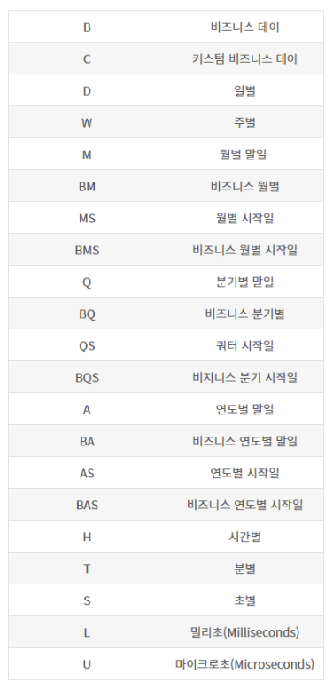

# Pandas Library
판다스는 series, DataFrame등의 자료구조를 활용한 데이터분석 기능을 제공해주는 라이브러리입니다.  
여러 종류의 클래스와 다양한 함수로 구성됩니다. 또한 `시리즈`와 `데이터프레임` 이라는 자료 구조를 제공합니다.  
`시리즈`는 1차원 배열, `데이터프레임`은 2차원 배열로 생각하면 좋습니다.  

판다스는 서로 다른 유형의 데이터를 공통된 포맷으로 정리하는 것을 도와줍니다.  
행과 열로 이루어진 2차원 데이터프레임을 처리 할 수 있는 함수를 제공하며, 실무에서 사용할 때의 형태는 `데이터프레임` 입니다.  

## Series
판다스에서 제공하는 기본 객체 중 하나입니다.  
인덱싱 기능을 추가하여 1차원 배열을 나타냅니다. 이 배열은 numpy의 ndarray를 기반으로 합니다.  
같은 타입의 0개 이상의 데이터를 가질 수 있습니다. 즉, 한 시리즈에 다른 타입의 데이터를 가질 수는 없습니다.  
시리즈를 생성할 때 여러 인수를 넣을 수는 없고, 반드시 집합적 자료형을 이용하여 생성해야 합니다.  

시리즈는 데이터가 순차적으로 나열된 1차원 배열 형태입니다.  
따라서 인덱스(index)와 데이터값(value)이 일대일로 대응됩니다.  
자동으로 0 base 인덱스가 생성되며, 지정한다면 명시적으로 지정된 index를 사용할 수도 있습니다.  

판다스는 문자열은 object 형으로 처리합니다.  
숫자와 문자가 혼용되어 있을때는(서로 다른 데이터 타입), 문자열로 변환되어진다.

범위를 넣을 수도 있다.

### 시리즈 생성
```python
import pandas as pd

s3 = pd.Series(range(10, 14))
s3

# 0    10
# 1    11
# 2    12
# 3    13
# dtype: int64
```

numpy를 활용해 범위에 있는 array를 만들 수 있다.
```python
import numpy as np

np.arange(10)
# array([0, 1, 2, 3, 4, 5, 6, 7, 8, 9])
```

이 또한 시리즈 함수에 적용해 생성할 수 있다.
```python
s4 = pd.Series(np.arange(10))
s4

# 0    0
# 1    1
# 2    2
# 3    3
# 4    4
# 5    5
# 6    6
# 7    7
# 8    8
# 9    9
# dtype: int64
```

결측값 NaN은 np.nan 속성을 이용해서 생성
NaN(결측값)이 있는 경우 dtype이 float으로 변환됨
```python
s = pd.Series([1, 2, 3, np.nan, 6, 8])
s

# 0    1.0
# 1    2.0
# 2    3.0
# 3    NaN
# 4    6.0
# 5    8.0
# dtype: float64
```

인덱스 명시해서 시리즈 만들기
```python
s = pd.Series([10,20,30],index=[1,2,3])
s
# 1    10
# 2    20
# 3    30
# dtype: int64

s = pd.Series([10,20,30],index=['a','b','c'])
s
# a    10
# b    20
# c    30
# dtype: int64
```

이 인덱스를 활용할 수 있다. 시리즈는 index 속성으로 접근 가능.
```python
s['a']
# 10
```

range를 사용해서 인덱스를 만들수도 있다.
```python
s3 = pd.Series(range(10, 14), index=range(1,5))
s3

# 1    10
# 2    11
# 3    12
# 4    13
# dtype: int64

s3.index
# RangeIndex(start=1, stop=5, step=1)

s = pd.Series([10,20,30], index=['a','b','c'])
s.index
# Index(['a', 'b', 'c'], dtype='object')
```
명시해서 생성한 index는(list로 생성한) Index 객체로 생성된다. 위 코드에서 s의 경우.
인덱스를 범위로 생성하면 RangeIndex 객체로 생성된다. 위 코드에서 s3의 경우가 범위로 생성한 경우이다.
생략하는 경우에도 RangeIndex 객체로 생성된다.

원래 list는 변경 가능하지만, 시리즈의 Index에는 접근만 가능하다.
보여지는 것과 사용하는 것은 리스트처럼 되어 있지만 Index 객체이기 때문에 즉, 재할당 할 수 없다.

### Index의 name 속성
인덱스 객체 안에 name 속성으로 인덱스에 대한 설명을 생성할 수 있다.
```python
s= pd.Series([9904312,3448737,289045,2466052], index=["서울","부산","인천","대구"]) 
s.index.name = '광역시'
s
# 광역시
# 서울    9904312
# 부산    3448737
# 인천     289045
# 대구    2466052
# dtype: int64
```


### 시리즈에 접근
```python
s.index
# Index(['서울', '부산', '인천', '대구'], dtype='object', name='광역시')
```

```python
s.values # array 형태로 저장, 시스템(ram)에 가장 가까운 자료구조
# array([9904312, 3448737,  289045, 2466052])
```

.index, .values로 접근 가능


### Series의 name 속성
```python
s.name = '인구'
s
# 광역시
# 서울    9904312
# 부산    3448737
# 인천     289045
# 대구    2466052
# Name: 인구, dtype: int64
```

## 인덱싱
데이터에서 특정한 데이터를 골라내는 것

### 시리즈의 인덱싱 종류
1. 정수형 위치 인덱스(integer position)
2. 인덱스 이름(index name) 또는 인덱스 라벨(index label)

**원소접근**
- 정수형 인덱스 : 숫자 s[0]
- 문자형 인덱스 : 문자 s['인천']

```python
s.index
# Index(['서울', '부산', '인천', '대구'], dtype='object', name='광역시')

s['인천'] # 문자 인덱싱
# 289045

s[2] # 위치(정수) 인덱싱
# 289045
```

명시적 index가 수치일 경우 위치 index 사용 불가
```python
s03 = pd.Series([1,2,3], index=[1,2,3]) #명시한 숫자 인덱스
s03
# 1    1
# 2    2
# 3    3
# dtype: int64

s03[1] # 명시적 index 접근
# 1

s03[0] # 위치 index 접근
# ERROR
```

두개 이상의 인덱싱 코드를 , 를 이용해서 나열하면 튜플 형태로 반환
```python
temp = s[3], s['대구']
temp
# (2466052, 2466052)
```


tip. 노트북 반환값 나오는 설정
```python
from IPython.core.interactiveshell import InteractiveShell 
InteractiveShell.ast_node_interactivity = "all" # Cell의 모든 반환값 출력
InteractiveShell.ast_node_interactivity = "last_expr" # 마지막 코드의 반환값만 출력
```


### 리스트 이용 인덱싱
#### 시리즈 슬라이싱
연속적인 데이터 => 슬라이싱. 시리즈['시작라벨':'끝라벨']
```python
s[1] # 원소값으로 반환 - 정수형 반환
# 3448737

s[1:2] # 슬라이싱을 쓰면 시리즈가 반환된다.
# 광역시
# 부산    3448737
# Name: 인구, dtype: int64

s['부산':'인천']
# 광역시
# 부산    3448737
# 인천     289045
# Name: 인구, dtype: int64
```

#### 리스트 이용 인덱싱
비연속적인 데이터 => 시리즈명[[리스트]]
```python
s[[1]]
# 광역시
# 부산    3448737
# Name: 인구, dtype: int64

s[[1,3]]
# 광역시
# 부산    3448737
# 대구    2466052
# Name: 인구, dtype: int64

s[['서울', '대구']]
# 광역시
# 서울    9904312
# 대구    2466052
# Name: 인구, dtype: int64
```

#### 문자인덱스
`.` 연산자로 접근 가능
하나의 원소에 접근할 때 가능.
문자 인덱스에만 가능하다. 숫자 인덱스는 불가능.
```python
s.서울 # 문자열 처리하지 않아도 된다.
# 9904312

s.1
# ERROR
```

#### 인덱스 통한 데이터 업데이트
기존 값을 업데이트 할 수 있다.
없는 인덱스에 값을 넣어주면 값이 추가된다.
```python
s['서울'] = 10
s
# 광역시
# 서울         10
# 부산    3448737
# 인천     289045
# 대구    2466052
# Name: 인구, dtype: int64

s['경기'] = 100
s
# 광역시
# 서울         10
# 부산    3448737
# 인천     289045
# 대구    2466052
# 경기        100
# Name: 인구, dtype: int64
```

기존의 인덱스 객체를 그대로 가져다 사용할 수도 있다.
```python
s.index
# Index(['서울', '부산', '인천', '대구', '경기'], dtype='object', name='광역시')

s1 = pd.Series(np.arange(5), s.index)
s1.index
# Index(['서울', '부산', '인천', '대구', '경기'], dtype='object', name='광역시')
```

### 시리즈 연산

#### 벡터화 연산
벡터화 연산이란 집합적 자료형의 원소 각각을 독립적으로 계산을 진행하는 방법
단, 연산은 시리즈의 값에만 적용되며 인덱스 값은 변경 불가
```python
pd.Series([1,2,3]) + 4
# 0    5
# 1    6
# 2    7
# dtype: int64
```

```python
s['서울'] = 10000000
s['경기'] = 9000000
# 광역시
# 서울    10000000
# 부산     3448737
# 인천      289045
# 대구     2466052
# 경기     9000000
# Name: 인구, dtype: int64

s/1000000
# 서울    10.000000
# 부산     3.448737
# 인천     0.289045
# 대구     2.466052
# 경기     9.000000
# Name: 인구, dtype: float64

s # 할당하지 않았기 때문에 원본은 변경되지 않음
# 광역시
# 서울    10000000
# 부산     3448737
# 인천      289045
# 대구     2466052
# 경기     9000000
# Name: 인구, dtype: int64
```

#### Boolean selection
s 시리즈의 원소 중 2500000보다 크고 5000000보다 작은 data 추출 => boolean Series 추출
시리즈변수명[조건]. 이 조건 안에 boolean Serie를 넣어 사용하면 Boolean selection.
```python
s > 250e4
# 광역시
# 서울     True
# 부산     True
# 인천    False
# 대구    False
# 경기     True
# Name: 인구, dtype: bool

(s > 250e4) & (s < 500e4)
# 광역시
# 서울    False
# 부산     True
# 인천    False
# 대구    False
# 경기    False
# Name: 인구, dtype: bool

s[(s > 250e4) & (s < 500e4)] # 조건에 true인 데이터만 넘겨준다.
# 광역시
# 부산    3448737
# Name: 인구, dtype: int64
```


```python
s0 = pd.Series(np.arange(10), np.arange(10)+1)
s0 > 5
# 1     False
# 2     False
# 3     False
# 4     False
# 5     False
# 6     False
# 7      True
# 8      True
# 9      True
# 10     True
# dtype: bool

s0[s0>5]
# 7     6
# 8     7
# 9     8
# 10    9
# dtype: int64

s0[s0%2 == 0] # 짝수값을 가지고 있는 데이터 출력
# 1    0
# 3    2
# 5    4
# 7    6
# 9    8
# dtype: int64
```

인덱스 객체에도 벡터화 연산이 가능하다.
```python
s0.index > 0
# array([ True,  True,  True,  True,  True,  True,  True,  True,  True, True])

# 인덱스 값이 5를 초과하는 데이터를 추출
s0[s0.index > 5]
# 6     5
# 7     6
# 8     7
# 9     8
# 10    9
# dtype: int64

# 인덱스 값 6를 초과, 9 미만인 데이터를 추출
s0[(s0.index > 6) & (s0.index < 9)]
# 7    6
# 8    7
# dtype: int64
```

```python
# True 값을 더하게 된다. 즉 true 값의 갯수를 알 수 있다.
(s0 >= 7).sum() 
# 3

# 데이터를 더하고 싶다면 이렇게. 조건의 결과 값들을 합한다.
s0[(s0 >= 7)].sum()
# 24
```

#### 두 시리즈간의 연산
시리즈간의 연산은 같은 인덱스를 찾아 연산
```python
num_s1=pd.Series([1,2,3,4],index=['a','b','c','d'])
num_s1
# a    1
# b    2
# c    3
# d    4
# dtype: int64

num_s2=pd.Series([5,6,7,8],index=['b','c','d','a'])
num_s2
# b    5
# c    6
# d    7
# a    8
# dtype: int64


num_s1 + num_s2
# a     9
# b     7
# c     9
# d    11
# dtype: int64
```

같지 않은 인덱스를 가진 시리즈를 연산하면?
같은 것만 계산하고 나머지는 NaN 를 출력한다. NaN가 포함되어 있으니 타입은 float64
```python
num_s3=pd.Series([5,6,7,8],index=['e','b','f','g'])
num_s4=pd.Series([1,2,3,4],index=['a','b','c','d'])

num_s3 + num_s4
# a    NaN
# b    8.0
# c    NaN
# d    NaN
# e    NaN
# f    NaN
# g    NaN
# dtype: float64
```

인덱스 무시하고 그냥 위치가 같은 것들끼리 연산하고 싶다면 .values 사용
.values 쓰면 시리즈 형태가 없어지고 numpy의 array 객체니까 같은 위치 원소들끼리 연산한다.
```python
num_s3.values # array([5, 6, 7, 8])
num_s4.values # array([1, 2, 3, 4])

num_s3.values + num_s4.values
# array([ 6,  8, 10, 12])
```

## 딕셔너리 와 시리즈의 관계
시리즈 객체는 라벨(문자)에 의해 인덱싱이 가능
실질적으로는 라벨을 key로 가지는 딕셔너리 형과 같다고 볼 수 있음
딕셔너리에서 제공하는 대부분의 연산자 사용 가능
- in 연산자 : T/F
- for 루프를 통해 각 원소의 key와 value에 접근 할수 있다.

in 연산자는 해당 인덱스가 시리즈에 존재하는지의 여부를 T/F로 반환
```python
s
# 광역시
# 서울    10000000
# 부산     3448737
# 인천      289045
# 대구     2466052
# 경기     9000000
# Name: 인구, dtype: int64

'서울' in s
# True

'대전' in s
# False

'대전' not in s
# True
```

딕셔너리의 items() 함수을 시리즈에도 사용할 수 있다. zip 객체를 반환하는데 list 변환 후에 확인할 수 있다.
```python
s.items()
# <zip at 0x1320f9340>

list(s.items())
# [('서울', 10000000),
#  ('부산', 3448737),
#  ('인천', 289045),
#  ('대구', 2466052),
#  ('경기', 9000000)]
```

zip 객체는 for문에 바로 사용할 수도 있다.
리스트 형태(`[]`)는 아니지만 반복문의 요소로 사용 가능
```python
for k in s.items():
    print(k)
# ('서울', 10000000)
# ('부산', 3448737)
# ('인천', 289045)
# ('대구', 2466052)
# ('경기', 9000000)

for k, v in s.items():
    print(k)
# 서울
# 부산
# 인천
# 대구
# 경기

for k, v in s.items():
    print('%s=%d' % (k, v))
# 서울=10000000
# 부산=3448737
# 인천=289045
# 대구=2466052
# 경기=9000000
```

#### 딕셔너리로 시리즈 만들기
인덱스 -> key
값 -> value
```python
scores = {'홍길동':96, '이몽룡':100, '성춘향':88}
s = pd.Series(scores)
s
# 홍길동     96
# 이몽룡    100
# 성춘향     88
# dtype: int64

city = {'서울':9631482,'부산':3393191,'인천':2632035,'대전':1490158}
s = pd.Series(city)
s
# 서울    9631482
# 부산    3393191
# 인천    2632035
# 대전    1490158
# dtype: int64
```

파이썬 버전 업 되면서 딕셔너리로 시리즈를 만들면 판다스도 순서를 보장하는 형태로 변경.
파이썬 2. 버전들은 순서가 보장되지 않음

딕셔너리의 원소는 원칙적으로는 순서를 갖지 않는다.
딕셔너리로 생성된 시리즈의 원소도 원칙적으로는 순서가 보장되지 않는다.
만약 순서를 보장하고 싶으면 인덱스를 리스트로 지정해야 한다.(원칙)
tip. 단, 파이썬 최신 버전은 편리성을 높이기 위해 딕셔너리도 순서를 갖는 구조로 변경되었으므로 기존 딕셔너리 순서가 보장됨(즉, 순서보장되지 않는건 무시해도 됨)
다만 인덱스를 이용해 순서를 명시하는게 가독성이 높음

```python
# 낮은 버전 파이썬을 사용할 때 index 지정해 순서 보장하기
city = {'서울':9631482,'부산':3393191,'인천':2632035,'대전':1490158}
s = pd.Series(city, index=city.keys())
```

#### 시리즈 데이터의 갱신, 추가, 삭제
원소 갱신
```python
s['부산'] = 1630000
s
# 서울    9631482
# 부산    1630000
# 인천    2632035
# 대전    1490158
# dtype: int64
```

원소 삭제: del 명령어 사용(완전삭제)
원본에 바로 반영되어 복원되지 않는다.
```python
del s['서울']
s
# 부산    1630000
# 인천    2632035
# 대전    1490158
# dtype: int64
```

### 시리즈 함수
시리즈나 데이터 프레임이나 다 가지고 있는 함수

size(속성) : 개수 반환
shape(속성) : 튜플형태로 shape반환
unique(함수) : 유일한 값만 ndarray로 반환
count(함수) : NaN을 제외한 개수를 반환
mean(함수): NaN을 제외한 평균
value_counts(함수) : NaN을 제외하고 각 값들의 빈도를 반환

```python
s1 = pd.Series([1, 1, 2, 1, 2, 2, 2, 1, 1, 3, 3, 4, 5, 5, 7, np.NaN])
s1
# 0     1.0
# 1     1.0
# 2     2.0
# 3     1.0
# 4     2.0
# 5     2.0
# 6     2.0
# 7     1.0
# 8     1.0
# 9     3.0
# 10    3.0
# 11    4.0
# 12    5.0
# 13    5.0
# 14    7.0
# 15    NaN
# dtype: float64

len(s1) # python
# 16

s1.size # series의 속성
# 16

s1.shape # 차원으로 표현하기 때문에 튜플형태로 출력된다. 행과 열의 데이터가 나온다
# (16,)

s1.unique() # NaN도 하나의 값으로 보고 표현되어진다.
# array([ 1.,  2.,  3.,  4.,  5.,  7., nan])

s1.count() # NaN를 제외한 원소의 개수
```

```python
a = np.array([2, 2, 2, 2, np.NaN])
a
# array([ 2.,  2.,  2.,  2., nan])

a.mean() # numpy의 array에 mean()을 하면, NaN 포함된 계산을 진행한다. 계산이 안되서 nan을 반환한다.
# nan

b = pd.Series(a) # 배열을 시리즈로 변경하고 계산하면, NaN을 제외시키고 계산한다.
b
# 0    2.0
# 1    2.0
# 2    2.0
# 3    2.0
# 4    NaN
# dtype: float64

b.mean()
# 2.0

s1.mean()
# 2.6666666666666665

s1.value_counts() # 각 원소들에 대해 빈도를 나타낸다. 반환 결과는 빈도가 높은것에서 낮은 순으로, 내림차순으로 반환한다.
# 1.0    5
# 2.0    4
# 3.0    2
# 5.0    2
# 4.0    1
# 7.0    1
# dtype: int64
```

#### 날짜 인덱스를 이용해 시리즈 만들기
날짜: '년-월-일' 형태로 표시

```python
index_date = ['2018-10-07', '2018-10-08', '2018-10-09', '2018-10-10']
s4 = pd.Series([200, 195, np.nan, 205], index=index_date)
s4
# 2018-10-07    200.0
# 2018-10-08    195.0
# 2018-10-09      NaN
# 2018-10-10    205.0
# dtype: float64

type(s4.index[0]) # 문자열로 넣었으니 당연히 str 타입이 나온다.
# str
```

문자열(object)을 날짜 type으로 변환
`pd.to_datetime(object)`
object는 문자열이라도 날짜 형식을 갖춰야 함
```python
index_date = ['2018-10-07', '2018-10-08', '2018-10-09', '2018-10-10']
pd.to_datetime(index_date)
# DatetimeIndex(['2018-10-07', '2018-10-08', '2018-10-09', '2018-10-10'], dtype='datetime64[ns]', freq=None)

s4 = pd.Series([200, 195, np.nan, 205])
s4.index = pd.to_datetime(index_date)
type(s4.index[0])
# pandas._libs.tslibs.timestamps.Timestamp
```

판다스 패키지의 date_range 함수 (날짜생성)
- pd.date_range(start=None, end=None, periods=None, freq='D')
- start : 시작날짜/ end= 끝날짜 / periods = 날짜 생성기간/ fref = 날짜 생성 주기
- start는 필수 옵션/end나 periods는 둘 중 하나가 있어야 함/ freq는 기본 Day로 설정


freq='D' 생략하면 기본값으로 일별 날짜 생성됨

날짜와 관련된 프리퀀시는 대문자로 쓰는 것이 안전하다. 소문자가 다른 의미로 적용되는 것들이 있기도 하고 없기도 하기 때문이다.
```python
# 일별 증가하는 날짜
pd.date_range(start='2018-10-01', end='2018-10-20', freq='D')
# DatetimeIndex(['2018-10-01', '2018-10-02', '2018-10-03', '2018-10-04',
#                '2018-10-05', '2018-10-06', '2018-10-07', '2018-10-08',
#                '2018-10-09', '2018-10-10', '2018-10-11', '2018-10-12',
#                '2018-10-13', '2018-10-14', '2018-10-15', '2018-10-16',
#                '2018-10-17', '2018-10-18', '2018-10-19', '2018-10-20'],
#               dtype='datetime64[ns]', freq='D')

# 3일씩 증가하는 날짜
pd.date_range(start='2018-10-01', end='2018-10-20', freq='3D')
# DatetimeIndex(['2018-10-01', '2018-10-04', '2018-10-07', '2018-10-10',
#                '2018-10-13', '2018-10-16', '2018-10-19'],
#               dtype='datetime64[ns]', freq='3D')

# 주별 증가하는 날짜
pd.date_range(start='2018-10-01', end='2018-10-20', freq='W')
# DatetimeIndex(['2018-10-07', '2018-10-14'], dtype='datetime64[ns]', freq='W-SUN') => 시작요일은 일요일을 기준

# 2018년 10월 1일(월) 이후 일요일 날짜 4개 생성
pd.date_range(start='2018-10-01', periods=4, freq='W')
# DatetimeIndex(['2018-10-07', '2018-10-14', '2018-10-21', '2018-10-28'], dtype='datetime64[ns]', freq='W-SUN')
```
시작요일은 sun을 변경하면 가능하다. default 값은 sun.
판다스 버전에 따라 요일 설정을 변경할 수 없는 경우도 있어서 직접 변경하지 않고 연산을 통해서 변경하는 편이다.

```python
# 월별 말일
pd.date_range(start='2018-10-01', periods=4, freq='M')
# DatetimeIndex(['2018-10-31', '2018-11-30', '2018-12-31', '2019-01-31'], dtype='datetime64[ns]', freq='M')

# 월별 시작일
pd.date_range(start='2018-10-01', periods=4, freq='MS')
# DatetimeIndex(['2018-10-01', '2018-11-01', '2018-12-01', '2019-01-01'], dtype='datetime64[ns]', freq='MS')

# 2달 간격으로 비지니스 월 말일. 휴가 날짜가 세팅되어 있다면 다르게 출력됨. 정확히는 업무일 기준 2개월 간격 월말 주기.
pd.date_range(start='2018-10-01', periods=12, freq='2BM')
# DatetimeIndex(['2018-10-31', '2018-12-31', '2019-02-28', '2019-04-30',
#                '2019-06-28', '2019-08-30', '2019-10-31', '2019-12-31',
#                '2020-02-28', '2020-04-30', '2020-06-30', '2020-08-31'],
#               dtype='datetime64[ns]', freq='2BM')
```

시간
```python
pd.date_range(start='2018-1-20 08:00', periods=10, freq='H')
# DatetimeIndex(['2018-01-20 08:00:00', '2018-01-20 09:00:00',
#                '2018-01-20 10:00:00', '2018-01-20 11:00:00',
#                '2018-01-20 12:00:00', '2018-01-20 13:00:00',
#                '2018-01-20 14:00:00', '2018-01-20 15:00:00',
#                '2018-01-20 16:00:00', '2018-01-20 17:00:00'],
#               dtype='datetime64[ns]', freq='H')

pd.date_range(start='2018-1-20 08:00', periods=10, freq='BH')
# DatetimeIndex(['2018-01-22 09:00:00', '2018-01-22 10:00:00',
#                '2018-01-22 11:00:00', '2018-01-22 12:00:00',
#                '2018-01-22 13:00:00', '2018-01-22 14:00:00',
#                '2018-01-22 15:00:00', '2018-01-22 16:00:00',
#                '2018-01-23 09:00:00', '2018-01-23 10:00:00'],
#               dtype='datetime64[ns]', freq='BH')

pd.date_range(start='2018-1-20 08:00', periods=10, freq='30min')
# DatetimeIndex(['2018-01-20 08:00:00', '2018-01-20 08:30:00',
#                '2018-01-20 09:00:00', '2018-01-20 09:30:00',
#                '2018-01-20 10:00:00', '2018-01-20 10:30:00',
#                '2018-01-20 11:00:00', '2018-01-20 11:30:00',
#                '2018-01-20 12:00:00', '2018-01-20 12:30:00'],
#               dtype='datetime64[ns]', freq='30T')

pd.date_range(start='2018-1-20 08:00', periods=10, freq='10S')
# DatetimeIndex(['2018-01-20 08:00:00', '2018-01-20 08:00:10',
#                '2018-01-20 08:00:20', '2018-01-20 08:00:30',
#                '2018-01-20 08:00:40', '2018-01-20 08:00:50',
#                '2018-01-20 08:01:00', '2018-01-20 08:01:10',
#                '2018-01-20 08:01:20', '2018-01-20 08:01:30'],
#               dtype='datetime64[ns]', freq='10S')
```