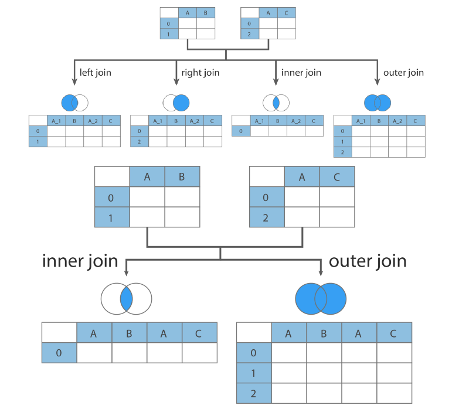
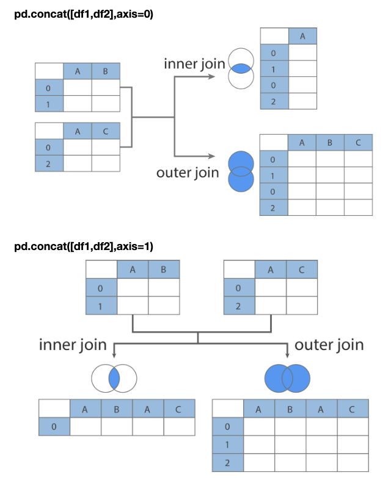

# Pandas - merge, concat

<br>

## 데이터 프레임 병합
pandas는 두개 이상의 데이터 프레임을 하나로 합치는 병합(merge)이나 연결(concat)을 지원한다.  

<br>
<br>

## merge
두개의 데이터 프레임의 공통열 이나 인덱스를 기준으로 두개의 데이터프레임을 합친다.  
이때 기준이되는 열 데이터를 key라고 부른다.  

<br>

### 형식
`df.merge(df1, df2)` : 두 df를 how 방식에 따라 병합시켜 준다.  
how를 작성하지 않으면 default로 inner join(양쪽에 동일하게 존재하는 키만 표시)을 한다.  
모든 인수 생략하고 `df.merge(df1, df2)`만 작성하면, 두 데이터프레임의 공통 이름을 갖고 있는 열이 키가 되고, inner join 한다.  

정리하면,  
**기준열을 넘겨주지 않은 경우, 양쪽 df에서 이름이 같은 공통된 열을 기준으로 merge 한다.**  
**다른 파라미터 없으면 inner join 진행**  

<br>

merge 인수
- `how='병합방식'`
- `on='컬럼명'`
- `left_on='컬럼명'`
- `right_on='컬럼명'`
- `left_index=True`
- `right_index=True`

<br>

key: 기준열을 의미
- 실제 데이터 필드거나 행 인덱스 일 수 있다.

<br>

병합방식(`how=inner/outer/left/right`)
- `how='inner'`: 양쪽 df에서 모두 키가 존재하는 data만표시. default
- `how='outer'`: 키 값이 어느 한쪽에만 있어도 데이터를 보여 줌. 어느 한 df에 데이터가 존재하지 않으면 NaN으로 표시됨. 
- `how='left'` : 왼쪽 df에 있는 모든 키의 데이터는 표시
- `how='right'` : 오른쪽 df 에 있는 모든 키의 데이터는 표시
`how='left/right'`인 경우 결합되는 df의 순서에 따라 다른 결과가 나옴



<br>

### inner join(기본 merge)
```python
df1
	고객번호	이름
0	1001	둘리
1	1002	도우너
2	1003	또치
3	1004	길동
4	1005	희동
5	1006	마이콜
6	1007	영희

df2
	고객번호	금액
0	1001	10000
1	1001	20000
2	1005	15000
3	1006	5000
4	1008	100000
5	1001	30000


# df1.merge(df2) 와 같은 결과
pd.merge(df1, df2)
	고객번호	이름	금액
0	1001	둘리	10000
1	1001	둘리	20000
2	1001	둘리	30000
3	1005	희동	15000
4	1006	마이콜	 5000
```

<br>

### outer join
```python
pd.merge(df1, df2, how='outer')
	고객번호	이름	금액
0	1001	둘리	10000.0
1	1001	둘리	20000.0
2	1001	둘리	30000.0
3	1002	도우너	 NaN
4	1003	또치	 NaN
5	1004	길동	 NaN
6	1005	희동	15000.0
7	1006	마이콜	 5000.0
8	1007	영희	 NaN
9	1008	NaN	   100000.0
```

<br>

### left/right join
```python
pd.merge(df1, df2, how ='left')
	고객번호	이름	금액
0	1001	둘리	10000.0
1	1001	둘리	20000.0
2	1001	둘리	30000.0
3	1002	도우너	 NaN
4	1003	또치	 NaN
5	1004	길동	 NaN
6	1005	희동	15000.0
7	1006	마이콜	 5000.0
8	1007	영희	 NaN

pd.merge(df2, df1, how ='left')
    고객번호	금액	이름
0	1001	10000	둘리
1	1001	20000	둘리
2	1005	15000	희동
3	1006	5000	마이콜
4	1008	100000	NaN
5	1001	30000	둘리

pd.merge(df1, df2, how='right')
	고객번호	이름	금액
0	1001	둘리	10000
1	1001	둘리	20000
2	1005	희동	15000
3	1006	마이콜	 5000
4	1008	NaN	   100000
5	1001	둘리	30000
```
키값이 동일한 데이터가 여러개 있는 경우에는, 있을 수 있는 모든 경우의 수를 따져서 조합을 만들어 낸다.  

<br>

다른 예제
```python
df1 = pd.DataFrame({
    '품종':['setosa','setosa','virginica','virginica'],
    '꽃잎길이':[1.4,1.3,1.5,1.3]
}, columns=['품종','꽃잎길이'])

df1
    품종	    꽃잎길이
0	setosa	    1.4
1	setosa	    1.3
2	virginica	1.5
3	virginica	1.3

df2 = pd.DataFrame({
    '품종': ['setosa','virginica','virginica','ersicolor'],
    '꽃잎너비':[0.4,0.3,0.5,0.3]
},columns=['품종','꽃잎너비'])

df2
    품종	    꽃잎너비
0	setosa	    0.4
1	virginica	0.3
2	virginica	0.5
3	ersicolor	0.3
```

위 데이터에서 키값 setosa에 대해, df1에는 2개의 데이터가 있고 df2에는 1개의 데이터가 있으므로, 병합 데이터에는 setosa (1.4, 0.4), (1.3, 0.4)의 2 경우가 모두 표현된다.  
키값 virginica의 경우에는 df1에 2개 df2에 2개의 데이터가 있으므로, 2개와 2개의 조합에 의해 4개의 데이터가 표현된다.  
```python
pd.merge(df1, df2)
    품종	    꽃잎길이  꽃잎너비
0	setosa	    1.4	    0.4
1	setosa	    1.3	    0.4
2	virginica	1.5	    0.3
3	virginica	1.5	    0.5
4	virginica	1.3	    0.3
5	virginica	1.3	    0.5
```

<br>

### on
병합하는 두 데이터 프레임에서 이름이 같은 열은 모두 키가 될 수 있다.  
이름이 같아도 키가되면 안되는 열이 있으면 `on` 인수로 기준열을 명시해야 한다.  
`on` 인수는 기준열을 직접 지정하는 인수이다. `on=기준열 이름`  
```python
df1 = pd.DataFrame({
    '고객명':['춘향','춘향','몽룡'],
    '날짜' : ['2018-01-01','2018-01-02','2018-01-01'],
    '데이터':[20000,30000,100000]
})
df1
	고객명	    날짜	  데이터
0	춘향	2018-01-01	20000
1	춘향	2018-01-02	30000
2	몽룡	2018-01-01	100000

df2 = pd.DataFrame({
    '고객명':['춘향','몽룡'],
    '데이터':['여자','남자']
})
df2
    고객명	데이터
0	춘향	여자
1	몽룡	남자

pd.merge(df1, df2, on='고객명')
	고객명	    날짜	 데이터_x  데이터_y
0	춘향	2018-01-01	20000	여자
1	춘향	2018-01-02	30000	여자
2	몽룡	2018-01-01	100000	남자
```
반환 결과에 동일 필드명이 있을경우에는 필드명_x, 필드명_y로 필드명을 변경해서 표현한다.  

<br>

### left_on, right_on
키가 되는 기준열이 두 데이터 프레임에서 다르게 나타나면 `left_on`, `right_on` 인수를 사용해서 기준열을 명시해야 한다.  
```python
df1=pd.DataFrame({
    '이름' :['영희','철수','철수'],
    '성적' :[90,80,80]
})
df1
    이름	성적
0	영희	90
1	철수	80
2	철수	80

df2 = pd.DataFrame({
    '성명' :['영희','영희','철수'],
    '성적2':[100,80,90]
})
df2
    성명	성적2
0	영희	100
1	영희	80
2	철수	90

pd.merge(df1, df2, left_on='이름', right_on='성명')
    이름	성적	 성명	성적2
0	영희	90	    영희	100
1	영희	90	    영희	80
2	철수	80	    철수	90
3	철수	80	    철수	90
```

<br>

### left_index, right_index
일반 데이터 열이 아닌 인덱스를 기준으로 merge할 수도 있음  
인덱스를 기준열로 사용하려면 `left_index=True` 또는 `right_index=True`  
```python
df1
    도시	연도	인구
0	서울	2000	9853972
1	서울	2005	9762546
2	서울	2010	9631482
3	부산	2000	3655437
4	부산	2005	3512547

df2
		        데이터1	 데이터2
부산	 2000	 0	     1
        2005	2	    3
서울	 2000	 4	     5
        2005	6	    7
        2010	8	    9
        2015	10	    11

pd.merge(df1, df2, left_on=['도시', '연도'], right_index=True)
    도시	연도	인구	    데이터1	데이터2
0	서울	2000	9853972	    4	5
1	서울	2005	9762546	    6	7
2	서울	2010	9631482	    8	9
3	부산	2000	3655437	    0	1
4	부산	2005	3512547	    2	3
```

```python
df1 = pd.DataFrame(
[[1.,2.],[3.,4.],[5.,6.]],
index=['a','c','e'],
columns=['서울','부산'])
df1
    서울	부산
a	1.0	   2.0
c	3.0	   4.0
e	5.0	   6.0

df2=pd.DataFrame(
[[7.,8.],[9.,10.],[11.,12.],[13.,14.]],
    index=['b','c','d','e'],
columns=['대구','광주'])
df2
	대구	 광주
b	7.0	    8.0
c	9.0	    10.0
d	11.0	12.0
e	13.0	14.0

# 양쪽 데이터프레임에 key가 모두 인덱스 인 경우
pd.merge(df1, df2, left_index=True, right_index=True, how='outer')
    서울	부산	대구	광주
a	1.0	   2.0	  NaN	NaN
b	NaN	   NaN	  7.0	8.0
c	3.0	   4.0	  9.0	10.0
d	NaN	   NaN	  11.0	12.0
e	5.0	   6.0	  13.0	14.0
```

<br>
<br>

## concat
concat 명령을 사용하면 기준열 없이 데이터를 연결한다.  
`axis=0`: 위 아래로 데이터 행 결합(row bind). 생략시 default  
`axis=1`: 열 결합(column bind)을 수행한다.  
단순히 두 시리즈나 데이터프레임을 연결하기 때문에 인덱스 값이 중복될 수 있다.  

join 생략 시 결합방식은 'outer'를 default로 한다.  

```python
pd.concat(objs, # Series, DataFrame, Panel object
        axis=0, # 0: 위+아래로 합치기, 1: 왼쪽+오른쪽으로 합치기
        join='outer', # 'outer': 합집합(union), 'inner': 교집합(intersection)
        ignore_index=False, # False: 기존 index 유지, True: 기존 index 무시
        keys=None,) # 계층적 index 사용하려면 keys 튜플 입력
```



<br>

### 시리즈 concat - 행결합
```python
s1=pd.Series([0,1],index=['A','B'])
s1
A    0
B    1
dtype: int64

s2=pd.Series([2,3,4],index=['A','B','C'])
s2
A    2
B    3
C    4
dtype: int64

pd.concat([s1,s2])
A    0
B    1
A    2
B    3
C    4
dtype: int64
```

<br>

### 데이터프레임 concat - 행결합
```python
df1
    A	B	C	D
0	A0	B0	C0	D0
1	A1	B1	C1	D1
2	A2	B2	C2	D2
3	A3	B3	C3	D3

df2
	A	B	E	F
0	A4	B4	C4	D4
1	A5	B5	C5	D5
2	A6	B6	C6	D6
3	A7	B7	C7	D7

df3
    A	B	C	O
1	A8	B8	C8	D8
2	A9	B9	C9	D9
3	A10	B10	C10	D10
4	A11	B11	C11	D11

result = pd.concat([df1, df2, df3]) # 행방향 결합, join='outer'
result
	A	B	C	D	E	F	O
0	A0	B0	C0	D0	NaN	NaN	NaN
1	A1	B1	C1	D1	NaN	NaN	NaN
2	A2	B2	C2	D2	NaN	NaN	NaN
3	A3	B3	C3	D3	NaN	NaN	NaN
0	A4	B4	NaN	NaN	C4	D4	NaN
1	A5	B5	NaN	NaN	C5	D5	NaN
2	A6	B6	NaN	NaN	C6	D6	NaN
3	A7	B7	NaN	NaN	C7	D7	NaN
1	A8	B8	C8	NaN	NaN	NaN	D8
2	A9	B9	C9	NaN	NaN	NaN	D9
3	A10	B10	C10	NaN	NaN	NaN	D10
4	A11	B11	C11	NaN	NaN	NaN	D11

result = pd.concat([df1, df2, df3], join='inner') # 행방향 결합, 세 df의 컬럼명이 중복된 열만 표현
result
    A	B
0	A0	B0
1	A1	B1
2	A2	B2
3	A3	B3
0	A4	B4
1	A5	B5
2	A6	B6
3	A7	B7
1	A8	B8
2	A9	B9
3	A10	B10
4	A11	B11
```

<br>

### key 활용 - 행결합
인덱스가 중복 가능하기 때문에 key를 활용해 멀티 인덱스를 생성해줄 수 있다.  
key는 `keys=[]` 형식을 따라 작성해야 하며, concat하는 데이터프레임의 갯수만큼 array로 설정하면 된다.  
`keys=[]`는 상위레벨 인덱스 설정한다.  

outer join with keys
```python
result = pd.concat([df1, df2, df3], keys=['x', 'y', 'z']) # 행방향 결합, join='outer'
result
		A	B	C	D	E	F	O
x	0	A0	B0	C0	D0	NaN	NaN	NaN
    1	A1	B1	C1	D1	NaN	NaN	NaN
    2	A2	B2	C2	D2	NaN	NaN	NaN
    3	A3	B3	C3	D3	NaN	NaN	NaN
y	0	A4	B4	NaN	NaN	C4	D4	NaN
    1	A5	B5	NaN	NaN	C5	D5	NaN
    2	A6	B6	NaN	NaN	C6	D6	NaN
    3	A7	B7	NaN	NaN	C7	D7	NaN
z	1	A8	B8	C8	NaN	NaN	NaN	D8
    2	A9	B9	C9	NaN	NaN	NaN	D9
    3	A10	B10	C10	NaN	NaN	NaN	D10
    4	A11	B11	C11	NaN	NaN	NaN	D11
```

멀티 인덱스에 접근하는 방법
```python
result.loc[('x', 0), 'C']
# 'C0'

result.loc['x'].loc[0]
A     A0
B     B0
C     C0
D     D0
E    NaN
F    NaN
O    NaN
Name: 0, dtype: object

result.loc['x'].loc[0]['C']
# 'C0'

result.loc['x'].loc[0:1]
	A	B	C	D	E	F	O
0	A0	B0	C0	D0	NaN	NaN	NaN
1	A1	B1	C1	D1	NaN	NaN	NaN

result.loc[('x', 0), 'A':'C']
A    A0
B    B0
C    C0
Name: (x, 0), dtype: object
```

inner join with keys
```python
result = pd.concat([df1, df2, df3], keys=['x', 'y', 'z'], join='inner') # 행방향 결합, 세 df의 컬럼명이 중복된 열만 표현
result
		A	B
x	0	A0	B0
    1	A1	B1
    2	A2	B2
    3	A3	B3
y	0	A4	B4
    1	A5	B5
    2	A6	B6
    3	A7	B7
z	1	A8	B8
    2	A9	B9
    3	A10	B10
    4	A11	B11
```

<br>

### ignore_index 
`ignore_index=True` 설정을 하면, 기존 인덱스를 제거하고 제로베이스 인덱스를 설정한다.  
concat시 index가 중복될 수 있기 때문에, 기존 index 제거하고 기본 인덱스로 재설정할 때 사용한다.  
```python
pd.concat([df1, df2, df3], ignore_index=True, join='inner')
	A	B
0	A0	B0
1	A1	B1
2	A2	B2
3	A3	B3
4	A4	B4
5	A5	B5
6	A6	B6
7	A7	B7
8	A8	B8
9	A9	B9
10	A10	B10
11	A11	B11
```

<br>

### 데이터프레임 concat - 열결합
```python
df1=pd.DataFrame(
    np.arange(6).reshape(3,2),
    index=['a','b','c'],
    columns=['데이터1','데이터2']
)

df2=pd.DataFrame(
    5+np.arange(4).reshape(2,2),
    index=['a','c'],
    columns=['데이터2','데이터4']
)

df1
    데이터1	데이터2
a	0	    1
b	2	    3
c	4	    5

df2
    데이터2	데이터4
a	5	    6
c	7	    8


pd.concat([df1, df2], axis=1) # 열방향 결합, outer join
    데이터1	데이터2	데이터2	데이터4
a	0	   1	 5.0	6.0
b	2	   3	 NaN	NaN
c	4	   5	 7.0	8.0

pd.concat([df1, df2], axis=1, join='inner') # 열방향 결합, inner join
    데이터1	데이터2	데이터2	데이터4
a	0	   1	 5	    6
c	4	   5	 7	    8
```

<br>

### key 활용 - 열결합
```python
test = pd.concat([df1, df2], axis=1, join='inner', keys=['x', 'y'])
test
	            x	             y
    데이터1	  데이터2	데이터2	  데이터4
a	0	    1	     5	     6
c	4	    5	     7	     8

test.x
	데이터1	데이터2
a	0	   1
c	4	   5

test.x.데이터1
a    0
c    4
Name: 데이터1, dtype: int32
```

<br>

### concat을 활용한 행 추가
```python
df1 = pd.DataFrame(
      np.arange(6).reshape(3,2),
      index=['a','b','c'],
      columns=['데이터1','데이터2']
)
df1
    데이터1	데이터2
a	0	    1
b	2	    3
c	4	    5

df2 = pd.DataFrame([[5, 4]], index=['d'], columns=['데이터1', '데이터2'])
df2
	데이터1	데이터2
d	5	    4

temp = pd.concat([df1, df2])
temp
	데이터1	데이터2
a	0	    1
b	2	    3
c	4	    5
d	5	    4
```

<br>
