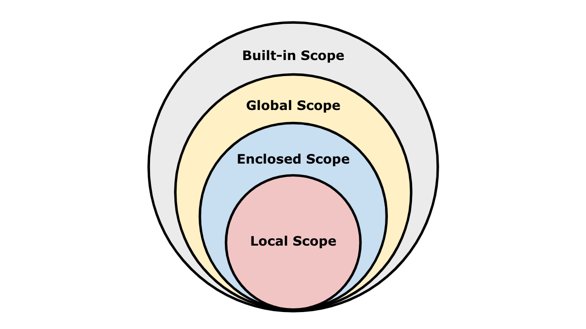
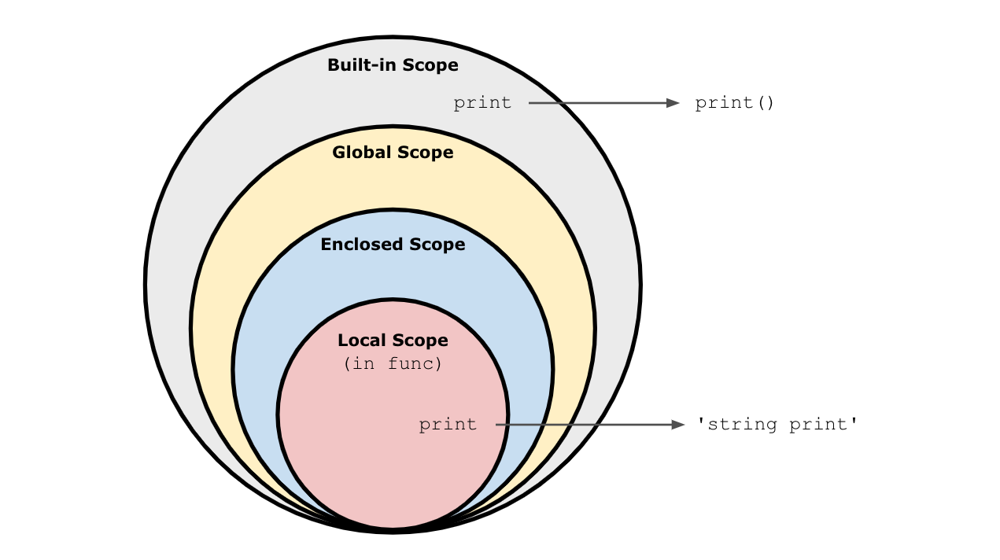
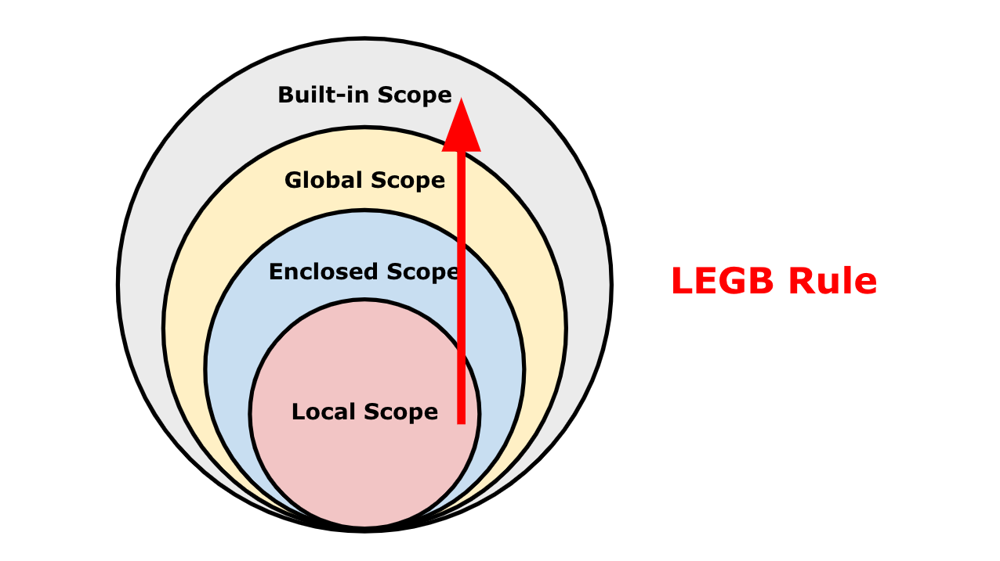

# Python Scope
## Scope(유효범위)
파이썬에서 스코프는 크게 두가지로 나뉩니다.  
둘을 나누는 기준은 오로지 함수 뿐입니다. 함수로 인해 글로벌인지 로컬인지가 나뉘게 됩니다.  
- Global Scope: 어디에서든지 참조할 수 있는 공간
- Local Scope: 함수 내부에서만 참조할 수 있는 공간

<br>

글로벌 스코프에서 정의된 변수를 전역 변수(global variable) 라고 하고, 로컬 스코프에서 정의된 변수를 지역 변수(local variable)라고 합니다.

```python
a = 10  # global variable

def func(b):
    c = 20
    # local variable (b, c)

func(a) 
```

<br>

전역 변수와 지역 변수의 이름을 같게 하면 어떻게 될까요?  
로컬 스코프에서는 전역 변수의 값을 참조할 수는 있지만, 변경은 불가합니다.  
따라서 같은 변수 이름이라 할지라도 재할당이 이루어지지 않고, 로컬 스코프 안에 새로운 변수가 만들어지는 방식으로 동작합니다.  
```python
a = 10

def func():
    a = 20
    print(a)

func() # 20
print(a) # 10
```

<br>

글로벌 스코프와 로컬 스코프 외에도 두가지의 스코프가 더 있습니다.
- Built-in Scope: 파이썬 내장 함수 등이 해당되는 범위입니다.
- Enclosed Scope: 중첩된 함수의 경우, 가장 가까운 상위 함수의 값들을 참조하는데 그때 사용되는 범위의 개념이라고 생각하면 됩니다.

<br>

짚고 넘어가자면, 전체적인 스코프는 아래 그림과 같이 구성됩니다.  


<br>

### Built-in Scope
빌트인 스코프 범위에 속해있는 내장함수인 `print()` 를 통해 실험을 해보겠습니다.  
임의의 함수 안에서 `print` 에 str을 할당하여 동작하지 못하게 만들었습니다.  
```python
def func():
    print = 'string print'

func()
print('something') # 'something'
```

그럼에도 `print` 는 동작합니다.  
가능한 이유는 당연하게도, `func` 함수의 로컬 스코프 안에서만 `print` 가 str이기 때문입니다.  
글로벌 스코프에서 호출된 `print` 는 빌트인 스코프로 올라가 그곳에 저장되어 있는 `print` 를 호출했습니다.  

즉, `func` 함수 내에서 변경한(할당한) `print` 와 호출된 `print` 는 다른 것입니다.


<br>

### Enclosed Scope
함수 안에 함수가 중첩되어 있을 때, 가장 가까운 상위 함수(부모 함수)의 변수 값을 참조할 수도 있습니다. 이때 사용되는 개념이 Enclosed Scope 입니다.
```python
a = 10  # Global
b = 20  # Global

def enclosed():
    a = 100  # Local
    print(a)  # Local
    
    def local():
        c = 40  # Local
        print(a)  # Enclosed
        print(b)  # Global
    
    local()
    
enclosed()

# 100
# 100
# 20
```

<br>
<br>

## 이름 검색(resolution) 규칙
파이썬에서 사용되는 이름(식별자)들은 이름공간(namespace)에 저장되어 있습니다.  
이름을 찾아나가는 순서는 다음과 같습니다.
1. Local Scope: 함수 내부
2. Enclosed Scope: 특정 함수의 상위 함수 내부
3. Global Scope: 함수 밖의 변수 혹은 import된 모듈
4. Built-in Scope: 파이썬 안에 내장된 함수 또는 속성

<br>



이와 같은 순서로 찾아나가는 것을 앞글자를 따서 `LEGB Rule` 이라고 합니다.  
해당 스코프에 찾으려는 변수가 없는 경우, `LEGB Rule`을 따라 이름을 검색합니다.  

<br>

주의해야 할 사항
- 변수에 접근은 가능하지만, 재할당(변경)은 불가합니다.
- 값을 할당한다면, 할당하는 해당 스코프의 이름공간에 새롭게 값이 생성됩니다.
- 함수 내에서 필요한 상위 스코프의 변수는 인자로 넘겨받아 사용합니다.(보통의 함수 사용 방법입니다.)

<br>

`LEGB Rule`에 따르면, 함수 내부에서 외부의 변수에 접근이 가능합니다.  
그럼 변경은 가능할까요? 원칙적으로는 불가합니다.

하지만 `global` 키워드를 사용하면 로컬에서 글로벌의 변수를 변경할 수는 있습니다.
`global` 키워드를 사용하면 코드가 복잡해지고 변경사항을 추적하기 어렵기 때문에 오류가 발생할 확률이 높아집니다.  
때문에, `global` 키워드는 되도록 사용하는 것을 지양해야 합니다.  
```python
num = 10

def local_scope():
    global num # 여기에서부터 num은 글로벌 스코프에 있는 num을 가리키게 됩니다.
    
    num = 100
    print(num)
    
local_scope()
print(num)
# 100
# 100
```

<br>
<br>

## 레퍼런스 타입의 경우
위에서 우리는 스코프에 대해 다루면서, 상위 스코프의 변수에 접근은 가능하지만, 재할당(변경)은 불가하다는 것을 알게 되었습니다.  
하지만 레퍼런스 타입 데이터의 경우는 조금 이야기가 다릅니다. 로컬 스코프에서 글로벌 변수(전역변수)를 수정하면 글로벌 변수가 그대로 수정되는 것을 볼 수 있기 때문입니다.

<br>

새로운 할당을 할 때면 원래 예상했던 것처럼 해당 스코프 내에서 새로운 변수로서 생성되지만,
```python
numbers = [1, 2, 3]

def func():
    numbers = [100, 200, 300]
    print(numbers)
    
func()

print(numbers)
# [100, 200, 300]
# [1, 2, 3]
```

아래와 같이 참조를 통해 변경한다면 같은 값을 가리키고 있기 때문에 변경이 가능하게 됩니다.  
```python
numbers = [1, 2, 3]

def func():
    numbers.append(100)
    numbers.append(200)
    numbers.append(300)
    print(numbers)
    
func()

print(numbers)
# [1, 2, 3, 100, 200, 300]
# [1, 2, 3, 100, 200, 300]
```

함수 내부에서 외부에 있는 값을 그대로 복사하여 사용하고 싶을 때, 참조를 사용하면 이런 문제가 생깁니다.  
따라서 참조 대신 카피를 해 사용해야 안전합니다.

<br>

1 깊이(1 depth)만을 카피하는 shallow copy 방식과, 깊이와 관계 없이 내부를 완전하게 복사하는 deep copy 방식이 있습니다.  
```python
a = [1, 2]

# reference
b = a

# shallow copy
c = a[:]
d = a.copy()

# deep copy
import copy
e = copy.deepcopy(a)
```

<br>
<br>

## 수명주기(lifecycle)
각각의 변수는 수명주기가 있습니다. 변수가 언제 생성되고 언제까지 유지되는지에 대한 것입니다.  
변수의 수명주기는 변수가 속해있는 스코프에 따라 다릅니다.  
- Built-in Scope: 파이썬이 실행되고 영원히 유지
- Global Scope: 모듈이 호출된 시점 이후, 혹은 이름이 선언된 이후부터 인터프리터가 끝날 때까지 유지
- Local Scope: 함수가 호출될 때 생성되고, 함수가 종료될 때까지 유지
  
<br>
