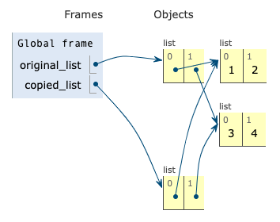

# Python Method

## String
string은 변경불가하고(immutable), 순서가 있고(ordered), 순회 가능한(iterable) 데이터입니다.

<br>

### `.find(x)`
문자열에서 x가 있는 **첫 번째 위치**를 반환합니다. 없으면 -1을 반환합니다.
```python
a = 'hello'

print(a.find('l'))
print(a.find('a'))
# 2
# -1
```

<br>

### `.index(x)`
문자열에서 x가 있는 **첫 번째 위치**를 반환합니다. 위의 `.find(x)`와 역할이 같습니다.  
하지만 없을 경우에 오류가 발생하는 점이 다릅니다.  
```python
a = 'hello'

print(a.index('l'))
print(a.index('a'))
# 2
# ValueError: substring not found
```

<br>

### `.startswith(x)` / `.endswith(x)`
`.startswith(x)`는 문자열이 x로 시작하면 True를 반환하고 아니면 False를 반환합니다.  
`.endswith(x)`는 문자열이 x로 끝나면 True를 반환하고 아니면 False를 반환합니다.  
```python
a = 'hello world'

print(a.startswith('hell'))
print(a.endswith('d'))
# True
# True
```

<br>

### 문자열 판별 메서드
- `.isalpha()` : 문자열이 (숫자가 아닌)글자로 이루어져 있는지 판별합니다.
- `.isspace()` : 문자열이 공백으로 이루어져 있는지 판별합니다.
- `.isupper()` : 문자열이 대문자로 이루어져 있는지 판별합니다.
- `.istitle()` : 문자열이 타이틀 형식으로 이루어져 있는지 판별합니다.
- `.islower()` : 문자열이 소문자로 이루어져 있는지 판별합니다.

<br>

### 숫자 판별 메서드
- `.isdecimal()` : 문자열이 0~9까지의 수로 이루어져 있는지 판별합니다.
- `.isdigit()` : 문자열이 숫자로 이루어져 있는지 판별합니다.
- `.isnumeric()` : 문자열을 수로 볼 수 있는지 판별합니다.

<br>

### `.replace(old, new, [count])`
문자열의 특정 문자를 새로운 문자로 바꿔서 반환합니다. count를 지정하면 그 수만큼 변환합니다.
```python
a = 'heeelloooooo'

print(a.replace('o', '-', 3))
# 'heeell---ooo'
```

<br>

### `.strip([chars])` / `.lstrip([chars])` / `.rstrip([chars])`
특정 문자를 지정하면 문자열의 양쪽에서 또는 왼쪽, 오른쪽에서 문자열을 제거한 값을 반환합니다.  
chars 파라미터를 지정하지 않으면 공백을 제거합니다.
```python
a = '   hello!  \n'
b = 'hihihihahahahihi'

print(a.strip()) # 양쪽 공백 제거
print(a.lstrip()) # 왼쪽 공백 제거
print(a.rstrip()) # 오른쪽 공백 제거
# 'hello!'
# 'hello!  
#  '
# '   hello!'

print(b.strip('ih')) # 양쪽 'i', 'h' 문자 제거
print(b.lstrip('ih')) # 왼쪽 'i', 'h' 문자 제거
print(b.rstrip('ih')) # 오른쪽 'i', 'h' 문자 제거
# ahaha
# ahahahihi
# hihihihahaha
```

<br>

### `.split([chars])`
문자열을 특정한 기준으로 나누어 리스트로 반환합니다.  
chars 파라미터를 지정하지 않으면 공백을 기준으로 나누어 리스트로 만듭니다.
```python
a = 'hello_world_!'
b = 'hello world !'

print(a.split('_')) # '_'을 기준으로 나누기
# ['hello', 'world', '!']

print(a.split(' ')) # 공백을 기준으로 나누기
print(a.split()) # 공백을 기준으로 나누기
# ['hello', 'world', '!']
# ['hello', 'world', '!']
```

<br>

### `'separator'.join(iterable)`
iterable 데이터에 사용합니다. separator(구분자)로 이어 붙인 문자열을 반환합니다.
```python
words = ['hello', 'world']

print('_'.join(words))
# 'hello_world'
```

<br>

### `.capitalize()` / `.title()` / `.upper()` / `.lower()` / `.swapcase()`
- `.capitalize()` : 앞글자를 대문자로 만들어 반환합니다.
- `.title()` : 어포스트로피(*'*)나 공백 이후를 대문자로 만들어 반환합니다.
- `.upper()` : 모두 대문자로 만들어 반환합니다.
- `.lower()` : 모두 소문자로 만들어 반환합니다.
- `.swapcase()` : 대 <-> 소문자로 변경하여 반환합니다.

<br>

### `string` 의 모든 메서드 확인
내장함수 `dir`을 통해 컨테이너가 가지고 있는 메서드를 확인할 수 있습니다.
```python
dir('string')
```

<br>
<br>

## List
List는 변경 가능하고(mutable), 순서가 있고(ordered), 순회 가능한(iterable) 데이터입니다.  
mutable한 것들은 보통 return 값이 없습니다.(예외케이스: pop)  
그 값을 직접 변경하기 때문에 새로운 값을 내놓지 않습니다.  

<br>

### `.append(x)`
리스트의 맨 끝에 `x` 값을 추가합니다.
```python
colors = ['red', 'blue']

colors.append('green') # 1개씩만 추가할 수 있습니다.
print(colors)
# ['red', 'blue', 'green']
```

<br>

### `.extend(iterable)`
리스트의 맨 끝에 iterable(list, range, tuple, string) 값을 추가합니다.
```python
colors = ['red', 'blue']

colors.extend(['green', 'orange'])  # iterable 값을 추가할 수 있습니다.
print(colors)
# ['red', 'blue', 'green', 'orange']

colors.extend('pink') # string을 그냥 붙이면 이 값도 iterable 하게 받아들입니다.
# ['red', 'blue', 'green', 'orange', 'p', 'i', 'n', 'k']
```

`+-` 연산자로도 리스트를 추가할 수 있습니다.  
이 경우 기존 리스트는 변경되지 않습니다.
```python
colors = ['red', 'blue']

colors + ['white']
print(colors)
# ['red', 'blue']

colors_with_white = colors + ['white']
print(colors_with_white)
# ['red', 'blue', 'white']
```

<br>

### `.insert(i, x)`
리스트의 정해진 위치 `i`에 값 `x`를 추가합니다.
```python
numbers = ['one', 'three']

numbers.insert(1, 'two')
print(numbers)
# ['one', 'two', 'three']

numbers.insert(len(numbers), 'four') # 마지막에 추가할 땐, len을 사용합니다.
print(numbers)
# ['one', 'two', 'three', 'four']
```
사실, 리스트 마지막에 요소를 추가하는 메서드는 `insert` 보다 `append` 가 더 편할 것입니다.

<br>

### `.remove(x)`
리스트에서 값이 `x`인 **첫번째 항목**을 삭제합니다.  
그 항목이 없다면 에러가 발생합니다.
```python
numbers = [1, 2, 3, 1, 2]

numbers.remove(2)
print(numbers)
# [1, 3, 1, 2]

numbers.remove(5)
print(numbers)
# list.remove(x): x not in list
```

<br>

### `.pop([i])`
리스트에서 정해진 위치 `i` 에 있는 값을 삭제하고, 그 값을 반환합니다.  
`i`를 작성하지 않는다면, 맨 마지막 항목을 삭제합니다.  
```python
numbers = [1, 2, 3, 4, 5, 6]

print(numbers.pop())
# 6
print(numbers)
# [1, 2, 3, 4, 5]

print(numbers.pop(2))
# 3
print(numbers)
# [1, 2, 4, 5]
```

<br>

### `.clear()`
리스트의 모든 항목을 삭제합니다.  
리스트에 빈 리스트를 할당하는 것과는 완전히 다릅니다. id 값을 확인해보면 차이를 알 수 있습니다.  
```python
numbers = [1, 2, 3, 4, 5, 6]
print(id(numbers))
# 4385956672

numbers.clear()
print(numbers)
# []
print(id(numbers))
# 4385956672

numbers = []
print(id(numbers))
# 4385819264
```

<br>

### `.index(x)`
`x` 값을 찾아 해당 index 값을 반환합니다.  
찾는 값이 없으면 오류가 발생합니다.
```python
numbers = [1, 2, 3, 4, 5]

print(numbers.index(3))
# 2
```

<br>

### `.count(x)`
`x` 값의 개수를 반환합니다.
```python
a = [1, 2, 5, 1, 5, 1]

print(a.count(5))
# 2
```

<br>

### `.sort()`
리스트를 정렬합니다.  
내장함수인 `sorted`와는 조금 다릅니다. `sorted`는 원본을 바꾸지 않고 정렬된 값을 반환합니다. `sort`는 원본을 바꾸고 None을 반환합니다.  
파라미터로 `key`와 `reverse`를 넘겨줄 수 있습니다.
```python
score_list = [100, 300, 50, 250, 70, 180]

score_list.sort()
print(score_list)
# [50, 70, 100, 180, 250, 300]

score_list.sort(reverse=True)
print(score_list)
# [300, 250, 180, 100, 70, 50]


students = [
    { 'id': 1, 'name': 'a', 'balance': 200 },
    { 'id': 2, 'name': 'b', 'balance': 400 },
    { 'id': 3, 'name': 'c', 'balance': 300 },
    { 'id': 4, 'name': 'd', 'balance': 500 },
]
students.sort(key=lambda student: student['balance']) # balance 오름차순으로 정렬
print(students)
# [{'id': 1, 'name': 'john', 'balance': 200},
#  {'id': 3, 'name': 'david', 'balance': 300},
#  {'id': 2, 'name': 'ashley', 'balance': 400},
#  {'id': 4, 'name': 'lee', 'balance': 500}]
```

<br>

### `.reverse()`
리스트의 요소들을 원본의 반대 순서로 뒤집습니다. 여기에서 순서는 정렬과 관계 없습니다.
내장함수 `reversed()` 와는 다르게 원본을 바꾸고 None을 반환합니다.
```python
num_list = [1, 5, 3, 8, 9]

num_list.reverse()
print(num_list)
# [9, 8, 3, 5, 1]
```

<br>

### `list` 의 모든 메서드 확인
list 또한, 내장함수 `dir`을 통해 컨테이너가 가지고 있는 메서드를 확인할 수 있습니다.
```python
dir(list)
```

<br>
<br>

## Tuple
Tuple은 변경할 수 없는 불변(Immutable) 자료형입니다. 때문에 값에 영향을 미치지 않는 메서드만 지원합니다.

<br>

### `.index(x, [start, [end]])`
튜플에 있는 항목 중 값이 `x` 와 같은 첫 번째 인덱스를 반환합니다. 없다면 에러가 발생합니다.
```python
a = ('javascript', 'python', 'go', 'ruby', 'python')

print(a.index('python'))
# 2

print(a.index('python', 2))
# 4
```

<br>

### `.count(x)`
`x`가 등장하는 횟수를 반환합니다.
```python
a = ('javascript', 'python', 'go', 'ruby', 'python')

print(a.count('python'))
# 2
```

<br>
<br>

## Set
Set은 변경 가능하고(mutable), 순서가 없고(unordered), 순회 가능한(iterable) 데이터입니다.

<br>

### `.add(el)`
`el`를 set에 추가합니다.
```python
fruits = {'apple', 'banana'}

fruits.add('peach')
print(fruits)
# {'apple', 'banana', 'peach'}
```

<br>

### `.update(*others)`
set에 여러개의 값을 추가합니다. 이때, **반드시 iterable 데이터 구조를 전달해야 합니다.**  
```python
fruits = {'apple', 'banana'}
additional_fruits = {'peach', 'melon'}

print(fruits | additional_fruits) # 합집합은 새로운 set을 만들어냅니다.
# {'apple', 'banana', 'melon', 'peach'}
print(fruits)
# {'apple', 'banana'}

fruits.update(additional_fruits) # update는 기존 집합에 추가하여 변경합니다.
print(fruits)
# {'apple', 'banana', 'melon', 'peach'}
```

<br>

### `.remove(el)`
`el`를 set에서 삭제합니다. set 내에 `el`가 존재하지 않으면 에러가 발생합니다.
```python
fruits = {'apple', 'banana', 'peach'}

fruits.remove('banana')
print(fruits)
# {'apple', 'peach'}
```

<br>

### `.discard(el)`
`el`를 set에서 삭제합니다. set 과 다른 점은, `el`가 존재하지 않아도 에러가 발생하지 않습니다.
```python
fruits = {'apple', 'banana', 'peach'}

fruits.discard('melon')
print(fruits)
# {'banana', 'apple', 'peach'} => 기존의 set이 그대로 나타납니다.
```

<br>

### `set` 의 모든 메서드 확인
set 또한, 내장함수 `dir`을 통해 컨테이너가 가지고 있는 메서드를 확인할 수 있습니다.
```python
dir(set)
```

<br>
<br>

## Dictionary
Dictionary는 변경 가능하고(mutable), 순서가 없고(unordered), 순회 가능한(iterable) 데이터입니다.

<br>

### `.get(key, [default])`
`key`를 통해 `value`를 반환합니다. `key` 값이 존재하지 않으면, None을 반환합니다.  
get은 입력한 `key` 값이 존재하지 않아서  None을 반환할 때, 두번째 인자를 설정해줌에 따라 반환값을 설정할 수 있습니다.  
```python
fruits_dict = {'apple': '사과', 'banana': '바나나', 'melon': '멜론'}

print(fruits_dict.get('melon'))
# '멜론'
print(fruits_dict.get('peach'))
# None
print(fruits_dict.get('peach', '결과가 없습니다.'))
# '결과가 없습니다.'
```

<br>

### `.setdefault(key, [default])`
`key`를 통해 `value`를 반환합니다.
get과는 `key`가 없을 경우에 반응하는 방식이 다릅니다. setdefault는 `key`가 딕셔너리에 없을 경우, default 값을 갖는 `key` 를 삽입한 후 default 를 반환합니다. 만일 default가 주어지지 않을 경우, None 을 돌려줍니다.  

```python
fruits_dict = {'apple': '사과', 'banana': '바나나', 'melon': '멜론'}

print(fruits_dict.setdefault('banana'))
# '바나나'

print(fruits_dict['peach']) # 없는 key 값에 [] 사용 => 에러
# KeyError: 'peach'
print(fruits_dict.get('peach')) # 없는 key 값에 get 사용 => None 반환
# None
print(fruits_dict.setdefault('peach')) # 없는 key 값에 setdefault 사용 => None 반환, 하지만 등록을 합니다.
# None
print(fruits_dict)
# {'apple': '사과', 'banana': '바나나', 'melon': '멜론', 'peach': None}
```

`key`와 함께 값을 설정해주면 새로운 `key`와 `value`를 등록할 수 있습니다.
```python
fruits_dict = {'apple': '사과', 'banana': '바나나', 'melon': '멜론'}

print(fruits_dict.setdefault('peach', '복숭아')) # 없는 key 값 => 새로운 `key`와 `value`를 등록합니다.
# 복숭아
print(fruits_dict)
# {'apple': '사과', 'banana': '바나나', 'melon': '멜론', 'peach': '복숭아'}
```

<br>

### `.pop(key, [default])`
key가 딕셔너리에 있으면 제거하고 그 값을 반환합니다. 그렇지 않으면 default를 반환합니다.  
list의 pop과 달리, 딕셔너리의 pop은 key값 입력이 필수입니다.
```python
fruits_dict = {'apple': '사과', 'banana': '바나나', 'melon': '멜론'}

print(fruits_dict.pop('banana'))
# '바나나'
print(fruits_dict)
# {'apple': '사과', 'melon': '멜론'}

print(fruits_dict.pop('peach', 'peach가 없습니다.')) # default 값을 설정하지 않으면 에러가 발생합니다.
# 'peach가 없습니다.'
```

<br>

### `.update([other])`
other 가 제공하는 `key/value` 쌍으로 딕셔너리를 덮어씁니다. other 는 다른 딕셔너리나 `key/value` 쌍으로 되어있는 모든 iterable을 사용 가능합니다.
```python
fruits_dict = {'apple': '사과', 'banana': '바나나', 'melon': '멜론'}
additional_fruits = {'peach': '복숭아', 'pear': '배'}

fruits_dict.update(additional_fruits)
print(fruits_dict)
# {'apple': '사과', 'banana': '바나나', 'melon': '멜론', 'peach': '복숭아', 'pear': '배'}
```

<br>

### `dictionary` 의 모든 메서드 확인
dictionary 또한, 내장함수 `dir`을 통해 컨테이너가 가지고 있는 메서드를 확인할 수 있습니다.
```python
dir(dictionary)
```

<br>
<br>

## 얕은 복사 & 깊은 복사
할당하는 것은 리스트가 존재하는 주소값을 복사하는 것 뿐입니다.  
리스트를 그대로 복사해서 새로운 리스트를 가지고 있는 것이 아닙니다.
```python
original_list = [1, 2, 3]
copied_list = original_list
copied_list[0] = 100

print(original_list)
print(copied_list)
# [100, 2, 3]
# [100, 2, 3]

print(id(original_list))
print(id(copied_list))
# 4390613248
# 4390613248
```

위와 같은 일을 방지하기 위해 할당이 아닌 복사를 사용합니다.  
복사는 2가지 형태가 있습니다. 
- 얕은 복사(Shallow Copy)
- 깊은 복사(Deep Copy)

<br>
  
### 얕은 복사(Shallow Copy)
얕은 복사(Shallow Copy)는 1 깊이(depth)만큼 복사합니다.
```python
a = [1, 2, 3]

# slice 연산자 사용
b = a[:]
# list 활용
c = list(a)

print(a, b, c)
print(id(a))
print(id(b))
print(id(c))
# [1, 2, 3] [1, 2, 3] [1, 2, 3]
# 4390889408
# 4390883456
# 4390889280
```

depth가 2 이상인 경우에도 이 copy 방법을 사용할 수 있을까요?  
`[[1, 2], [3, 4]]`와 같은 중첩된 리스트로 실험해보겠습니다.



1 깊이 보다 더 깊은 곳은 복사되지 않습니다.  
shallow copy로 바깥쪽 리스트는 원본과 다른 리스트로 생성되었지만, 결국 내부에 리스트는 원본과 같은 리스트를 가리키고 있습니다.  

중첩된 모든 것을 복사하고 싶다면 '깊은 복사(Deep Copy)'를 해야 합니다.

<br>

### 깊은 복사(Deep Copy)
깊은 복사(Deep Copy)는 얼마나 중첩되었는지와 상관 없이 모두 복사합니다.
```python
import copy

original_list = [[1, 2], [3, 4]]

copied_list = copy.deepcopy(original_list)
# [[1, 2], [3, 4]]

print(id(original_list))
print(id(copied_list))
# 4351629056
# 4390267968

copied_list[0][1] = 200
print(original_list)
print(copied_list)
# [[1, 2], [3, 4]]
# [[1, 200], [3, 4]]
```

<br>
