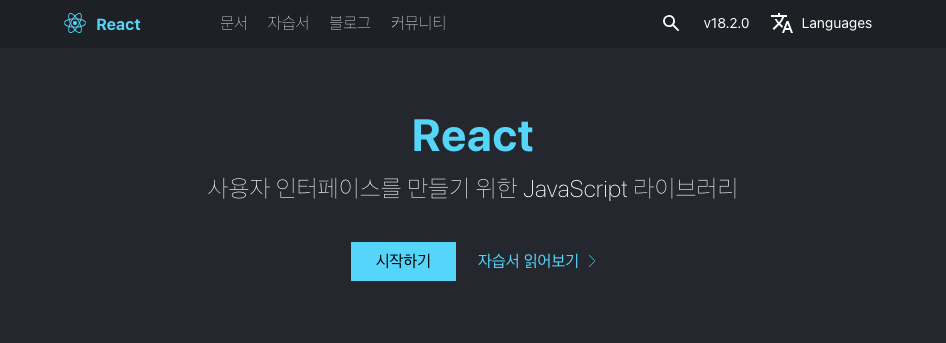

# React란 무엇인가?  왜 쓰는가?

리액트가 무엇이고 왜 사용할까요?  
리액트 공식 홈페이지에 방문하면 심플하게 그 답을 얻을 수 있습니다.



> “사용자 인터페이스를 만들기 위한 JavaScript 라이브러리”

리액트는 웹 및 네이티브 인터페이스를 위한 라이브러리 입니다. JavaScript 언어로 구축된 라이브러리 중 하나입니다.

이 리액트를 왜 쓰는지는 Netflix같은 웹페이지를 방문해보면 알 수 있습니다. 페이지에 들어가서 탐색하다보면 모든 전환이 부드럽다는 것을 느낄 수 있습니다. 완전한 새로운 페이지를 로드하기 위해서 버벅거리는 걸 볼 수가 없습니다.

리액트는 자바스크립트 라이브러리이기 때문에, 브라우저에서 자바스크립트를 사용합니다. 페이지를 다시 로드하지 않고, 자바스크립트로 페이지를 업데이트하여 사용자 인터페이스를 업데이트합니다.  
예를 들어, 자바스크립트가 웹사이트의 보이지 않는 뒤쪽에서 영화목록을 가져오고 영화 데이터를 업데이트해 매끄러운 전환을 하는 겁니다. 자바스크립트가 바로 그 역할을 합니다.  

그럼 자바스크립트가 모든 역할을 하는데 왜 리액트를 쓸까요?


## "Vanilla JavaScript" vs ReactJS
"바닐라 자바스크립트"는 다른 패키지를 사용하지 않고 오로지 자바스크립트 언어만 사용하는 자바스크립트를 말합니다.

일반적으로 바닐라 자바스크립트를 사용하는 것은 유저 인터페이스를 만들기에 좋은 옵션은 아닙니다.  
아래와 같은 이유로 흔하게 기피합니다.

- 자바스크립트 코드를 쓰는 것은 번거롭고 복잡하다.
- 복잡한 자바스크립트 코드는 에러를 발생하게 할 수 있다.
- 복잡한 자바스크립트 코드는 유지보수하기 힘들다.
- 리액트는 더 단순한 모델을 제공한다.
  
이 말은, 단순히 바닐라 자바스크립트가 좋지 않고 중요하지 않다는 의미가 아닙니다.  
자바스크립트 기반 라이브러리나 프레임워크를 잘 사용하기 위해서는 당연히 자바스크립트에 대한 탄탄한 지식이 필요합니다. 하지만 코드를 작성하는 입장에서, 사용자 경험을 위해서 유저 인터페이스를 구축하기 위해 좋은 선택은 아닙니다.  

리액트와 바닐라 자바스크립트 코드를 간단하게 비교하며 알아보겠습니다.

### ReactJS 와 "Vanilla JavaScript" 코드 비교
리액트는 선언적 코드를 씁니다. ui 상태를 즉 목표를 정의한다는 겁니다. 거기에 필요한 단계들이 아니라요.
```javascript
// Vanilla JavaScript

let content;

if (user.isLoggedIn) {
	content = <button>Continue</button>
} else {
	content = <button>Log In</button>
}

return content;
```

반면에 바닐라 자바스크립트는 명령적 코드를 씁니다. 목표를 정의하는 게 아니라 도달하기 위한 단계들을 정의합니다.
```javascript
// React

let btn = document.querySelecor('button');

if (user.isLoggedIn) {
	button.textContent = 'Continue';
} else {
	button.textContent = 'Log In';
}

document.body.append(btn);
```

때문에 바닐라 자바스크립트로 쓴 코드는 복잡하기도 하고, 단계를 잊거나 오류를 일으키기 쉽습니다.  

대신 리액트는 아주 간결합니다. 코드가 적고 리액트가 ui 업데이트 하는 부분을 담당해줍니다.  
리액트는 UI를 업데이트하기 위해 내부적으로 자바스크립트를 사용합니다. 리액트를 사용하는 우리는 그저 조건들과 타깃 상태(state), 그리고 언제 상태가 변경되어야 하는지만 정의한다면 리액트가 나머지를 다 알아서 할겁니다.
