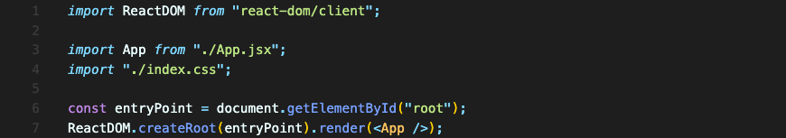
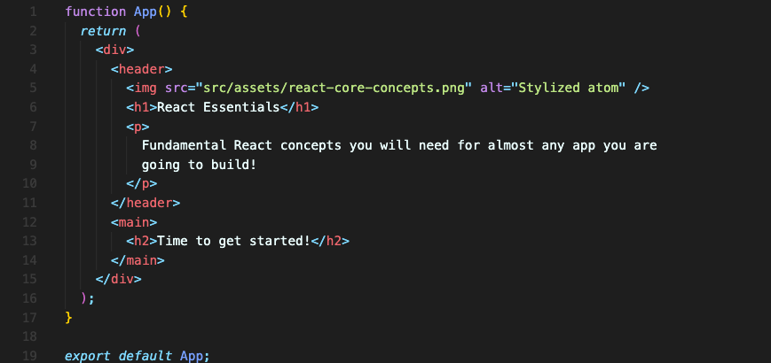
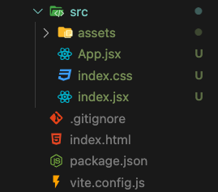

# JSX & React Components

아래 이미지를 보면 좀 혼란스러울 수도 있습니다.  
자바스크립트 코드 안에 HTML 코드가 있는 것 같거든요. 파일 확장자도 `.jsx`라는 이상한 것으로 되어 있습니다.  

||
|:--:|
|Index 컴포넌트|

||
|:--:|
|App 컴포넌트|

||
|:--:|
|폴더 구조|

## JSX
코드 내부에는 HTML 요소같은 것들이 쓰여 있습니다. 이건 HTML 요소가 아닌 JSX 구문입니다.  
보면 `App` 파일과 `Index` 파일 모두 `.jsx` 파일 확장자를 씁니다.  
왜냐면 표준 JavaScript 구문을 사용하지 않는 자바스크립트 파일이거든요(표준 자바스크립트에서는 HTML 요소를 위의 코드와 같이 쓸 수 없습니다). 정확히 말하면 'JavaScript Syntax eXtension' 즉 `JSX`라는 확장을 사용합니다.  

이 확장은 개발자가 HTML 마크업 코드를 자바스크립트 내에서 생성할 수 있게 해줍니다.  
리액트에서는 선언적 코드를 쓰기 때문에 UI를 생성하는 데 아주 유용한 기능입니다.  

하지만 이 기능은 브라우저에서 지원하지 않습니다.  
그렇기에 브라우저에 전달되기 전 변환되어 전달됩니다. 개발 단계에서는 개발서버에서 변환됩니다. 

 

## React Components
리액트에서 보다시피 컴포넌트는 함수로 작성됩니다.  
이 컴포넌트 함수는 2가지 중요한 규칙을 따라야 합니다.  

### Rule 1. 컴포넌트 이름은 대문자로 시작해야 한다!
- 컴포넌트 함수의 이름은 반드시 대문자로 시작해야 한다.
- 여러 단어로 되어있는 이름은 파스칼 케이스로 써야 한다. (e.g. “UserInput”)
- 이름은 컴포넌트를 설명하는 이름으로 선택하는 게 좋다. (e.g. “UserInput” or “Input”)

### Rule 2. 렌더링 가능한 내용을 반환해야 한다!
- 컴포넌트 함수는 반드시 화면에 표시되는 렌더링 가능한 내용을 반환해야 한다.
- 대부분의 경우 JSX를 반환한다. (string, number, boolean, null, array(비어있지 않은) 또한 허용됨)

 

## 컴포넌트의 파일 확장자
맨 위에 첨부된 코드에는 App과 Index 모두 `.jsx` 확장자를 가진 파일에 저장되어 있습니다.

`.jsx` 파일은 브라우저에서 지원하지 않는 파일 확장자입니다. 이 특별한 확장자를 지원하는 리액트 프로젝트에서 작업하고 있기 때문에 작동하는 것입니다. 왜냐면 이 확장자가 밑에 있는 빌드 프로세스에게 파일에 JSX 코드가 포함되어 있다고 알려주기 때문입니다. 빌드 프로세스는 개발 서버가 실행될 때 뒤에서 실행되고요.  
브라우저는 이 파일에 신경 쓰지 않습니다. 빌드 프로세스만이 관심을 가집니다.  

다른 리액트 프로젝트를 보면 `.jsx` 대신 `.js`파일 확장자를 사용하는 것도 볼 수 있습니다. 해당 `.js`파일에서도 JSX 코드를 볼 수 있는데요, 이건 파일에서 이 JSX 구문을 사용할 때 확장이 예상되는 빌드 프로세스에 따라서 달라지기 때문입니다.  

**`.jsx` 를 사용하든  `.js` 를 사용하든 브라우저에서는 작동하지 않는다는 것을 알아야 합니다.**

파일을 가져올때도 확장자까지 쓰는 게 필요한 프로젝트(e.g. `import App from './App.jsx'`)도 있고, 그렇지 않은 프로젝트(e.g. `import App from './App'`)도 있습니다. 

이런 것들은 브라우저나 표준 자바스크립트와는 아무런 관련이 없습니다. **선택한 프로젝트 설정이 들어 있는 빌드 프로세스에 따라 요구되는 게 달라질 뿐입니다.**

 