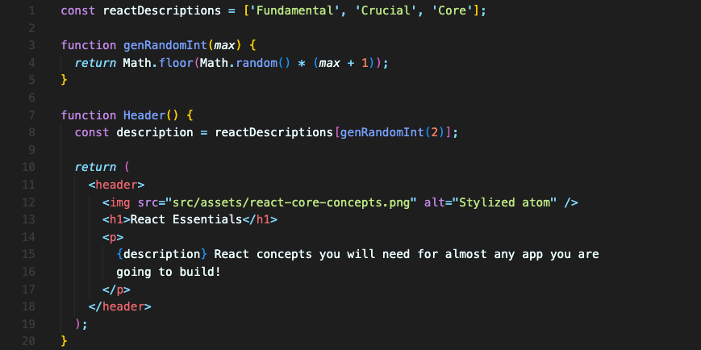
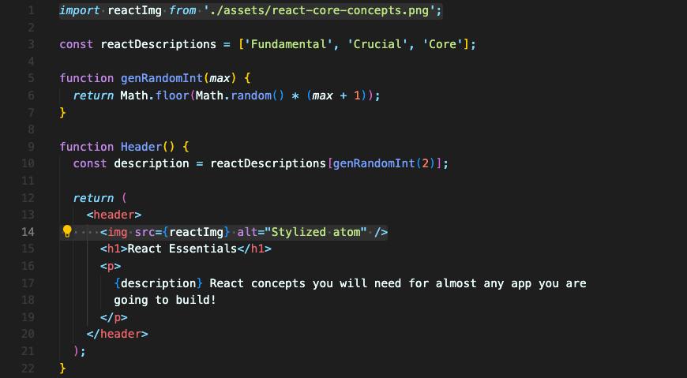

# 동적 값(Dynamic Values) 사용과 내보내기

컴포넌트에서 출력하는 내용을 다이나믹하게 변경하려면 중괄호 `{}`를 이용하면 됩니다.  
동적값을 이용할 땐 무조건 이 중괄호를 이용하면 되는데 주의해야 할 점이 있습니다.  

- if 문, for 루프, function 정의 그 외에 다른 블록문은 허용되지 않습니다.
- 직접적으로 값을 제공하는 표현식만 가능합니다.

## 동적 값 이용 예시
`['Fundamental', 'Crucial', 'Core']`의 요소들이 랜덤으로 나오길 원한다면 이렇게 할 수 있습니다.

line 8 - `description`에 랜덤하게 요소를 가져오고,  
line 15 - `{}` 를 이용해 그 값을 출력합니다.

만약 line 15의 `{description}` 값을 지우고 `{1+1}` 이렇게 입력하면 2가 화면에 출력될 겁니다.  
어떤 표현식이든 `{}` 안에 들어가 올바르게 작동할 수 있으니까요.

 

## 속성 동적 세팅 & 이미지 파일 로드

이미지를 가져올 때 이렇게 `string`으로 경로를 입력하는 것은 좋은 방법이 아닙니다. "src/assets" 폴더에 있는 이미지를 가리키고 있는데 이렇게 하면 배포할 때 이미지가 사라질 수 있습니다.  

배포를 위해 코드 전체가 변환되고 최적화되는 과정에서 잃어버릴 수 있습니다. 그러므로 다른 방법으로 이미지 경로를 가져와야 합니다.  

리액트에서는 `import` 구문을 사용해 가져옵니다. 이미지를 이런 방식으로 가져오는 게 이상할 수 있지만 `JSX`와 같은 원리로 리액트에서는 할 수 있습니다. 당연히 평범한 자바스크립트에서는 불가능합니다.

경로를 지정하여 이미지를 `import` 하고 그 이미지를 src 값으로 넣으면 됩니다.

이 이미지는 정확히 말하면 이미지를 가리키는 자바스크립트 변수입니다. 그리고 변수는 경로를 포함하고요. src는 그 값을 사용하는 겁니다.