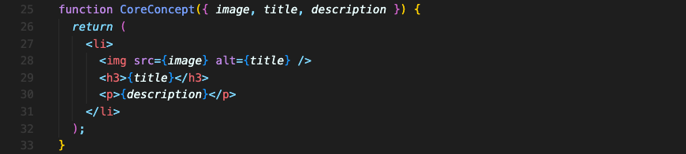
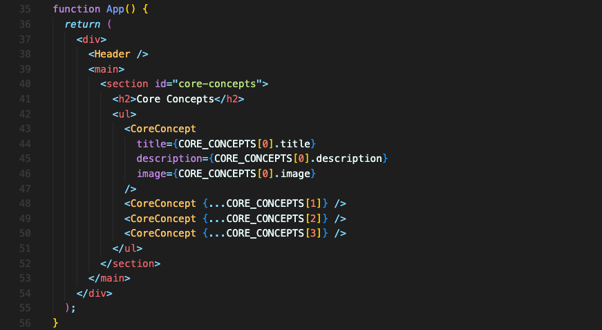

# Props로 재사용 가능한 컴포넌트 만들기

컴포넌트는 재사용할 수 있을 때 진가를 발휘합니다.  
리액트는 컴포넌트에 데이터를 전달할 수 있도록하는 `Props` 라는 중요한 개념이 있습니다.  
재사용할 수 있는 틀(컴포넌트)에 다양한 데이터(`Props`)를 담아서 재사용할 수 있는 겁니다.  
컴포넌트를 사용할 때 Props 값을 넣어주면, 컴포넌트는 그 값을 받아 사용합니다.  

Prop가 전달되는 과정은 아래의 3단계를 거칩니다.  

### 1. 컴포넌트에 Props 값 설정
Props는 컴포넌트에 설정하는 커스텀 HTML 속성입니다.  
Props는 모든 Value 타입을 허용합니다. (String value, Number value, Object value, Array value)

```jsx
<UserInfo
	name='anko'
	age={100}
	details={{userName: 'anko'}}
	hobbies={['Cooking', 'Reading']}
/>
```

문자열 외에 다른 값을 넘길 땐 꼭 중괄호를 써야 합니다. 만약 쌍따옴표 `“”` 를 쓰면 그 안의 모든 것을 문자열로 인식할 겁니다.  

객체 값을 넘길 때 더블 중괄호는 특별한 문법이거나 그런 게 아닙니다. 문자열이 아닌 값이니 바깥에 중괄호를 쓰고 단순한 자바스크립트 객체의 중괄호가 안에 들어간 겁니다.

### 2. Props 값이 객체로 병합
리액트는 모든 props를 하나의 객체로 병합합니다. 그래서 key, value 쌍으로 묶이게 됩니다.  
이 과정은 눈에 보이지 않고 내부적으로 일어납니다. 한 마디로 동작하는 방식입니다.  

위 예시가 객체로 병합되는 것을 시각화하면 아래 코드와 같이 됩니다.

```jsx
{
	name: 'anko',
	age: 100,
	details: {userName: 'anko'},
	hobbies: ['Cooking', 'Reading']
}
```

### 3. 컴포넌트에서 Props 값 사용
컴포넌트에서는 오직 한개의 파라미터만 받아들입니다. 이름은 원하는 대로 지을 수 있지만 보통 props라고 합니다.  

이 props를 사용하려면 어떻게 해야 할까요? 위에 객체로 병합되었다고 했으니 객체를 사용하듯 하면 됩니다.  

```jsx
function UserInfo(props) {
	return (
		<div>
			<p>{props.name}</p>
			<p>{props.age}</p>
		</div>
	);
}
```

<br/>

## 다른 Props 구문 작성법
object destructing을 이용해 props 값 하나를 받는대신 destructing한 값을 받는 방법도 있습니다.  


컴포넌트에 props 값을 넣어줄 때, props 이름이 객체 속성이름과 같다면 spread 오퍼레이터를 사용해 shortcut을 사용할 수 있습니다.  


<br/>

## Default Prop 값 설정
Default Prop 값을 설정하여 선택적으로 prop을 받는 컴포넌트를 만들수도 있습니다.  

```javascript
<Button type="submit" caption="My Button" />
<Button caption="My Button" />
```

이 때 type 값에 대해 default 값을 가지게 하려면 아래와 같이 작성할 수 있습니다.

```javascript
export default function Button({ caption, type = "submit" }) { 
  
}
```
type prop이 전달되지 않으면 default 값인 “submit”을 사용하게 됩니다.

<br/>