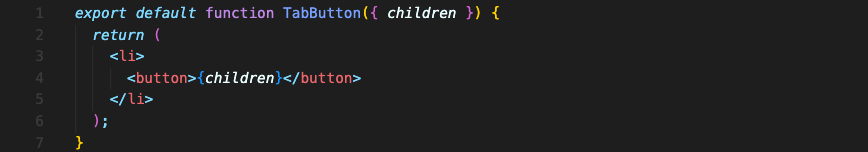
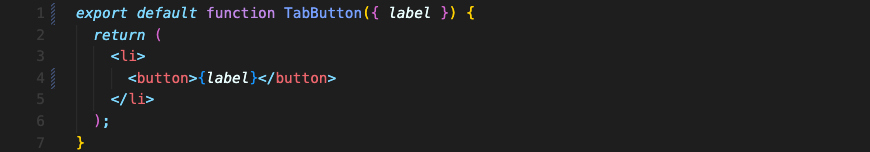

# 특별한 Prop "children"
prop 값을 지정하지 않고도 컴포넌트에 컨텐츠를 전달할 수 있습니다.  
바로 `children` prop을 사용하는 겁니다.

||
|:--:|
|App 컴포넌트의 return 부분|

||
|:--:|
|TabButton 컴포넌트|

`TabButton` 컴포넌트를 생성한 뒤에 아무런 속성값 없이 이렇게 입력해도 `TabButton` 컴포넌트 안에선 props 값에 접근할 수 있습니다. 속성값을 전달한 게 없으니 텅 빈 객체값이겠지만요.

하지만 완전히 텅 빈건 아닙니다. 언제나 가지고 있는 prop이 하나 있는데 그게 특별히 빌트인 된 `children` prop입니다. 리액트에서 설정된 prop입니다.

컴포넌트의 <열림태그>와 </닫힘태그> 사이에 있는 내용은 특별히 `children` prop 값으로 사용됩니다. 리액트가 자동으로 `children`이라는 이름을 붙인 prop으로 모든 컴포넌트에 전달하는 겁니다.

내용으로는 문자열도 가능하고, 복잡한 `JSX` 구조도 가능합니다.

`children` prop을 사용하지 않고 속성을 사용할 수도 있습니다.

||
|:--:|
|App 컴포넌트의 return 부분|

||
|:--:|
|TabButton 컴포넌트|

위에서 `children`을 사용한 것과 똑같은 결과가 출력될 겁니다.

 

## “children” Prop vs “Attribute Props”
더 좋고 나쁜 방법은 없고 오히려 상황에 따라서나 취향에 따라 선택하면 됩니다.  

### “children” Prop

- 이 접근방법은 일반 HTML사용법에 더 가깝습니다.
- 하나의 출력하는 컨텐츠를 받는 컴포넌트의 경우에 사용하기 좋습니다.
- 이 접근방법은 다른 컴포넌트로 JSX 코드를 값으로 넘겨받을 때 특히 편리합니다.

### “Attribute Props”

- 이 접근방법은 컴포넌트에 넘겨야 하는 많은 작은 정보들을 가지고 있다면 적절합니다.
- 내용을 태그로 감싸는 것 대신에 추가로 prop을 더하는 것이 편할수도 있습니다.

 