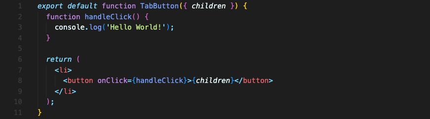

# 이벤트에 반응하는 방법
보통의 자바스크립트에서는 요소에 이벤트리스너를 추가할 때 이렇게 추가합니다.  
```javascript
document.querySelector('button').addEventListener('click', () => {})
```

하지만 리액트 프로젝트에서는 이렇게 명령적 코드로 작성하지 않습니다. 리액트는 선언적 코드를 작성하니까요.

그리고 리액트 개발자로서 작업할 때 DOM, 페이지와 이렇게 상호작용하는 걸 원하지 않습니다. 리액트는 DOM을 직접 조작하지 않으니까요. 우리가 직접 조작하지 않고 리액트가 대신 하길 바랍니다.

리액트에선 요소에 특별한 속성을 더해 작동하게 할 수 있습니다.  
용어에 혼동이 없도록 짚고 넘어가자면, `<button> 요소에 속성을 더한다` , `<button> 컴포넌트에 prop을 더한다` 이 둘은 같은 의미라 보면 됩니다. 결국 요소들은 html 요소들이 아니라 컴포넌트고 속성 또한 prop이니까요.

아무튼 그 특별한 prop을 사용하는 방법에 대해 마저 이야기하자면, `on~` prop을 사용하면 됩니다.

예를 들어, 클릭했을 때 이벤트가 발생하게 하려면 타겟 요소에 `onClick` prop을 사용하면 됩니다.



이벤트에 실행되는 함수 이름은 마음에 달렸지만, 컨벤션으로는 `handleClick()` 이나 `clickHanlder()` 이런식으로 씁니다.

**중요한 건 속성값으로 넣은 함수 이름 뒤에 실행하는 `()` 를 넣으면 안된다는 겁니다.** (e.g.  `<button onClick={handleClick()}>`)

괄호를 넣으면 이 컴포넌트가 실행되는 순간 이 함수도 실행될겁니다. 클릭하거나 하는 원하는 타이밍이 아니라요.

괄호를 넣지 말고 함수의 이름만 넣어 함수를 가리키게만 하면 됩니다. 그럼 클릭될 때 실행될 겁니다.

<br/>