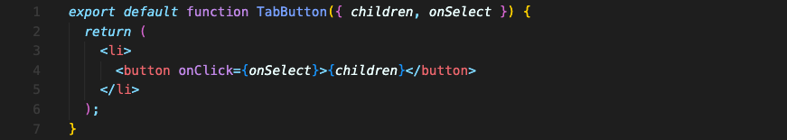
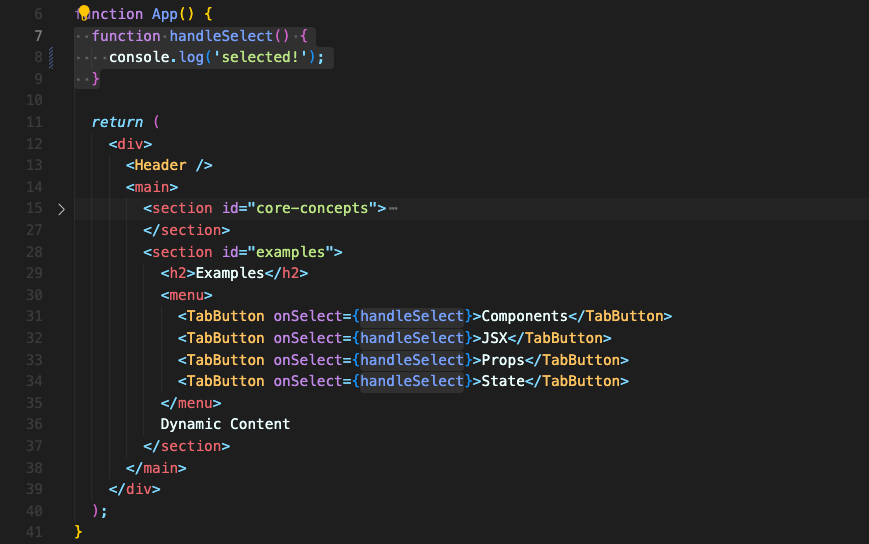

# 함수를 Props 값으로 받기
prop 값으로 함수를 전달할 수도 있습니다.  

버튼을 클릭했을 때 버튼 내부에서 정의한 함수가 아닌 상위 컴포넌트의 함수를 사용하기 위해서 prop 값으로 함수를 전달할 때가 많습니다.  
버튼은 하나의 목적을 달성하기 위한 함수를 사용하지 않고 여러 함수를 재사용할 수 있어야 하니까요.

부모 컴포넌트인 `App` 컴포넌트와 자식 컴포넌트인 `TabButton` 컴포넌트가 있다고 생각해보겠습니다.


컴포넌트를 재사용 할 수 있도록 자식 컴포넌트인 `TabButton` 컴포넌트는 prop으로 `onSelect`함수를 받아서 사용합니다.  

button 요소가 클릭될 때마다 `onSelect`가 실행될 겁니다.


부모 컴포넌트인 `App` 컴포넌트는 내부에서 정의한 함수 `handleSelect` 를 자식 컴포넌트인 `TabButton` 컴포넌트에 `onSelect` prop으로 전달합니다.

정리하면, `TabButton` 안에 있는 button 요소가 클릭되면 prop으로 받은 `onSelect`가 실행되고 `onSelect`는 `handleSelect` 함수를 가리키고 있으니 결론적으로 `handleSelect` 함수가 실행됩니다.

<br/>

## 이벤트 함수에 인수를 추가적으로 전달하는 방법
`onSelect`에 함수 이름만 전달하는 대신에, 익명 화살표 함수를 전달할 수도 있습니다.  
화살표 함수는 리액트와 관련 없이 표준 자바스크립트 기능이죠. 화살표 함수 대신 그냥 익명함수를 사용해도 상관 없습니다. 간단하니까 화살표 함수를 많이 쓸 뿐입니다.

```jsx
<TabButton onSelect={() => handleSelect}>Components</TabButton>
```

`onSelect` 속성으로 전달된 이 익명함수(`() => handleSelect`)는 `TabButton` 컴포넌트 button 요소의 `onClick`에도 전달될 겁니다.

따라서 화살표의 오른쪽에 있는 우리의 함수 `handleSelect`는 익명함수가 실행될 때 실행될 겁니다. 버튼이 클릭되면 익명함수가 실행되고 그 다음 `handleSelect` 함수가 실행되는 거죠.

그렇기 때문에 이제는 `handleSelect` 뒤에 `()`를 붙일 수 있습니다. 왜냐면 이 코드는 파싱된 즉시 실행되지 않거든요. 버튼이 클릭되어야 실행됩니다!

이제 괄호 안에 버튼 식별자를 전달할 수 있게 됐습니다.

```jsx
<TabButton onSelect={() => handleSelect('components')}>Components</TabButton>
```

이 방식은 리액트에서 인수를 전달해 함수를 호출하고 싶을때 사용되는 아주 일반적인 패턴입니다.

<br/>