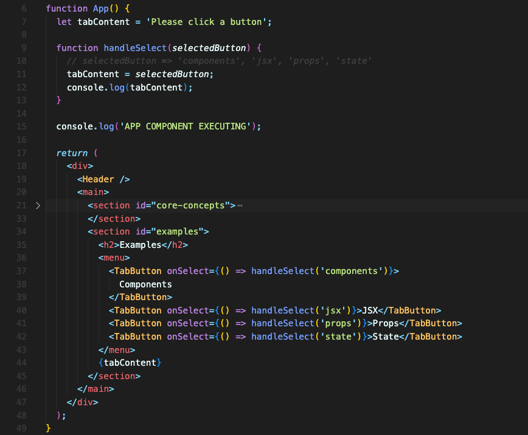
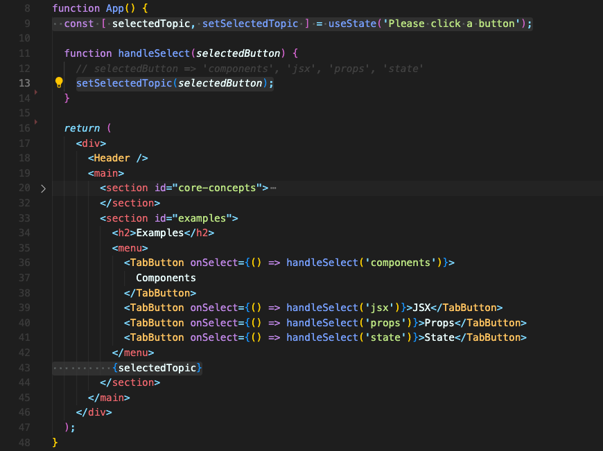

# UI가 업데이트 안되는 이유 & State를 관리하고 Hook을 사용하는 방법

## UI가 업데이트 안되는 이유

클릭할 때마다 prop으로 전달받은 함수가 실행되는 버튼이 있다고 가정해봅시다.   
버튼은  `TabButton` 컴포넌트 내부에 들어있습니다. 버튼을 클릭할 때 실행되는 함수는 `handleSelect` 함수이고요.



handleSelect 함수 내부에서는 `tabContent` 변수 값을 변경합니다. 그리고 `tabContent` 변수는 화면에서 `TabButton` 밑에 출력되게 합니다.

하지만 버튼을 클릭할 때마다 변경되길 원했던 `tabContent`가 변경되지 않습니다.  
이유가 뭘까요?  

컴포넌트는 단지 함수가 실행된다는 이유만으로 다시 실행되지 않습니다.

**기본적으로, 리액트 컴포넌트는 오직 한번만 실행되기 때문입니다.**

컴포넌트가 재실행되야 한다고 하면 리액트에게 재실행해야 하는 사실을 전달해야 합니다. 그렇게 해야만 컴포넌트를 재실행시킬 수 있습니다.

위의 코드에서 콘솔창을 보면 아래와 같이 나옵니다.

1. 처음 App 컴포넌트가 실행 ⇒  'APP COMPONENT EXECUTING’
2. Components 버튼을 클릭 ⇒ ‘components’
3. JSX 버튼을 클릭 ⇒ ‘jsx’

클릭할 때마다 `tabContent` 값이 업데이트 되고 출력되려면, `handleSelect` 함수에서 업데이트만 되고 실제 return 에서는 업데이트된 `tabContent` 값이 사용되고 있지 않습니다. 처음 App 컴포넌트가 실행된 이후로 'APP COMPONENT EXECUTING’ 메세지가 다시 나오지 않은 것을 보면 알 수 있습니다.

컴포넌트 내에서 변경되는 변수를 참조하고 있어도, 한 번만 실행되는 컴포넌트의 특성상 변경된 내용은 반영될 수 없습니다.

<br/>

### 리액트는 UI 업데이트가 필요한지 어떻게 체크할까?

리액트는 '이전 아웃풋(이전 JSX 코드)'과 '새로운 아웃풋(새로운 JSX 코드)'을 비교합니다. 그리고 **달라진 점**만 실제 웹사이트 UI에 적용합니다.

첫번째 아웃풋은 웹앱이 처음 로드되면서 생깁니다. 컴포넌트가 처음으로 실행되면서 생기는 아웃풋인데, 그 이후로 컴포넌트가 재실행되면 그 때 달라진 JSX 코드를 이전 아웃풋과 비교해 달라진 부분이 UI에 반영되는 것입니다.

함수가 실행되거나 내부의 변수가 바뀌어도 컴포넌트는 재실행되지 않습니다. **컴포넌트 내부에서 사용하는 상태값인 `state` 라는 것이 변경되면 재실행됩니다.**

<br/>

## State를 관리하고 Hook을 사용하는 방법

`state`는 리액트의 또다른 중요한 개념입니다. `state`로 이 문제를 해결할 수 있습니다.

이 `state` 개념은 변수 등록이 전부라고 할 수 있습니다.  
이 변수는 리액트에 의해서 핸들링됩니다. 그리고 리액트에서 제공하는 함수의 도움으로 업데이트되는 변수들이 바뀌었다고 리액트에게 알릴 수 있습니다. 

이런 특별한 변수는 리액트 라이브러리에서 제공하는 특별한 함수의 도움을 받아야 만들 수 있습니다. 바로 `useState` 라는 함수입니다.

### 리액트 훅(Hook)
`useState`는 리액트 훅이라 불립니다. 리액트에서 `use`로 시작하는 모든 함수는 리액트 훅들 입니다. **리액트 훅들의 특별한 점은 기술적으로는 일반 함수지만 리액트 컴포넌트 함수안에서 호출되어야만 합니다.** (또는 다른 리액트 훅 안에서 호출되어야 하는데, 가령 커스텀 훅 같은 경우가 그렇습니다.)

### `useState`
`useState` 훅은 가장 중요한 훅 중 하나입니다. 이 훅은 **컴포넌트의 특정 상태를 관리**하게 도와주거든요.

이건 리액트에 의해서 저장된 데이터입니다. 그래서 이게 변경되면 리액트가 이 훅이 들어있는 컴포넌트가 재실행하고 재평가되도록 합니다.

### 훅의 규칙
1. **컴포넌트 함수 안에서만 호출할 수 있다.** 컴포넌트 외부에서 호출되면 안된다.
2. **컴포넌트의 가장 탑 레벨에서만 호출할 수 있다.** 중첩된 코드 문 안에서 호출될 수 없다(e.g. if문 안에서, 함수 안에서..)

### `useState` 사용
`useState`는 기본값을 받습니다. 그리고 언제나 정확하게 2개의 요소를 가진 Array를 반환합니다.

```jsx
const stateArray = useState('my default value');
// array destructuring
const [myState, setMyState] = useState('my default value');
```
- 첫번째 요소: 현재 `state`의 값
- 두번째 요소: `state`를 업데이트하는 함수. 이 함수가 불리면서 리액트에게 컴포넌트를 다시 실행시키라고 말한다.

이름은 어떻게 지어도 되지만, 보통 세팅하는 함수의 이름은 `set`으로 시작하는게 대부분의 리액트 프로젝트의 컨벤션입니다.

`state`를 업데이트하는 함수를 사용하면 `state`를 업데이트 할 수 있습니다.  
이 함수가 실행되면서 업데이트 시키는 것도 역할이지만 **정말 중요한건, 리액트에게 컴포넌트를 다시 실행시키라고 말하는 겁니다.** 덕분에 업데이트 된 `state` 값을 이용해 UI를 변경할 수 있습니다.



<br/>