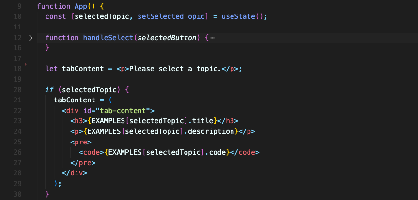
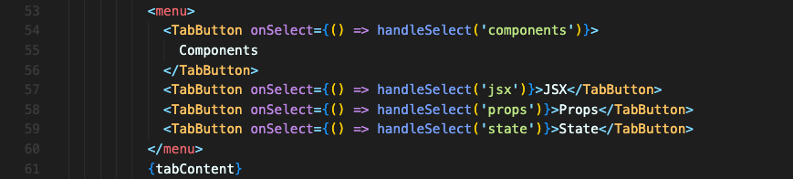
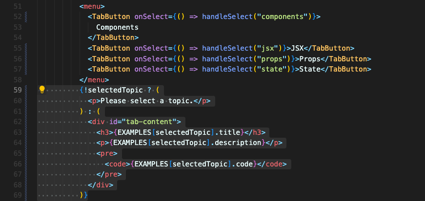

# 조건에 따라 컨텐츠 렌더링하기

조건에 따라서 다른 내용을 보여줘야 할 때도 있습니다.

어떤 버튼을 클릭했는지에 따라 `state` 값을 변경하고, 그 `state` 값에 따라 내용을 출력하려고 한다면 아래와 같이 할 수 있습니다.

 

## 1. 변수 사용하기

실제로 출력될 `tabContent` 변수에 내용을 변경하는 방법입니다.

`selectedTopic` `state` 값이 변경되면 컴포넌트가 재실행되기 때문에 if 문에서 새로운 `selectedTopic` 값에 맞는 내용으로 `tabContent`가 채워질 겁니다.

다른 방법으로는 삼항표현식을 사용할 수 있습니다.

 

## 2. 삼항표현식(ternary expression) 사용하기

`selectedTopic` `state` 값에 따라 출력값을 변경하는 방법입니다.

 
 

위의 2가지 조건부로 렌더링하는 방법 중, 어떤 접근방법을 선택하든 상관없이 상황에 따라 더 보기 편한 방식을 선택하면 될 것 같습니다.

 