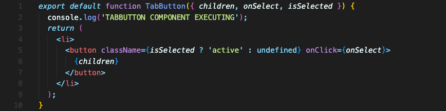
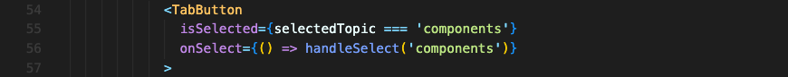

# 기본적인 리액트 스타일링 & 동적 스타일링

리액트에서 스타일링을 어떻게 할까요? 또, 조건에 따라 스타일을 다르게 주려면 어떻게 해야 할까요?

### `className`
먼저 리액트의 클래스 속성에 대해 이야기하고 넘어가겠습니다.  
리액트는 요소에 `class` 속성 대신 `className` 속성으로 스타일을 줄 수 있습니다. JSX에 특화되어 있어서 그렇습니다. id 같은 속성은 JSX도 HTML과 똑같이 id로 씁니다. 하지만 클래스를 추가하려면 `className` 속성을 써야 합니다.

 

## 리액트에서 스타일링하기

기본적으로 스타일을 더하는 방법은, CSS 파일에서 정의한 스타일 값을 `className` 속성에 주는 것입니다!  
HTML 요소의 `class`로 스타일을 더하는 방법과 거의 같다고 볼 수 있습니다.

전역적으로 CSS 파일을 만들어 `import` 하든, 컴포넌트별로 CSS 파일을 만들어 `import` 하든 사실상 스타일의 스코프는 전역적으로 만들어질 겁니다. 이 문제를 해결하는 방식이나, 다른 여러 스타일링 방식이 있지만 그 자세한 부분은 추후 따로 다루겠습니다.

 

## 동적으로 스타일링하기

버튼이 선택되었는지 아닌지에 따라 스타일을 바꾸는, 이런 동적 스타일링을 어떻게 해야 할까요?

버튼 컴포넌트에서 `isSelected` 라는 새로운 prop을 받아오겠습니다. 선택되었는지 아닌지에 대한 boolean 값이 들어올 겁니다.

이제 이 값을 이용합니다. 삼항연산자로 `className`을 지정할 겁니다. 선택되었다면 `‘active’` 클래스를 주고(CSS 파일에 이미 만들어 놓은 클래스), 그렇지 않다면 아무 클래스도 주지 않으면 됩니다.

버튼을 사용할 땐 boolean 값을 넘겨주면 되니까 `state`에 저장된 `selectedTopic` 값과 비교해 boolean 값을 넘깁니다.

 