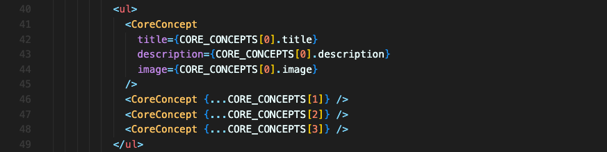

# 동적으로 리스트 데이터를 출력하는 방법

위의 코드에서는 `CoreConcept` 컴포넌트를 4개 출력하고 있습니다. CORE_CONCEPTS 리스트 데이터에 요소가 4개 있기 때문입니다.

하지만 CORE_CONCEPTS 리스트 데이터가 더 늘어날 수도 있고, 그 수가 100개가 넘어갈 수도 있습니다.  
그렇게 많은 컴포넌트를 일일히 컴포넌트를 추가하는 건 너무 비효율적일 겁니다.

어떻게 동적으로 리스트 데이터를 출력할까요?

자바스크립트의 빌트인 메서드인 `map`을 이용하면 됩니다! 기존에 존재하는 배열로 새로운 배열을 만들어주거든요.  
`map`으로 배열 요소 하나하나를 파라미터로 받고, 그걸 활용해 JSX 코드로 return 하게 합니다.

**`map`을 사용할 때 주의해야 할 점은 모든 요소가 `key` prop을 가지고 있어야 한다는 것입니다.** (key에 대한 자세한 것은 더 나중에 다루겠습니다.)

따라서 모든 요소에 `key` 값을 주어야 하고, 그 값은 중복되지 않는 항목을 식별할 수 있는 값이어야 합니다.

이렇게 하면 불필요하게 반복되는 코드가 없는, 데이터 소스가 바뀌어도 깨질 가능성 없는 코드가 완성됩니다.

 