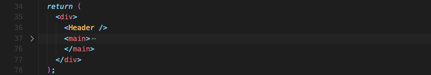
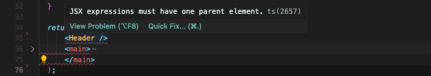
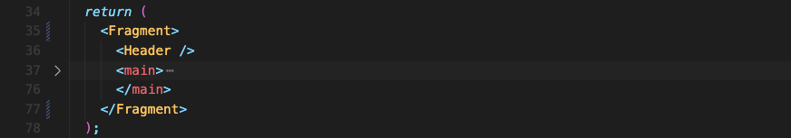
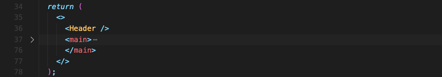

# Working with Fragments

아래 코드에서 가장 바깥의 `
` 요소는 아무런 속성도, 스타일도 가지고 있지 않습니다.

필요 없는 요소라 생각되어 삭제한다면 어떻게 될까요?

하나의 부모 요소를 가져야 한다고 오류가 뜹니다. 여기서 문제는 두 형제 요소를 반환하고 있다는 겁니다.

**반환되는 JSX 표현식은 반드시 하나의 부모 요소를 가져야 합니다.**

왜 하나의 요소만 가능할까요? 왜 형제요소는 허용되지 않을까요?

**자바스크립트에서는 함수에서 두 개의 값을 괄호로 감싸서 여러줄로 나눠 반환할 수 없습니다.** 그렇게 하는 건 불가능한 자바스크립트 코드입니다. 값이 2개가 아니라 1개만 반환할 수 있기 때문입니다.

JSX 코드는 'Syntatic Sugar'라는 걸 잊으면 안됩니다. JSX를 사용하지 않으면 아래와 방식으로 요소를 만들 수 있을텐데, 마찬가지로 2개의 값을 반환할 수는 없기에 불가능합니다.

그래서 래핑 요소가 필요합니다. 모든 요소들을 래핑하는 요소는 값을 하나만 반환하게 하니까요.

모든 요소의 return되는 JSX를 `
`로 래핑을 한다고 가정하면, 여러 컴포넌트가 모인 UI에서는 쓸모없는 여분의 `
`가 많이 보일 수 있습니다. 이건 아무 문제를 일으키지 않지만 DOM에는 매우 불필요합니다.

리액트에서는 대안으로 특별한 `Fragment` 컴포넌트를 제공합니다. 

더 모던한 리액트 프로젝트는 훨씬 더 짧은 대안을 제공하는데요, 아예 `Fragment`를 리액트에서 가져오지 않아도 됩니다. 그냥 빈 태그로만 작성하면 되거든요. 리액트가 인식하고 처리합니다.

 