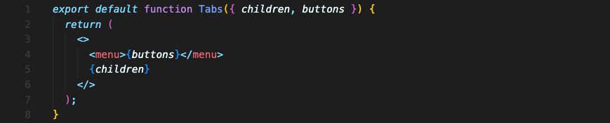
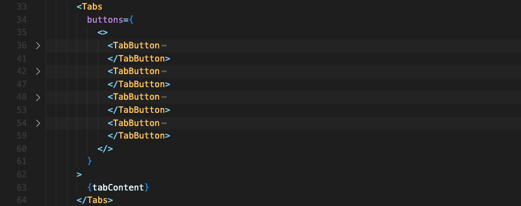

# 여러개의 JSX를 컴포넌트에 넘기기

'버튼들' 그리고 '그에 맞는 컨텐츠' 이 두가지 JSX 묶음을 받는 Tabs라는 컴포넌트를 만드려고 합니다. 

총 JSX를 두 묶음이나 받아하는데 어떻게 해야 할까요?

간단합니다. 하나는 children으로 받고, 하나는 props로 받으면 됩니다.

여기서 props로 받은 buttons는 어떻게 전달되었을까요?

속성에 JSX 코드 그대로 전달되었습니다. JSX 코드에선 여러 형제요소가 루트에 있는게 허용되지 않으니 빈 태그로 감싸서 전달해줍니다.

이 방식을 쓰면 깔끔하게 컴포넌트를 용도에 맞게 분리할 수 있을 겁니다.

 