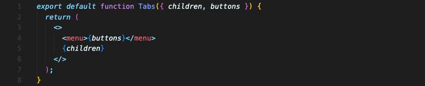
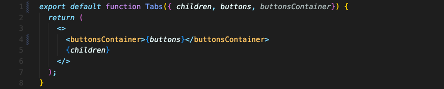
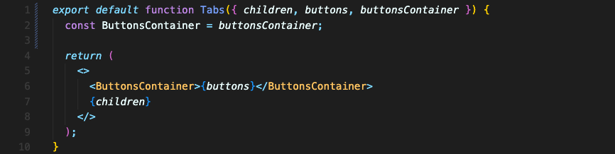
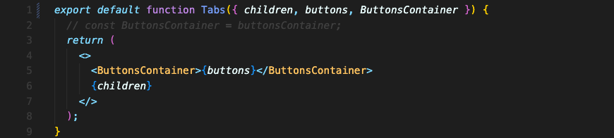
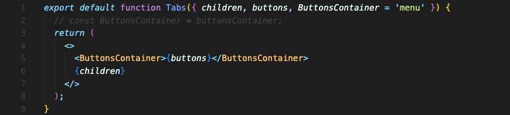

# 컴포넌트 내부의 요소를 동적으로 설정하기

이 컴포넌트 내부에서 사용하는 menu 태그를 동적으로 다른 태그로 변경하고 싶다면 어떻게 해야 할까요?

prop에 원하는 태그를 string으로 넣습니다. 커스텀 컴포넌트를 사용하고 싶다면 `buttonsContainer={Menu}` 이런 식으로 써야 합니다.

그리고 컴포넌트에서는 그 값을 받아와 그대로 태그를 교체해보겠습니다.

이렇게 하면 작동되지 않을 겁니다. 소문자로 시작하니까, 내장되어있는 buttonsContainer 이라는 요소를 찾을거거든요. 당연히 그런 요소는 없고요.

그럼 대문자로 시작하게 하면 됩니다.

짧게 쓰기 위해 아예 대문자로 prop을 넘겨 받아올 수도 있습니다.

원하는대로 menu 요소로 적용되어 잘 작동됩니다.

default prop 값을 설정할 수도 있습니다.

 

중요한 건
1. 컴포넌트 안에서 커스텀 컴포넌트로 쓰이는 값이기 때문에 반드시 대문자로 시작해야 한다는 것과, 
2. 식별자를 넘길때 string 이름을 써야 한다는 것입니다. (커스텀 컴포넌트는 {}를 사용해서 써야 합니다. 태그를 사용하지 않고 그냥 컴포넌트 이름만 담아서요. e.g. `ButtonsContainer={Section}`)

 