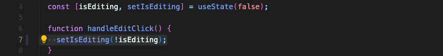
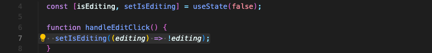

# State를 이전 State 기반으로 올바르게 업데이트하는 방법



이전 state 값을 기반으로 state를 업데이트할 때, 위의 코드같이 업데이트 하면 안됩니다.  
현재의 state 값을 참조해서 그 반대값으로 업데이트 하라는 방식은 불가합니다.

대신 **이전 state 값을 기반으로 state를 업데이트하려면, 함수를 넘겨야 합니다.** 리액트 팀이 강력하게 이 방법을 추천합니다.

```javascript
setNewState((prevState) => {});
```

이 넘겨진 함수는 리액트가 자동으로 호출할거고, 가장 최근 state 값에 대한 보장을 합니다. 그래서 이 방법을 사용하는 것이 안전합니다.

이 함수는 자동으로 state 최신 값을 파라미터로 받아옵니다. 이 값을 내부에서 사용해서, 새로운 state를 return 하면 state는 새로 반환된 state로 업데이트 됩니다.

따라서 아래와 같이 변경할 수 있습니다.



실제로 잘 작동되는 것 같아 보이는데요, 왜 함수를 사용하지 않고 직접적으로 변경하면 안될까요? 

```javascript
setIsEditing(!isEditing);
```

이렇게 코드를 쓰면 **리액트는 보이지 않는 곳에서 state 업데이트하는 스케줄을 만듭니다.**  
즉, **state 업데이트는 바로 일어나지 않고 조금 있다가 일어납니다.** 빠르게 업데이트를 하긴 하지만 즉각적이지는 않습니다.

이런 테스트를 해볼 수 있습니다.

```javascript
function handleEditClick() {
	setIsEditing(!isEditing); // => true겠지
	setIsEditing(!isEditing); // => false겠지
}
```

`handleEditClick` 이 실행되면 `isEditing` 초기값인 false에서 true로, 그 다음 다시 false로 변경될 것으로 예상됩니다.  

하지만 실행시켜보면 `isEditing` 값은 true가 되어 있습니다.

그래서 함수양식을 사용하는 겁니다. 예상한대로 작동하지 않거든요. 사실 위의 코드는 같은 컴포넌트 실행 사이클에 있기 때문에 이렇게 해석됩니다.

```javascript
function handleEditClick() {
	setIsEditing(!isEditing); // => isEditing(=false) 반대값 true로 업데이트될 예정
	setIsEditing(!isEditing); // => isEditing(=false) 반대값 true로 업데이트될 예정
}
```

함수양식을 사용해서 업데이트하면 이런 문제가 없습니다.

```javascript
function handleEditClick() {
	setIsEditing((editing) => !editing); // => true
	setIsEditing((editing) => !editing); // => false
}
```

따라서 이전 상태값에 근거해 상태를 업데이트할 때에는 이런 함수 양식을 사용해야 합니다!

<br/>