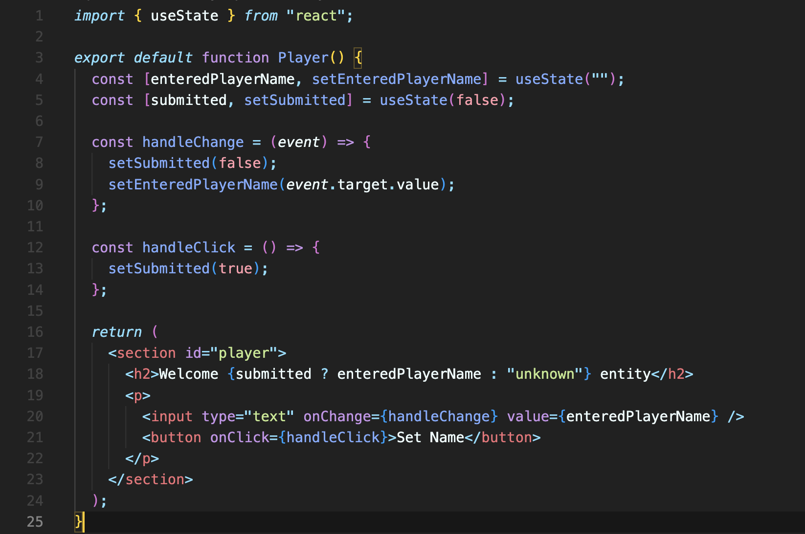
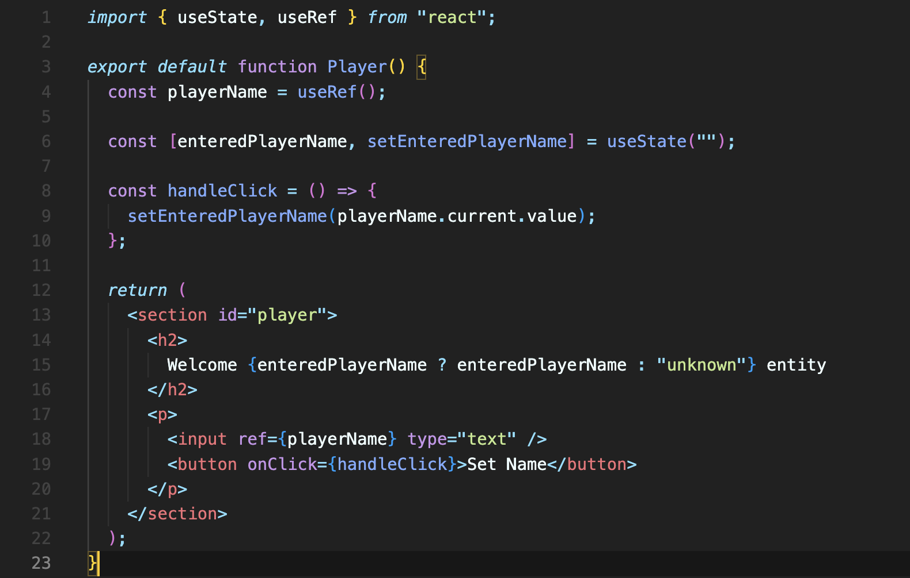
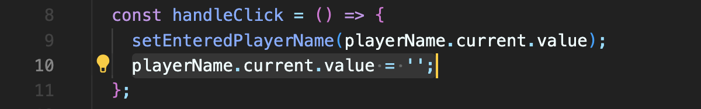

# HTML 요소에 Refs 연결하기
아래 코드는 input에 useState를 사용하여 two-way-binding 한 코드입니다.



그냥 input 값 하나 바꾸는 건데, useState를 사용하는 이 방식은 어떻게 보면 너무 코드가 많습니다.  
이런 경우 ref를 사용해 단순화할 수 있습니다.

리액트의 ref는 단순히 값입니다. 하지만 일반 변수나 상수와는 달리 조금 특별한 방법으로 리액트에 의해 관리됩니다.

ref는 `useRef` 훅으로 가져와서 사용할 수 있습니다. 다른 훅들과 마찬가지로 컴포넌트 안에서 사용되어야 합니다.

```javascript
import { useRef } from "react";

// 컴포넌트 안에서 사용
const playerName = useRef();
```
`useRef`를 실행시키면 ref 객체가 반환값으로 생성됩니다. 이 생성된 ref를 JSX 요소에 연결할 수 있습니다. 

**ref로 할 수 있는 다른 것도 있지만, 가장 많이 하는 건 요소에 연결하는 것입니다.**  
요소에 연결하려면, 요소에 ref 속성을 추가해 연결할 수 있습니다.

```javascript
<input ref={playerName} type="text" />
```

`useRef`로 생성된 이 `playerName`은 객체이며, 항상 `current` 속성을 가지고 있습니다.  
그리고 이 `current` 에는 해당 요소에 대한 속성이나 메서드가 저장되어 있습니다. input 요소에는 value 값이 있으니 value를 가져올 수 있습니다.



two-way-binding 할 때보다 더 간편하게 만들 수 있습니다.

<br/>

## Refs로 DOM을 조작하는 것에 대해
위 코드에서, input에 대한 입력이 끝나고 저장(Set Name)버튼을 클릭하면 input 값을 초기화하는 동작을 추가하려고 합니다.

input 값을 빈 값으로 초기화하려면 어떻게 해야 할까요?



ref 값인 `playerName`에 이렇게 빈 값을 주면 될까요?

**이 방법은 DOM을 직접 조작하는 방법입니다.** 리액트가 선언적 코드를 작성하는 것과 반대되는 것입니다.  
9번 줄과 같은 경우에는 값을 읽기만 했으니 문제 없지만, 10번 줄은 변경하는 것이니 논쟁의 여지가 있긴 합니다. **리액트가 DOM 상호작용을 처리해야 한다는 원칙을 위반하는 거니까요.**

그럼에도 이렇게 빈 값을 주는 것이 다른 어떤 것을 트리거하도록 연결되어 있지 않은 이런 경우에는, 이렇게 작성하는 걸 고려해볼 수도 있습니다. 간편함이라는 이점을 주기는 하니까요.  
하지만 DOM을 직접 조작하는 방법은 언제나 조심해서 사용해야 합니다.

<br/>