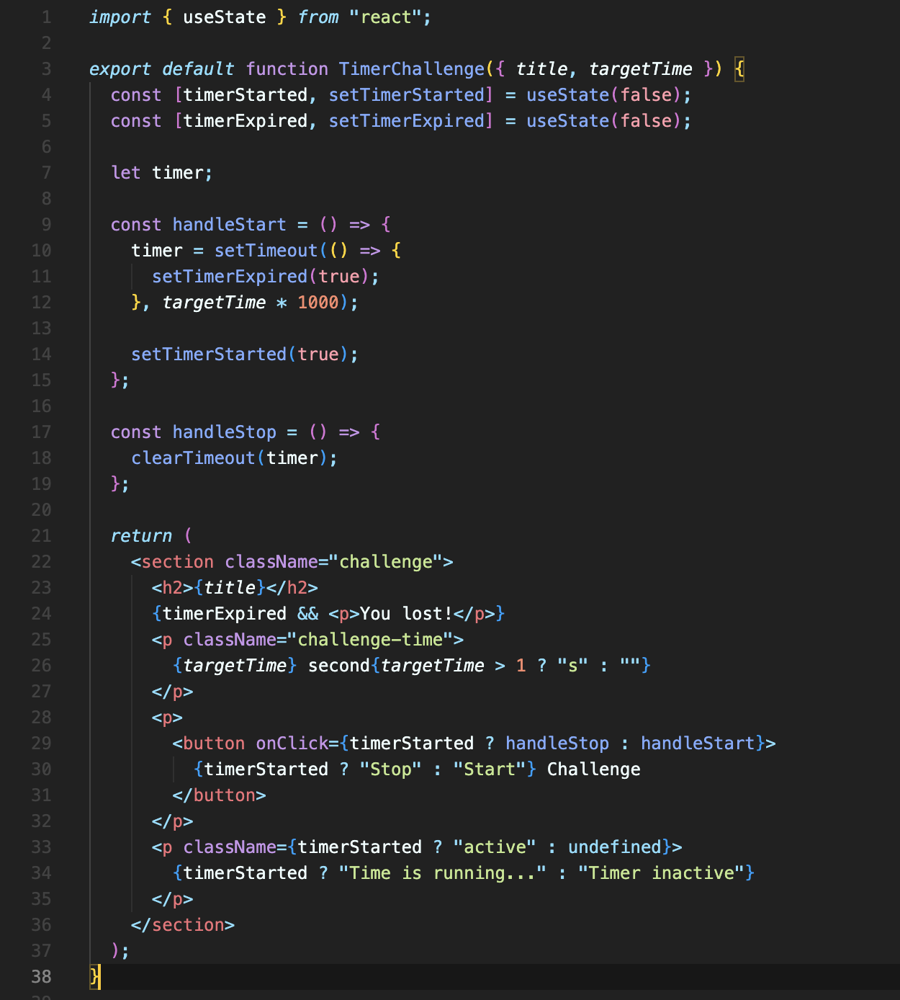
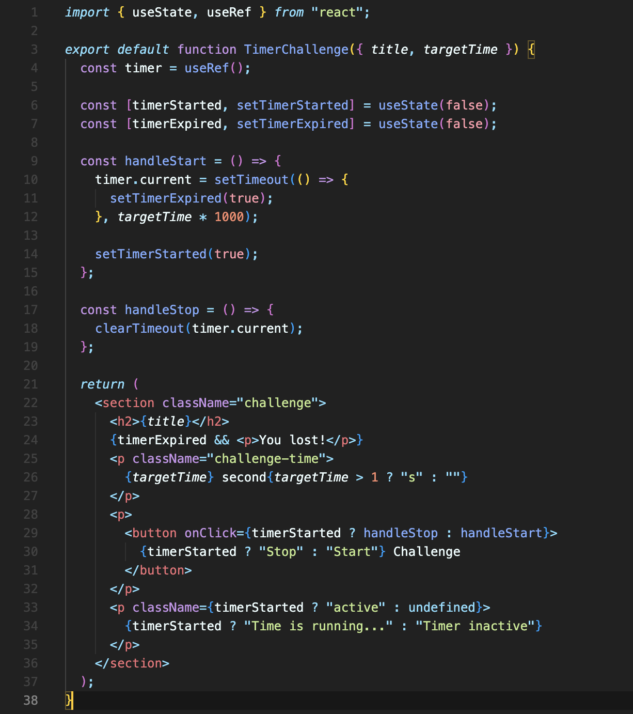

# Ref를 DOM 요소에 연결하는 것 외에 사용하기

Ref를 DOM 요소에 연결하는 것 외에도 다른 유용한 용도로 사용할 수 있습니다.

먼저 필요한 상황에 대한 예시를 들어보겠습니다.

- 타이머가 시작되었는지에 대한 state와, 타이머가 만료되었는지에 대한 state가 있다.
- 타이머가 시작되지 않은 상태면, 버튼 클릭 시 타이머가 시작된다. (`handleStart` 함수 내부)
- 이 때, 타이머는 변수로 저장해둔다. (`let timer;`)
- 타이머가 시작되었다면, 버튼 클릭 시 타이머를 삭제한다. (`handleStop` 함수 내부)

하지만 타이머가 시작되고, 아무리 타이머가 만료되기 전에 버튼을 다시 눌러 `handleStop` 을 실행시켜도 타이머가 삭제되지 않습니다.

이유는, 변수로 `timer`를 지정해서 그렇습니다.  
내부적으로는 어떻게 진행될까요?

1. 처음 타이머를 시작하기 위해 버튼을 누릅니다. `handleStart` 가 실행됩니다.
2. `handleStart` 내부에서 `timer` 변수에 `setTimeout`이 할당됩니다.
3. `handleStart` 내부에서 `setTimerStarted(true);` 가 실행되면서 state가 업데이트됩니다.
4. state가 업데이트되니 컴포넌트가 재실행되면서, `timer`는 다시 새로 선언됩니다. (`let timer;` 부분)
5. 2에서 설정한 `timer`가 만료되기 전에 버튼을 눌러 `handleStop`을 실행시켜도 현재 `timer` 변수에는 아무것도 없기에 `clearTimeout` 할 것이 없습니다.

그럼 컴포넌트 바깥에 변수를 사용하면 되지 않을까요?  
컴포넌트 바깥에 변수를 사용하게 되면 또 다른 문제가 생깁니다.

앱을 만들 때 한 컴포넌트를 여러개 사용할 수도 있습니다. 그럼 그 컴포넌트를 사용하는 모든 곳에서 함께 변수를 공유하게 되어서 변수의 값이 이상해지게 됩니다.

만약 `setTimeout`을 컴포넌트 바깥에 변수로 할당해두면, 여러 개의 컴포넌트가 모두 한 개의 `setTimeout`을 공유하는 것이나 마찬가지가 되기 때문에, 원하는 대로 동작하지 않게 됩니다.

이때 해결책으로 `Ref`를 사용할 수 있습니다.

`Ref` 에는 HTML 요소만 저장할 수 있는 게 아니라, 어떤 값이라도 저장할 수 있습니다.

`timer.current` 값에 타이머(`setTimeout`)를 저장하게 되면 문제는 해결됩니다.

컴포넌트 안에 있기 때문에, 같은 컴포넌트를 쓰더라도 다른 컴포넌트와 완전히 독립적으로 작동하는 타이머를 가지게 됩니다. 그리고 state가 변경되어 재실행되어도, 초기화되거나 삭제되지 않습니다.

 