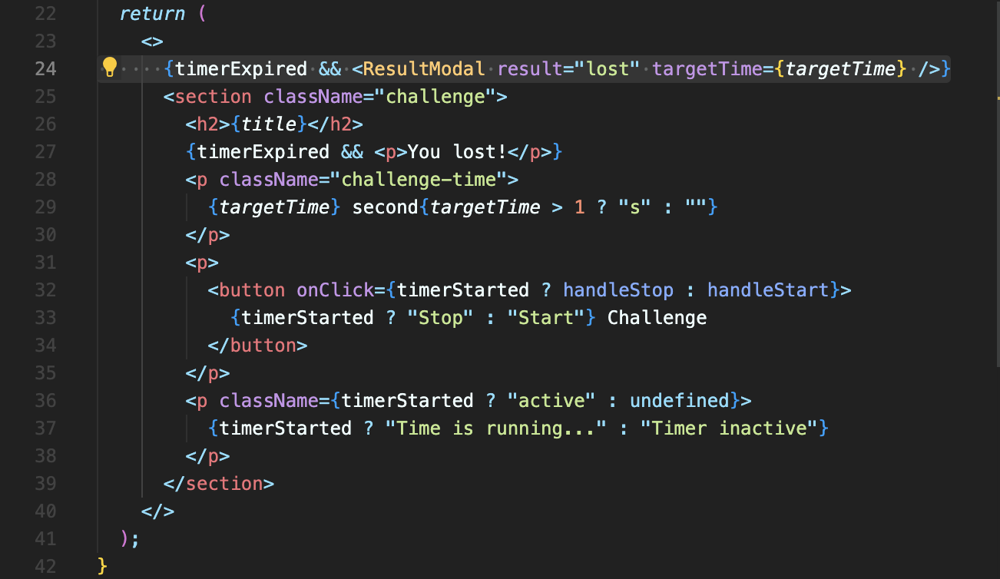
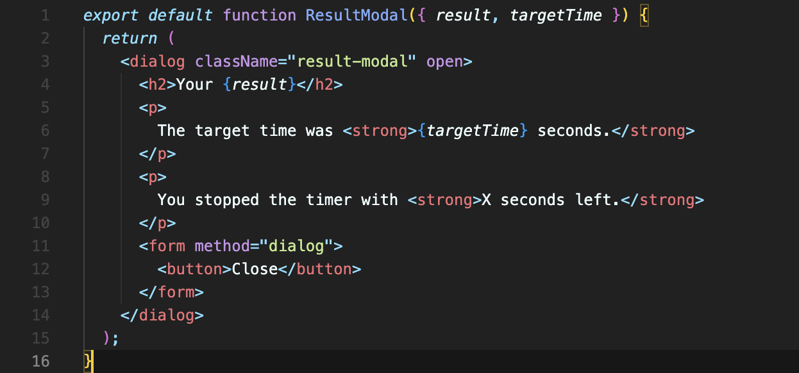
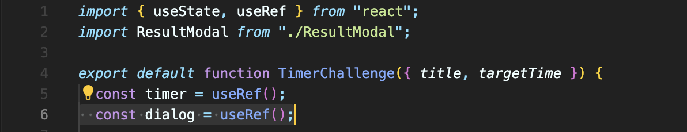
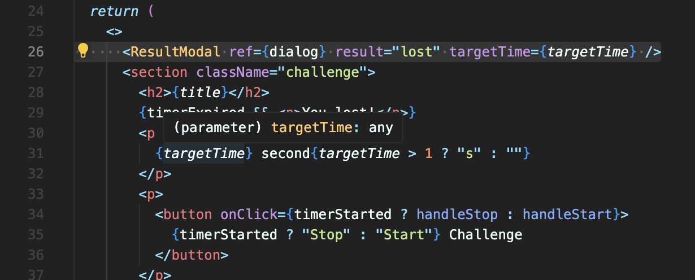
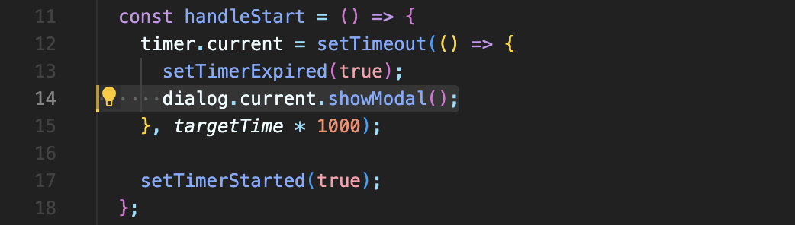
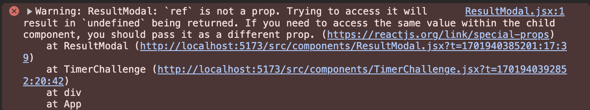
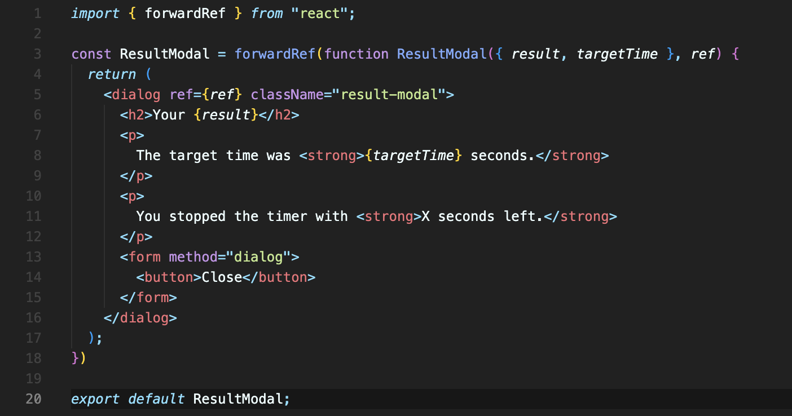
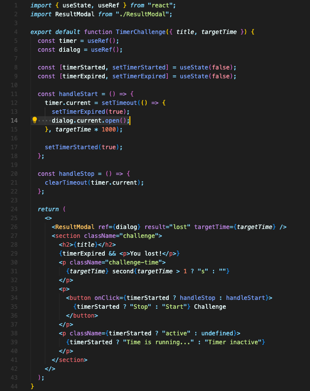
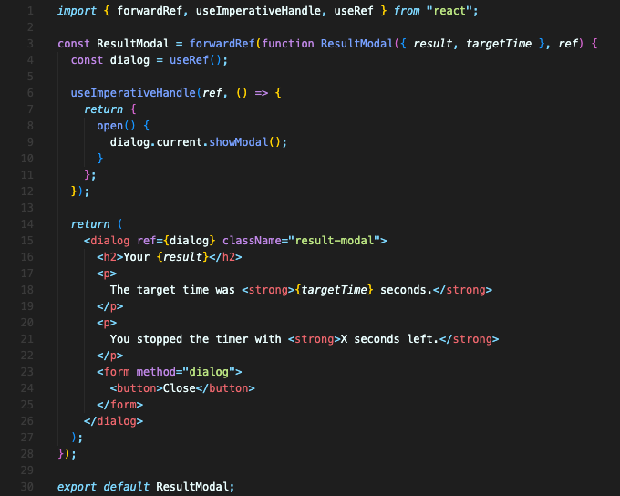

# forwardRef과 useInperativeHandle의 사용 예

아래 코드에서는, 시간이 만료되면 모달을 열려고 합니다.

모달의 상위 컴포넌트


state값인 `timerExpired`이 true일 때, 모달을 열라고 하는 것이죠.

모달은 `dialog` 요소로 만들어진 컴포넌트입니다. `dialog` 요소는 기본적으로 보이지 않는 요소로, `open` 속성이 있어야만 화면에 보입니다.

모달 컴포넌트


하지만 `open` 속성을 직접 하드코딩으로 입력하면, 기본적으로 함께 제공하는 backdrop을 받지 못합니다.

`dialog` 요소의 `showModel()` 메서드로 불러줘야 backdrop도 함께 불러올 수 있습니다. 이 방식으로 `dialog` 요소를 불러오려면 당연히 `open` 속성은 필요 없겠죠.

그럼 `showModel()` 메서드를 사용하기 위해, 상위컴포넌트에서 모달컴포넌트로 `ref`를 이용해서 접근하면 어떨까요?

상위 컴포넌트에서 `ref`로 모달 요소의 메서드를 실행하는 아이디어입니다.

먼저 `dialog`라는 이름으로 `ref`를 생성하고,


모달에 `ref` 값을 넘깁니다.


시간이 만료되면 모달을 여는 메서드를 실행합니다.


제대로 앱이 실행되지 않고 오류가 뜹니다.


이런 방식으로는 `ref`를 어떤 컴포넌트에서 다른 컴포넌트로 넘겨줄 수 없습니다.

이렇게 `ref`를 넘겨주려면 리액트에서 제공하는 특별한 `forwardRef`라는 함수를 써야 합니다.

<br/>

## forwardRef: Ref를 커스텀 컴포넌트에 넘겨주기

`forwardRef`를 사용하려면 아래와 같이 하면 됩니다.

1. 먼저 `forwardRef` 함수로 컴포넌트 함수를 모두 감싸줍니다.
2. 그리고 `const`로 이름을 지정해주고요,
3. `export default`로 내보냅니다.
4. `ref`를 props 처럼 받지 말고, 마지막 파라미터로 받습니다.



첫번째 파라미터는 props, 두번째 파라미터를 `ref`로 받는 겁니다.  
이 컴포넌트를 사용하는 상위 컴포넌트는 props 넘겨주듯 `ref`를 그대로 넘겨주면 됩니다.

이렇게 `forwardRef`의 도움을 받아 `ref`를 넘겨서 사용할 수 있게 되었습니다.

<br/>

## useImperativeHandle 훅 사용하기

나중에 다른 개발자가 모달 컴포넌트의 `dialog` 요소를 `div` 요소로 바꾸면 큰 문제가 생길 겁니다.  
`ref`를 사용해 `dialog`의 메서드를 사용하고 있었으니까요.

이 모달 컴포넌트가 불려져야 하는 함수를 직접 내보내게 하는 게 좋을 것 같습니다.  
컴포넌트의 다른 부분이 변경되어도 내보내는 함수를 제외하고 바뀌어도 괜찮도록요.

그걸 할 수 있게 해주는 특별한 훅이 있습니다. `useImperativeHandle` 훅입니다.

**이 컴포넌트 바깥에서 이 컴포넌트에 접근할 수 있는 속성과 메서드를 정의하기 위해서 이 훅을 씁니다.**

이걸 자주 쓰지는 말아야 합니다. 가능한 props 같은 걸 쓰는 게 좋습니다.  
하지만 이런 use case에서는 이 훅이 컴포넌트가 안전하게 쓰이게 해주기에 유용합니다.

`useImperativeHandle`은 두 개의 인수가 필요합니다.
- 첫번째는, `forwardRef`로 받아온 `ref` 입니다.(`useImperativeHandle`는 `forwardRef`와 함께 쓰기 위한 것입니다.)
- 두번째는, 함수인데요, 이 함수는 내보내기 위한 모든 속성이나 메서드를 담은 객체를 반환해야 합니다.

여기서 쓰는 함수 이름은 마음대로 정해도 됩니다. 밖에서는 이 이름으로 호출될 겁니다.

```javascript
import { forwardRef, useImperativeHandle } from 'react';

const ResultModal = forwardRef(function ResultModal({ result, targetTime }, ref) {

  useImperativeHandle(ref, () => {
    return {
      open() {

      }
    };
  });

  return (
    <dialog ref={ref} className="result-modal">
		  {/* ... */}
		</dialog>
	);
// ...
})
```

`useRef`로 새로운 `ref` 를 추가로 생성합니다. `dialog` 요소를 외부 컴포넌트와 분리하기 위해서 따로 ref를 달아줄 겁니다.

기존에 상위 컴포넌트에서 받았던 ref를 삭제하고, 새로 만든 `dialog` `ref`를 `ref` 속성에 달아줍니다.

```javascript
import { forwardRef, useImperativeHandle, useRef } from 'react';

const ResultModal = forwardRef(function ResultModal({ result, targetTime }, ref) {
  const dialog = useRef();

  useImperativeHandle(ref, () => {
    return {
      open() {
        dialog.current.showModal();
      }
    };
  });

  return (
    <dialog ref={dialog} className="result-modal">
		{/* ... */}
		</dialog>
	);
// ...
})
```

`useImperativeHandle` 내부에 있는 새로 생성한 `open()` 함수는 `dialog.current.showModal();`를 넣어줍니다.

상위 컴포넌트에서는 이렇게 부르고 있는데요,

```javascript
<ResultModal ref={dialog} targetTime={targetTime} result="lost" />
```

이 상위 컴포넌트에서의 `dialog`는 이제 `useImperativeHandle`의 반환되는 객체를 참조하고 있게 됩니다.

`useImperativeHandle`이 그렇게 한거죠.

따라서 상위 컴포넌트에서 `dialog.current.open()` 이 실행되는 부분은, `useImperativeHandle`의 `open` 메서드를 실행하는 겁니다.





<br/>