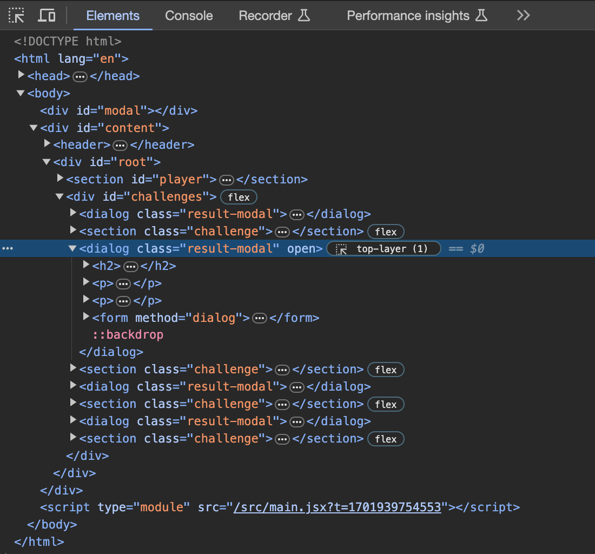
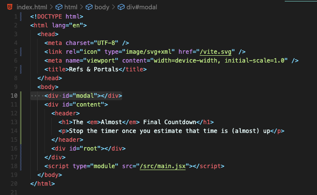
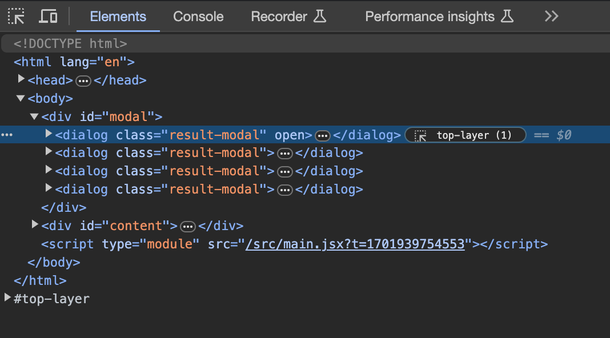
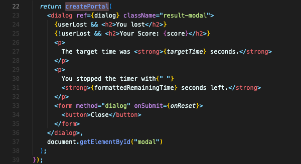

# 리액트 Portal

`dialog` 요소로 생성한 모달 컴포넌트는, 지금 구조상 다른 html 요소들과 섞여져서 출력되고 있습니다. (참고로, 지금 html에는 4개의 모달 컴포넌트가 있습니다.)



모달이라는 요소는 페이지 전체를 덮는 요소이기에, 가장 상단에 빼는 것이 구조적으로 좋아보일 것 같습니다.

그렇게 하기 위해서, 먼저 html 의 body 가장 바깥 부분에 모달용 자리를 `div`로 만들어두겠습니다.



이 문제를 해결할 수 있는 함수를 react-dom에서 가져올 겁니다. react-dom은 react와 같은 팀이 관리하는 라이브러리입니다.  
차이점은 리액트는 모든 환경에서 작동하는 기능만 공개한다는 게 차이점입니다.  
반면 react-dom 라이브러리는 몇개의 기능이 포함되어 있어서 DOM과 상호작용 할 수 있습니다.

react-dom 라이브러리에서 제공하는 `createPortal`을 가져옵니다.

```javascript
import { createPortal } from 'react-dom';
```

텔레포트하기 원하는 JSX 코드 정확히는, return 하는 부분 전체를 `createPortal`로 감싸줍니다. 첫번째 인수로 JSX 코드가 들어가게요.  
이 JSX 코드를 어디로 텔레포트 시킬지를 두번째 인수로 적어주면 됩니다.

```javascript
return createPortal(
    <dialog ref={dialog} className="result-modal">
			{/* ... */}      
    </dialog>,
    document.getElementById('modal')
);
```

index.js에서 app 아이디를 가진 `div` 요소에 루트를 만드는 것과 비슷합니다.

같은 리액트 앱이지만 html 에서 다른 곳에 출력되는 거죠.



여기서는 4개의 모달을 가지고 있다가 모달을 보여줘야 할때만 화면에 띄우는 `dialog`를 사용했기 때문에, 모달 요소가 4개나 있는 것을 볼 수 있습니다. 물론 실제로 보여질때는 한개만 보여주거나 아예 보여주지 않습니다.

중요한 건, body 태그 바로 아래에 modal 아이디를 가진 `div`에 잘 출력되고 있다는 점입니다. `createPotal`을 이용해서 이렇게 원한는 곳에 직접 출력할 수 있습니다.



<br/>