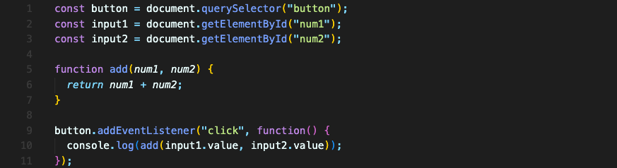
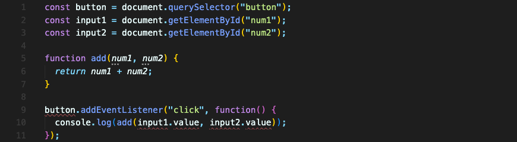
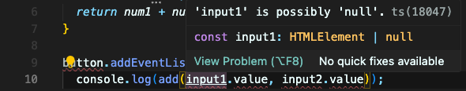
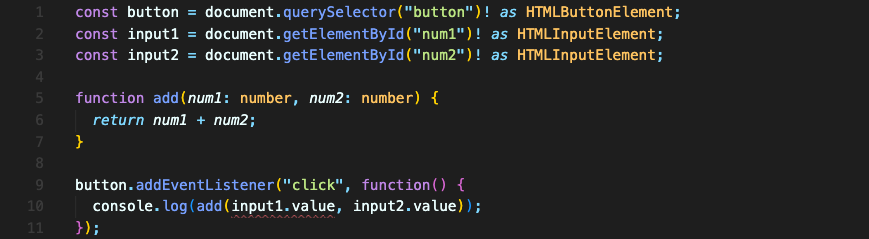
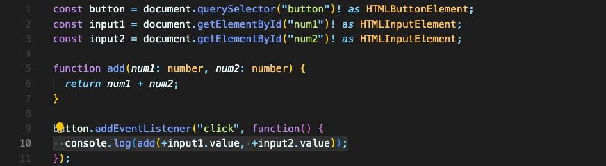

# 타입스크립트(TypeScript)에 대해

## 타입스크립트는 무엇인가?

타입스크립트는 자바스크립트의 Superset 입니다. 자바스크립트로 만들어진 언어죠. 자바스크립트에 새로운 기능들과 이점을 더한 것입니다.  

브라우저같은 일반 자바스크립트 환경에서 타입스크립트는 바로 실행될 수 없습니다.  
타입스크립트는 언어이기도 하지만 도구이기도 해서, 컴파일러의 역할도 합니다. 타입스크립트의 컴파일러가 타입스크립트를 일반 자바스크립트로 컴파일할 수 있습니다.  

그래서 정확히 타입스크립트는 뭘 할까요?  
타입스크립트는 이름에서 알 수 있듯이 자바스크립트에 타입을 추가합니다. 이는 개발자가 브라우저 런타임 오류 발생 전에 오류를 확인할 수 있게 합니다.   
예를 들어, 아래의 코드와 같이 코드 자체에서는 오류가 일어나진 않지만 원치 않는 결과를 가져오는 경우가 있습니다.
```javascript
function add(num1, num2) {
	return num1 + num2;
}

console.log(add('2', '3'))
// '23'
```
이런 원치 않는 오류는 타입스크립트를 써서 방지할 수 있습니다.

<br/>

## 타입스크립트 설치 & 기본 사용

npm을 사용하기 위해 node.js 를 설치한 뒤, 아래 명령어를 입력해 전역으로 타입스크립트를 설치합니다.
```bash
npm install -g typescript
```

타입스크립트는 프로그래밍 언어지만, 컴파일러라는 것을 잊지 말아야 합니다. 여기에서 설치한 건 타입스크립트를 자바스크립트 코드로 변환해주는 컴파일러입니다.

아래의 자바스크립트 파일을 `.ts` 확장자(타입스크립트 파일의 확장자)로 바꾸면


아래와 같이 자동으로 오류 표시가 뜹니다


Visual Studio Code에서 작업중인데, IDE에서 `.ts` 파일 안의 작업을 많이 지원해주거든요. 그래서 오류 메세지를 볼 수 있는 겁니다.    
`input`에도 오류가 떠 있는데 이 오류 메세지를 보면 `null`일 수도 있다고 써 있습니다.


개발자로서 이 요소는 절대 비어있지 않을 것을 알고 있습니다. 이 요소의 id값도 정확하게 입력했으니까요. 그래서 여긴 null 값이 들어있을 수 없다고 타입스크립트에게 알려줄 겁니다.

이렇게 요소의 맨 뒤에 `!` (느낌표)를 달아주면 타입스크립트에게 `null`은 절대 나오지 않는다고 전달할 수 있습니다.  

느낌표를 추가하니 요소에 대한 오류가 사라졌습니다.  
추가로, 타입스크립트에서 `as`를 사용해 요소가 어떤 타입의 요소인지 알려줄 수 있습니다.  
```typescript
const input1 = document.getElementById("num1")! as HTMLInputElement;
```
`as`는 당연히 일반 자바스크립트에서는 불가능합니다.  

다시 코드로 돌아가보면, `add` 함수 정의 부분에서도 파라미터 `num1`, `num2`에 메세지가 뜹니다.  
`any` 타입으로 되어있는데 사용에 따라 타입을 지정하라고 하네요.

타입을 지정할 땐, 콜론을 쓰고 타입을 입력하면 됩니다.


마지막으로, `add` 함수를 사용하는 부분의 오류를 수정해줍니다. `input`요소는 항상 `string` 값을 가지고 있으니 생기는 오류입니다.


이렇게 모든 오류를 없애고, 타입스크립트 컴파일러가 실행되도록 명령어를 입력합니다.
```bash
# tsc <typescript-file-name>.ts
tsc app.ts
```

그럼 같은 경로에 컴파일된 `app.js` 파일이 생성될 겁니다.

<br/>

## 타입스크립트의 이점
타입스크립트를 사용하는 것의 이점은 타입을 추가할 수 있게 하는 것 뿐만이 아닙니다.
- 차세대 자바스크립트 기능들이 옛날 브라우저에서도 작동할 수 있도록 컴파일해줍니다.
- 자바스크립트 기능이 아닌, 인터페이스, 제네릭 같은 기능을 추가할 수 있습니다.
- 데코레이터같은 메타 프로그래밍 기능을 제공합니다.
- 타입스크립트는 구성 옵션이 뛰어납니다. (더 엄격하게 하거나, 더 느슨하게 하거나)
- 모던한 IDE는 타입스크립트 파일을 인식하고 지원해줍니다. (심지어 타입스크립트를 깔지 않았더라도요)

<br/>