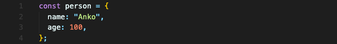
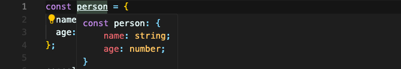
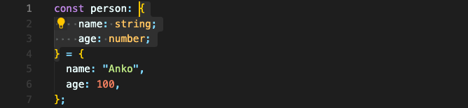
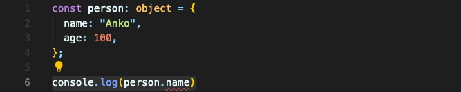

# Object 타입

객체를 만들어보고 객체 이름에 hover해보면 아래와 같이 뜹니다.


이건 자바스크립트 객체가 아닙니다. 타입스크립트가 제공하는 객체 타입입니다.  
잘 보면, `key`, `value` 페어가 아니라 `key`, `type` 페어가 있습니다. 

좋은 예는 아니지만 이해를 위해 타입을 추가해보자면 이렇게 할 수 있습니다. (할당할 때 이미 타입스크립트가 타입을 알고 있으니, 사실 따로 지정할 필요 없어서 좋은 예가 아니라는 의미)

객체 안의 요소 하나하나에 대해 타입을 정의했습니다.

자바스크립트의 object 자체를 타입으로 지정하면 어떻게 될까요?

오류가 뜹니다. 오브젝트 내에서 `name` 속성을 못 찾겠다는 오류가 뜹니다. 즉 직접 속성의 타입을 지정해줘야 합니다.

다시 말하지만, 이렇게 할당이 바로 이루어지는 상수 혹은 변수에서는 타입 지정하는 것이 불필요합니다. 타입스크립트가 알아서 타입을 정확하게 읽어오니까요.

<br/>

## 중첩된 Object와 그 타입

이런 객체가 있다고 가정하겠습니다.
```typescript
const product = {
  id: 'abc1',
  price: 12.99,
  tags: ['great-offer', 'hot-and-new'],
  details: {
    title: 'Red Carpet',
    description: 'A great carpet - almost brand-new!'
  }
}
```

이 객체의 타입은 이렇게 될 겁니다.
```typescript
{
  id: string;
  price: number;
  tags: string[];
  details: {
    title: string;
    description: string;
  }
}
```
오브젝트 타입 안에 오브젝트 타입이 있을 수 있습니다.

<br/>

## 요약
객체의 형태
```typescript
const person = {
    name: 'Anko',
    age: 100
    pet: {
        name: 'Coucou',
        age: 3
    }
}
```
위 객체의 타입
```typescript
{
    name: string;
    age: number;
    pet: {
        name: string;
        age: number;
    }
}
```