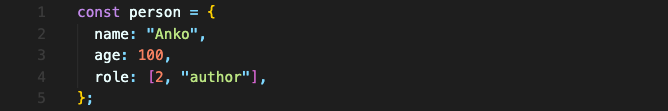
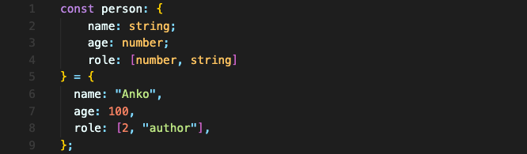

# Tuple 이용하기

person 객체 안에 배열이 값인 role이 있습니다.



이 role은 첫번째 값이 식별자 번호고, 두번째 값이 식별자 문자열입니다. 따라서 role 배열은 길이가 더 늘어나거나 자리마다 타입이 바뀔 수 없습니다.

만약 `person.role.push(’admin’);` 이나 `person.role[1] = 10;` 같은 코드를 입력하면 변경될 겁니다. 변경되면 안되는데도요.  
이런 경우가, 딱 튜플 타입을 적용하기 좋은 경우입니다.  

role을 포함하여 객체에 타입을 지정합니다.



튜플은 이렇게 `[]` 안에 각각의 타입을 지정해서 타입을 지정할 수 있습니다.

첫번째 요소는 number가 되어야 하고, 두번째 요소는 string이 되어야 합니다.

컴파일을 하게 되면 `person.role[1] = 10;` 같은 코드는 오류로 잡지만, `person.role.push(’admin’);` 는 잡지 못합니다.  
**push는 예외적으로 잡을 수 없습니다. 주의해야 합니다.**

<br/>

## 요약
배열에 길이가 있고, 각 자리에 정해진 타입이 있다면 tuple 타입을 사용합니다.
```typescript
let role: [number, string]  = [0, "ADMIN"];
```

<br/>