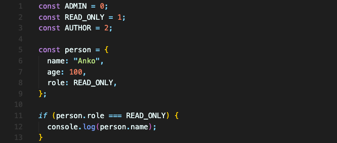
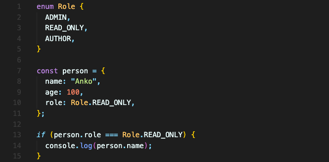

# Enum 이용하기

person 객체의 role 속성에 `"READ_ONLY”` 값을 주었다고 가정해보겠습니다.


아래 `if` 문에서 이 값을 체크하는데, 띄어쓰기인 대시를 표시하는 방법에 차이가 있어서 원하는대로 작동하지 않습니다.

자바스크립트에서는 이런 경우 글로벌 상수를 정의하는 게 일반적입니다.



잘 작동하지만, 이 방법의 단점이 있습니다.

role은 number 타입으로 추론되니 사실상 어떤 숫자든 저장할 수 있습니다. 상수로 정의한 지원하는 숫자 외에 다른 숫자들도요. 게다가 모든 상수를 정의하고 관리해야 합니다.

이렇게 해도 되지만 enum을 사용하면 더 편해집니다.



enum의 이름은 대문자로 시작하게 하고, 보통 요소들은 대문자로 쓰는 것이 컨벤션입니다.

여기서 person의 타입을 살펴보면 이렇습니다.
```typescript
const person: {
    name: string;
    age: number;
    role: Role;
}
```
enum의 요소들은 기본적으로 0부터 시작하는 숫자 값을 가지고 있습니다.  
위의 경우 `Role.ADMIN = 0`, `Role.READ_ONLY = 1`, `Role.AUTHOR = 2` 이렇게 됩니다.

하지만 어떤 이유에서든 0이 아닌 다른 값으로 시작하길 원한다면 특정한 값을 지정할 수도 있습니다.
```typescript
enum Role {
  ADMIN = 2,
  READ_ONLY,
  AUTHOR,
}
```
이렇게 하면 `Role.ADMIN = 2`, `Role.READ_ONLY = 3`, `Role.AUTHOR = 4` 가 됩니다.

string 값을 줄 수도 있습니다.
```typescript
enum Role {
  ADMIN = 'ADMIN',
  READ_ONLY = 100,
  AUTHOR = 200,
}
```
이렇듯, enum은 배후에 매핑된 값이 있는 식별자가 필요할 때 사용하기 좋은 구성입니다.

<br/>

## 요약
enum은 식별자가 필요할 때 상수보다도 사용하기 좋은 방법입니다.  
특별히 지정하지 않으면 내부적으로 매핑되는 값은 0부터 시작합니다.
```typescript
enum Role {
  ADMIN,
  READ_ONLY,
  AUTHOR,
}

const person = {
    name: "Anko",
    role: Role.ADMIN,
}
```

<br/>
