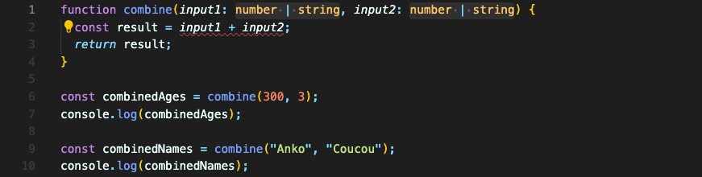
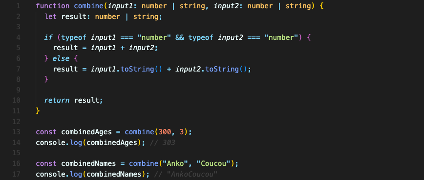

# Union 타입

한가지 타입만 허용하게 하는 게 아니라 두가지 타입 이상을 허용하고 싶다면 Union Type을 쓸 수 있습니다.

number와 string을 모두 받고 싶다면 파이프 (`|`) 기호를 사용해 Union Type을 명시하면 됩니다.



여기서 `input1`과 `input2`를 더할 수 없다고 오류가 뜹니다.  
원래는 string이나 number나 둘 다 `+` 연산자로 더하거나 합칠 수 있는 게 맞습니다. 하지만 타입스크립트는 Union Type이 있다는 것만 보고 무엇이 있는지 분석하지는 않습니다.  
“여러 유형이 필요한데, 플러스 연산자를 쓸 수 없는 것도 있어!” 하고 오류를 내보내는 겁니다.

해결하기 위해 runtime typecheck를 추가해서 코드를 쓰면 됩니다.


<br/>

## 요약
두가지 타입 이상을 허용하고 싶다면 파이프 (`|`) 기호를 사용해 Union Type을 명시하면 됩니다.
```typescript
let input: number | string;
```

<br/>