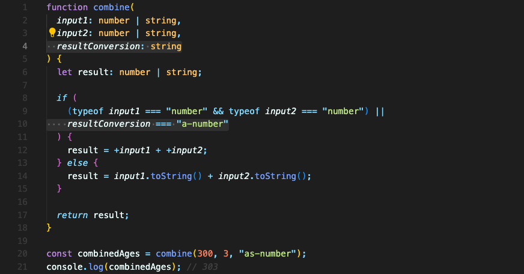
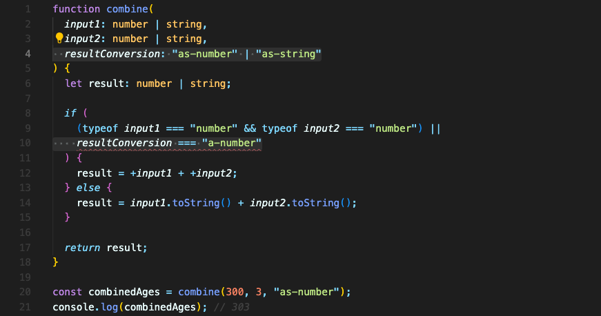

# Literal 타입

문자열 값에 대한 타입을 단지 string이 아닌 특정한 문자열로 지정할 수도 있습니다.  
이렇게 하면 어떤 이점이 있을까요?

### string 타입으로 지정한 경우
먼저 Literal 타입이 아닌 string으로 타입을 지정한 경우입니다.

`combine` 함수는 `resultConversion`값을 string 타입으로 가지고 있습니다.

이 함수는 `input1`과 `input2`가 모두 number 타입이거나, `resultConversion`이 `"as-number”`이면 두 값을 더합니다.(`if`문)

만약 이 함수를 내부에서 `resultConversion === "as-number”` 라고 쓰려 했던 부분이 `resultConversion === "a-number”` 이렇게 오타가 나면 어떻게 될까요?  
`resultConversion` 값은 string을 모두 허용하기 때문에 아무런 오류도 뜨지 않을 겁니다.

이 부분을 개선하기 위해서  Literal 타입을 사용할 수 있습니다.

### Literal 타입으로 지정한 경우

모든 문자열을 허용한다는 string이 아니라, 특정한 문자열인 `"as-number”`와 `"as-string”`만 허용하는 Literal 타입을 지정했습니다.

line 10에서 볼 수 있듯, 바로 오류를 잡을 수 있습니다.

<br/>

## 요약
string이 아닌 특정한 문자열을 사용해 타입을 제한할 수 있습니다. string 중에서도 정확하게 같은 문자열만 허용됩니다.
```typescript
function foo(resultType: "as-number" | "as-string") {
	// ...
}
```

<br/>