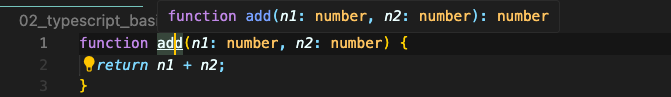
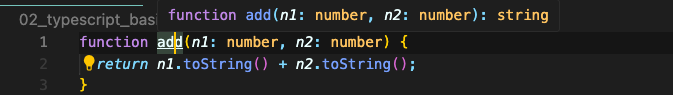
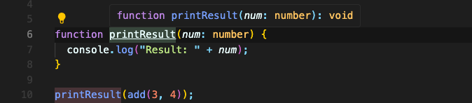
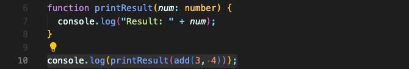

# 함수 return 타입 & "void”

숫자 2개를 받아 더한 값을 return 하는 함수가 있다고 가정하겠습니다.  
타입스크립트에서 이 함수는 return 값에 대한 타입도 가집니다.  


함수 이름 위에 hover 해보면 맨 뒤에 `: number` 로 표시되어 있습니다. 이게 return 타입입니다.  
number 2개를 받았고, 그걸 더한 값이니 number 값이 반환될 거라고 추론하는 겁니다.

return 값을 문자열로 바꾸면 어떨까요?


타입스크립트가 string 타입이 return 될 것이라고 추론했습니다.  

아래와 같이 명시적으로 이렇게 return 값을 써 줄 수 있지만,

특별한 이유가 없다면 타입스크립트가 알아서 타입을 추론하도록 두는 게 좋습니다.

## “void” 타입

“void” 타입은 자바스크립트에는 없는 타입입니다.  
함수 내에서 return 하는 값이 없다면 return 타입은 void가 됩니다.


다른 프로그래밍 언어에서는 void가 있기도 하지만, 자바스크립트에서는 없습니다. 타입스크립트가 역할을 하는 겁니다.

그럼 void를 리턴하는 함수를 콘솔로 찍으면 뭐가 나올까요?



undefined가 나옵니다.  
undefined는 정의되지 않은 값입니다. 존재하지도 않는 객체의 속성에 접근하려고 하면 나오는 값이에요.

그런데 혼란스럽게도 타입스크립트에는 undefined 타입이 있습니다.  
이 undefined 타입을 void 대신 사용하면 같지 않을까요?

```typescript
function printResult(num: number): undefined { // error
  console.log("Result: " + num);
}
```

에러가 일어납니다. 타입스크립트는 조금 다르게 생각해서 undefined를 반환하려면 undefined을 return해야 하거든요.

```typescript
function printResult(num: number): undefined {
  console.log("Result: " + num);
	return;
}
```

정리해서 이야기하면,  
- **void는 return문이 없는 경우에 써야합니다.** (return 문이 있어도 상관 없습니다.)    
- **undefined는 return문을 무조건 가져야 하고, 아무것도 반환하지 않는것을 기대합니다.**

자바스크립트에서는 두 경우가 차이 없지만, 타입스크립트는 다르게 취급합니다.  
undefined를 사용해야 하는 특별한 경우가 아니라면 void를 사용하는 것이 좋습니다.

<br/>