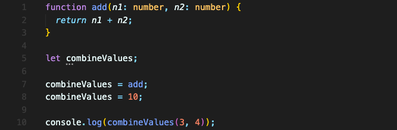
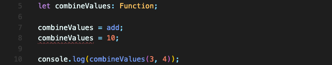
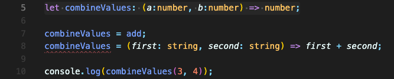

# 타입으로 특정 유형의 함수 지정하기

문제의 상황부터 먼저 보겠습니다.  

아래 코드에서는 `combineValues` 라는 변수를 선언합니다.

`combineValues`는 타입이 any 이기에 아무 값이나 넣을 수 있습니다.  
함수 `add`를 할당했을 때는 원하는대로 동작하지만, 엉뚱한 숫자나 문자열이 들어갈 수도 있습니다.

이럴 때, 타입을 함수로 지정해 방지할 수 있습니다.  
첫번째 방법은 Function 타입을 사용하는 겁니다.

원하는대로 바로 에러가 뜹니다.

하지만 이렇게 하면 모든 함수를 값으로 받을 수 있게 설정한 것입니다. 두개의 숫자를 받아 숫자를 return 하는 함수로 특정할 수는 없을까요?  
arrow 함수를 이용해 파라미터 타입과 반환 값의 타입만 써주면 됩니다.

두번째 할당할 때, 함수이지만 다른 타입의 값을 받고 반환하는 함수를 할당해봤습니다.  
string값 2개를 받아 string값을 반환하는 함수는 할당할 수 없다고 에러메세지가 나옵니다.

구체적으로 어떤 타입의 함수를 사용하고 싶은지 이렇게 적용할 수 있습니다.

 