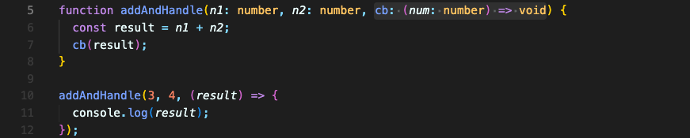
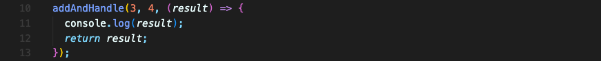

# Callback 함수 타입 지정

callback 함수도 타입을 지정할 수 있습니다.  

아래 예시를 보면 `addAndHandle` 함수의 세번째 파라미터로 callback 함수를 받아옵니다.  
이 부분에 간단하게 타입을 추가할 수 있습니다.

`addAndHandle` 함수를 사용할 때, 콜백으로 넘기는 함수의 파라미터를 늘리면 오류가 납니다.

당연합니다. number 타입의 값 1개만 받는 콜백함수로 정의되어 있으니까요.  
**파라미터는 잘못 전달되면 원하는 결과를 얻지 못할 수 있는 위험이 있습니다.** 따라서 바로 오류를 띄웁니다.

조금 이해가지 않는 부분은 이제 나옵니다.  
콜백함수는 파라미터의 타입이 정의되어 있을 뿐만 아니라, 또한 void 타입을 반환다고 정의되어 있습니다.  
하지만 콜백 함수에 return 값을 추가하면 오류가 나지 않습니다.

먼저 요약해서 말하면, **이건 직접적인 오류를 일으키지 않기 때문입니다.**

`addAndHandle` 함수 내에서 작업을 할 때, void 타입을 반환한다고 명시적으로 써 놓았기에 `addAndHandle` 함수 내부에서 return 값을 사용하지 않아야 한다는 것을 알 수 있습니다. 전해지는 콜백 함수가 값을 return 했든 안했든 return 값을 사용하지 않을 겁니다. (물론 return 값을 사용할 수는 있습니다만, void를 써 놓았으니 원래 return 값은 쓰는 용도가 아니겠죠.)

그래서 여기서 타입스크립트는 파라미터에 신경을 쓰지 return 타입에는 크게 신경을 쓰지 않습니다.

 