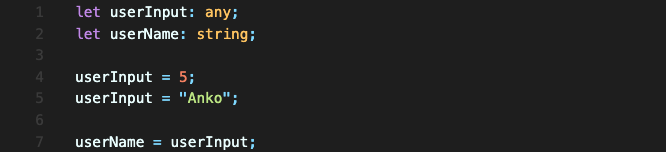
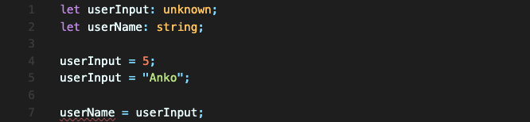
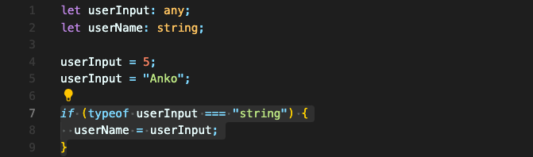
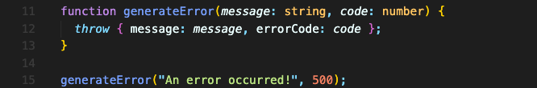
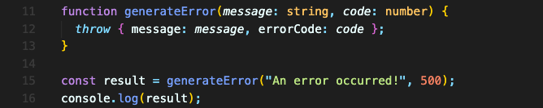
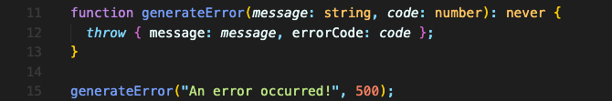
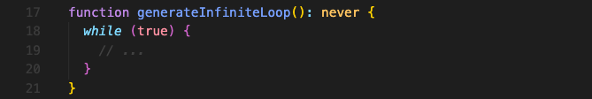

# "unknown" & "never" 타입

## "unknown" 타입

타입스크립트에는 unknown 타입도 있습니다.  

```typescript
let userInput: unknown;
```
unknown 타입 값은, 모든 타입을 저장할 수 있습니다.
듣기엔 any 타입과 같은 타입처럼 들리지만, unknown 타입은 any 타입보다는 좀 더 제한적입니다.

### any 타입 사용

any 타입은 말 그대로 모든 타입을 저장할 수 있습니다.  
위 코드에서처럼, 몇 번의 재할당을 하는 것에도 자유롭습니다.

### unknown 타입 사용

unknown 타입 또한, 모든 타입을 저장할 수 있습니다.  
하지만 any 타입과 다른 점은, **한 번 값이 할당된 후에는 그 값에 맞는 타입만을 가진다는 겁니다.**  
그래서 unknown을 쓰려면 먼저 지금 저장되어 있는 타입을 체크해야 합니다.


예시 코드의 경우, 이렇게 if문과 typeof를 사용해 string인지 아닌지 확인한 다음에야 재할당할 수 있습니다.

이런 추가적인 작업이 필요하기에 unknown은 any보다 더 안전하게 쓸 수 있습니다. 따라서 unknown이 any보다 더 나은 선택임을 알 수 있습니다.

<br/>
<br/>

## "never" 타입

함수가 반환하는 타입 중에, never 타입도 있습니다.  

아래 코드와 같은 에러를 생성하는 유틸리티 함수가 있다고 가정해보겠습니다.



이 `generateError` 함수의 return 타입은 무엇일까요?

아무것도 반환하지 않으니 void라고 생각할 수도 있습니다. 하지만 엄밀히 말하면 아무것도 반환하지 않는게 아니라, 이 함수는 '절대' 반환하지 않습니다.

말장난 같지만 `console.log`를 찍어보면 일반적으로 return 타입이 void인 함수와 차이가 있습니다.



이렇게 찍어보면 undefined도 뜨지 않습니다. 에러가 일어나고 끝입니다.  
return 타입이 void 인 함수는 똑같이 console.log를 찍어보면 undefined가 나오지만요.

그 부분에서 차이가 있습니다. 이 함수는 '절대' 어떤 값도 반환하지 않습니다. **에러만 던지는 함수의 경우 항상 never 타입을 반환합니다.**  
따라서 return 타입을 이렇게 설정할 수 있습니다.



never 타입은 비교적 최신 타입이라, IDE에서는 void로 추정합니다만, never로 지정하는게 더 명확합니다.  

이런 경우 외에, **never을 타입을 반환하는 다른 경우는 무한루프가 있는 함수입니다.**



`while (true)` 로 설정해서 루프를 돌리면, 반환 절대 반환하지 않는 함수를 만들 수 있습니다.  

이런 경우보다는 위의 에러 생성하는 함수의 경우가 더 일반적인 사례겠지만요.

<br/>