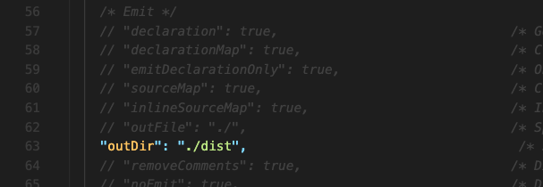
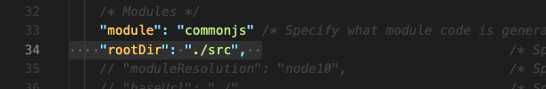
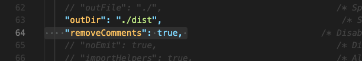

# 타입스크립트 컴파일러 구성하기

[tsconfig Document](https://www.typescriptlang.org/docs/handbook/tsconfig-json.html)  
[Compiler Options](https://www.typescriptlang.org/tsconfig)

`tsc —init` 명령어로 생성된 tsconfig.json 파일은, 타입스크립트에게 어떻게 컴파일해야 하는지 말해주는 파일입니다.  

tsconfig.json 파일을 어떻게 설정할지 몇가지 살펴보겠습니다.


## 파일 Including & Excluding
tsconfig.json 파일이 처음 생성되었을 때, 내부를 보면 `"compilerOptions”`만 존재합니다.  
`"compilerOptions”`와 같은 레벨에 `"exclude"` 와 `"include"`, `"files"`를 추가할 수도 있습니다.


### `"exclude"` 키워드
폴더 내에 컴파일 할 모든 파일에서 특정하게 빼고 싶은 파일을 추가하면 됩니다.


이렇게 입력하면 analytics.ts 파일은 빼고 나머지 모든 파일을 컴파일 할 겁니다.

여기서 `*` 표시의 와일드 카드를 써도 됩니다.


보통은 흔하게 node_modules 폴더를 넣습니다. 그 안에 있는 패키지가 가지고 있는 타입스크립트는 모두 컴파일하면 시간이 걸리니까요.


**`"exclude"` 키워드 자체를 쓰지 않으면 자동으로 기본 설정으로 node_modules은 제외됩니다.**   `"exclude"`를 쓸 때는 node_modules을 추가해서 제외시켜줘야 하지만요. 한 마디로, **`"exclude"`를 쓸 때는 node_modules을 꼭 써줘야 합니다.**


### `"include"` 키워드
반대로 `"include"` 키워드는 컴파일 프로세스에 추가할 파일이나 폴더를 넣을 수 있습니다.

`"include"` 키워드를 쓰지 않으면, 알아서 프로젝트 폴더 내부의 모든 타입스크립트 파일을 컴파일 하지만, `"include"` 키워드를 쓰면 그 안에 있는 파일이나 폴더만 컴파일 합니다. 


**`"exclude"`와 `"include"`를 같이 쓰면, `"include"`에 쓰여있는 것들에서 `"exclude"`에 쓰여 있는 것들을 제외하고 컴파일합니다.**

위의 경우는 `"exclude"`와 `"include"`의 범위가 중복되지 않지만, `"include"`에 루트 폴더 자체를 넣으면 중복되겠죠.  
그 경우 include에 적인 루트 폴더에서 `"exclude"`의 파일/폴더들을 제외하고 컴파일합니다.

> `"include"` - `"exclude"` = 컴파일되는 것들


### `"files"` 키워드
`“files”` 키워드도 있습니다.  
컴파일할 파일 명을 넣는다는 부분에서 `"include"`와 비슷하지만, 차이점은 폴더를 넣을 수는 없다는 겁니다. 개별 파일 명만 명시할 수 있어요.

작은 프로젝트에서 몇몇 파일만을 컴파일하기 위해 사용할 수도 있지만, 현실에서는 이런 설정은 잘 사용되지 않습니다.


<br/>

## `"compilerOptions"` 내부 구성하기
위에서는 `"compilerOptions”`와 같은 레벨에 무엇을 추가할 수 있는지 살펴봤습니다.  
여기에서는 `"compilerOptions”` 내부에 대한 구성을 살펴보겠습니다.  

`"compilerOptions”`는 컴파일러의 작동방식을 구성할 수 있는 곳입니다.  
아래의 내용을 중점적으로 살펴보겠습니다.
- `target`
- `lib`
- `sourceMap`
- `rootDir`
- `outDir`
- `removeComments`
- `noEmit`
- `downlevelIteration`
- `noEmitOnError`
- `strict` 관련


### `target`
`"target"`은 어떤 자바스크립트 버전으로 컴파일하길 원하는지 지정하는 것입니다.

원하는 브라우저가 지원하는 자바스크립트 버전에 맞게 설정하면 됩니다. 예시에서는 es2016 즉, ES7 으로 최종 자바스크립트 파일이 변환되도록 설정했습니다.


### `lib`


`“lib”`는 어떤게 디폴트 오프젝트인지 기능인지 타입스크립트가 특정하도록 합니다.

아래와 같은 타입스크립트 파일이 있다고 가정하겠습니다.


어떻게 document에 접근하고 거기에 querySelector 같은 메서드가 있는지 알까요?

사실 이건 자바스크립트에서는 유효한 코드지만, 타입스크립트에서는 아닙니다. 타입스크립트는 브라우저만을 위한 게 아니니까요. node.js에서 쓸 수도 있고요. 사실 이 코드 자체는 작동할 수 없습니다.

`“lib”`은 지금 주석처리되어 있습니다. 이렇게 아무 세팅도 없는 경우엔, 기본적으로 `"target"` 으로 설정된 자바스크립트(여기선 es2016)에 따라 그 모든 기능을 포함해서 쓸 수 있습니다.  
한 마디로, es2016 기능을 모두 쓸 수 있고 DOM API도 쓸 수 있다는 것입니다.

따라서 이 주석을 풀면, 세팅이 없는게 아니라 빈 배열(`[]`) 즉 아무 값도 넘기지 않기 때문에 컴파일에 실패할 수밖에 없습니다.  
주석을 풀면 컴파일하며 다음과 같이 에러 메세지가 나옵니다.


`"lib"`에 `"DOM"`을 추가하면 DOM API를 사용할 수 있게 됩니다.


**따라서 `"lib"`은, 타입스크립트가 이해할 수 있는 식별자를 전달해주는 것이라고 생각하면 됩니다.**  

주석처리했을 때 `"target"` 으로 설정된 자바스크립트 기능과 DOM API를 모두 쓸 수 있다고 했는데요,  
그 때와 같은 효과를 가지는 `"lib"` 설정은 아래와 같습니다.


정확히 주석처리했을 때와 같은 동작을 하니, 주석처리하고 사용하면 됩니다.


### `sourceMap`
`“sourceMap”`은 디버깅과 개발을 도와줍니다.

개발자도구를 켜보면 js로 변환된 파일로 디버깅해야 합니다. 컴파일된 복잡한 자바스크립트 코드가 아니라 타입스크립트로 디버깅 할 수 있다면 더 좋을 것 같습니다.

이때 `“sourceMap”`을 이용하면 됩니다.


`“sourceMap”: true`로 설정하면 컴파일되면서, 컴파일 된 자바스크립트 파일 뿐만 아니라 \<file-name>.js.map 파일도 생성됩니다.

이 파일은 컴파일된 자바스크립트 파일과 그 소스인 타입스크립트 파일을 연결시켜주는 역할을 합니다. 브라우저나 개발자도구에서 읽을 수 있게요.

개발자도구를 보면 자바스크립트 파일 외에 타입스크립트 파일이 있는 것을 볼 수 있습니다.


이 기능을 켜면 타입스크립트로 디버깅을 할 수 있어 편리합니다.


### `outDir` & `rootDir`
보통 프로젝트에서는, 한 디렉토리 안에 모든 자바스크립트 파일과 타입스크립트 파일을 보관하지 않습니다.

src 폴더에 타입스크립트 파일을, dist 폴더에 자바스크립트 파일을 넣어 보관하는 경우가 많습니다.  
하지만 지금 설정으로는, src 폴더에 타입스크립트 파일을 담고 컴파일을 해도, 바로 그 옆에 자바스크립트 파일이 생성됩니다.


**원하는 특정한 폴더 위치로(예를 들어, dist 폴더) 자바스크립트 파일을 저장하게 할 수 있는 게 `"outDir"` 설정입니다.**



컴파일 된 파일을 dist 폴더 안에 저장하라고 설정했습니다. 경로는 tsconfig.json 파일 기준으로 작성됩니다.

컴파일을 하면 원하는대로 잘 저장됩니다.


컴파일 된 자바스크립트 파일의 위치가 dist 폴더 내부로 변경되었으니, HTML 파일의 스크립트 읽어오는 경로도 변경해줘야 할 겁니다.


추가로, outDir의 좋은 점은 이렇게 폴더 구조도 그대로 복사해 저장한다는 것입니다.


하지만 src 폴더 밖 다른 곳에 타입스크립트 파일이 있어도 그대로 구조를 복사해서 dist 폴더에 넣습니다.


src 폴더 내부를 그대로 컴파일 하기 원했기에 이건 우리가 원한 결과가 아닙니다. `"outDir"`만 썼을 때 발생할 수 있는 문제입니다.  

**특정 폴더 내에 있는 파일만을 컴파일하고 싶다면 `"rootDir"`로 범위에 제한을 줄 수 있습니다.**  
src 폴더 안에 있는 타입스크립트 파일만을 컴파일 하기 위해 `"rootDir"`을 설정하겠습니다.



src 폴더 안으로만 범위를 제한했습니다. 그리고 컴파일을 실행해보겠습니다.


dist 폴더 안에는 원하는대로 src 파일 안에 있는 타입스크립트 파일만이 컴파일되어 나왔습니다.


### `removeComments`
`"removeComments"`는 말 그대로 true 값으로 설정하면, 컴파일할 때 주석을 제거하고 컴파일하는 것입니다.



### `noEmit`
`"noEmit": true`로 설정하면, 자바스크립트 파일을 생성하지 않습니다.  
파일이 올바른지 확인만 하고 싶을 때 쓰면 됩니다. 큰 프로젝트에서는 개발할 때 자바스크립트 파일을 만드는 데 드는 시간을 절약할 수 있습니다.


### `downlevelIteration`
`"downlevelIteration"`는 고급 옵션입니다. 옛날 버전의 자바스크립트로 컴파일할 때, for 루프가 타입스크립트 파일에 담겨있다면 드물지만 컴파일이 제대로 안 될 수 있습니다. 그럴때 켜면 좀 더 정확한 컴파일이 됩니다.

항상 켜야 하는 건 아닙니다. 코드에 대한 아웃풋이 많아지기에 고려해서 결정해야 합니다.  
그러니 이건 **루프가 있고 루프가 이상하게 작동할 때만 켜야합니다.**


### `noEmitOnError`
타입스크립트 파일에 오류가 있어도, 자바스크립트 파일도 생성되는 것을 볼 수 있습니다.  
컴파일하면서 오류 메세지는 나오지만요.

오류가 났을 때 자바스크립트 파일이 아예 생성되지 않도록 하는 옵션 `"noEmitOnError"` 옵션입니다.


오류가 있어도 자바스크립트 파일을 생성하는 게 괜찮다면 아예 적지 않거나, `false` 값으로 둬도 됩니다.  
이걸 `true`로 설정하면 문제가 있는 자바스크립트 파일이 생성되지 않습니다. 오류 있는 파일 자체가 생성되는 것을 방지하는 겁니다.

확실하게 알아야 할 것은, 오류가 있는 자바스크립트 파일만 생성되지 않는 게 아니라 모든 자바스크립트 파일이 생성되지 않습니다. 오류가 일어나면요.


### `strict`
`"strict"` 옵션이 켜있으면 아래 주석처리 되어 있는 모든 옵션을 켠 것과 같습니다. 


이걸 끄고 밑의 다른 옵션들을 조합해 설정할 수도 있습니다. 켠 상태로 다른 옵션만 `false`로 바꿔 꺼 줘도 되고요.  
아래에 있는 다른 strict 관련 옵션들을 조금 살펴보겠습니다.

#### "noImplicitAny"

타입스크립트 코드에서, 파라미터에 타입을 넣어주지 않으면 이런 에러가 뜹니다.

이 파라미터는 암목적으로 any 유형을 가지고 있습니다.

이런 에러 메세지는 `"noImplicitAny"`를 `false`로 바꿔주면 사라집니다.


`"noImplicitAny"`는 이런 부분을 조절해주는 설정입니다.

```
>> Note

타입스크립트는 변수에서는 타입을 유추할 수 있습니다. 하지만 함수의 파라미터에서는 아닙니다.
함수가 사용되어야 파라미터 타입을 추론할 수 있는데, 함수는 항상 사용하기 전에 먼저 선언되니까요.

따라서 변수는 타입 없이 정의 가능하지만, 파라미터는 무조건 타입을 적어줘야 합니다.
```

#### "strictNullChecks"

위 코드에서는 버튼 같은 요소는 null 값이 나올 수 있다고 오류가 뜹니다.  
때문에 버튼 요소를 가져올 때, 끝에 `!`를 달아 null이 나오지 않음을 보장줘야만 합니다.

`"strictNullChecks"`를 false로 만들어주면 이런 오류가 사라집니다.


#### "alwaysStrict"
`"alwaysStrict"`는 자바스크립트 파일이 strict 모드로 제어되도록 합니다.  
`"alwaysStrict"` 값이 `true`로 되어 있으면, 컴파일 된 자바스크립트 파일 맨 위에 `"use strict";`가 써 있는 것을 볼 수 있습니다.

#### "noUnusedLocals", "noUnusedParameters", "noImplicitReturns"


이 세가지는 코드 품질을 향상시키는 설정입니다.

`"noUnusedLocals"`는 지역스코프의 변수가 사용되는지 아닌지 체크합니다.

위 코드에서처럼, 사용되지 않은 지역스코프는 경고가 뜹니다.

`"noUnusedParameters"`는 파라미터가 사용되는지 체크합니다.

위 코드에서처럼, 사용되지 않은 파라미터는 경고가 뜹니다.

`"noImplicitReturns"`는 리턴문이 없는 것을 감지합니다.

위 코드에서처럼, 리턴문이 없는 함수는 경고가 뜹니다.

<br/>