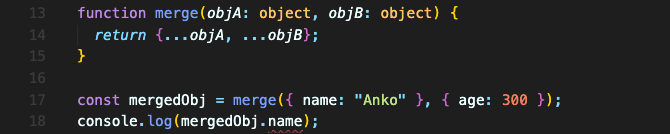
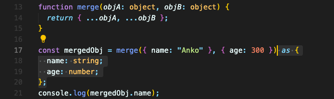
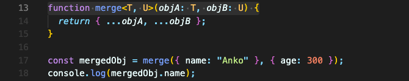
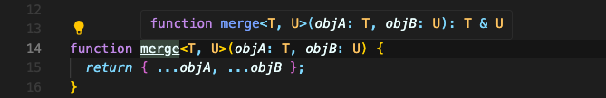
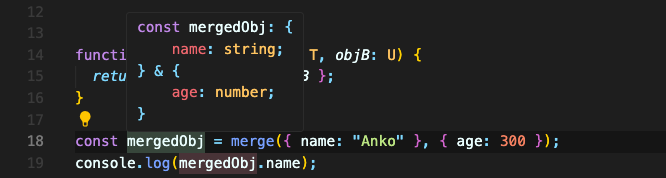

# 제네릭 함수 생성하기

직접 제네릭 만들어야 할 필요성을 느낄 수 있는 예시를 먼저 들어보겠습니다.


두 객체를 합쳤지만 타입스크립트는 합친 객체의 타입을 미리 추론하지 못했기에 에러가 발생합니다.  
이럴 땐, 타입 캐스팅을 사용해서 타입을 알려줄 수도 있을 겁니다.



하지만 너무 번거롭습니다. 그리고 `merge` 함수를 사용하는 객체가 매번 어떻게 생겼는지도 알 수 없습니다.  

이럴때 제네릭이 도움될 수 있습니다.  
제네릭을 사용하려면 아래와 같이 하면 됩니다.

1. 함수 뒤에 각진 괄호를 추가하고 2개의 식별자를 추가합니다. (보통 첫번째는 T로 많이 합니다. 그 다음부턴 알파벳 순서로 늘어나고요.)
2. 이 제네릭 타입은 이제 함수 내에서 사용할 수 있습니다. 파라미터의 타입을 이 타입으로 변경합니다.
    

    
일단 오류는 해결됐는데 이게 어떻게 작동하는 걸까요?

제네릭 타입을 지정한 `merge` 함수를 보면 반환값이 `T & U`, 즉 합친 값을 반환하는 것을 볼 수 있습니다.



`objA`, `objB`가 무슨 타입인지는 모르겠지만, `spread` 오퍼레이터로 합쳐서 내보낸 것이니 합친 값을 반환한다는 사실은 타입스크립트가 알게 되었습니다.

그럼 이 `objA`, `objB`가 객체인지, 또 그 안엔 어떤 속성이 있는지는 어떻게 알까요?  
그 부분은 `merge` 함수를 사용할 때 추론을 하게 됩니다.



`merge` 함수를 사용할 때 객체 타입임과 그 내부의 타입이 어떤 것임을 알게 됩니다. (`T`는 object 타입이고, `name` 속성은 string 타입이다. 이런 식으로요.) 따라서 동적으로 파라미터에 대한 형식을 유추할 수 있습니다.

그리고 `merge` 함수는 두 파라미터를 합쳐서 반환하니, 객체 둘을 합쳐서 추론하게 됩니다.  
결론적으로, 이제는 합친 객체의 속성도 추론할 수 있게 된 겁니다.

### 다른 제네릭 함수 예시

다른 제네릭 함수 예시를 들어보겠습니다.

```typescript
interface Lengthy {
  length: number;
}

function countAndDescribe<T extends Lengthy>(element: T): [T, string] {
  let descriptionText = "Got no value";

  if (element.length === 1) {
    descriptionText = "Got 1 element.";
  } else if (element.length > 1) {
    descriptionText = "Got " + element.length + " elements.";
  }

  return [element, descriptionText];
}

// 문자열 사용
console.log(countAndDescribe("Hi there"));
// ['Hi there', 'Got 8 elements.']

// 배열 사용
console.log(countAndDescribe(["Sports", "Cooking"]));
// [Array(2), 'Got 2 elements.']

// 숫자 사용
console.log(countAndDescribe(3)); // error
```

문자열과 배열은 length 속성을 가지고 있기에 `T` 타입에 적합하여 `countAndDescribe` 함수에서 사용할 수 있습니다.

<br/>