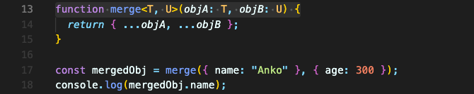
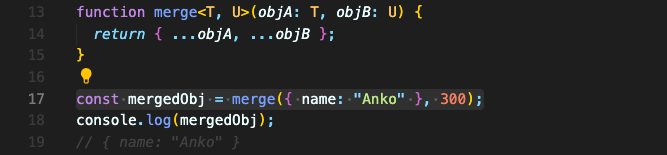
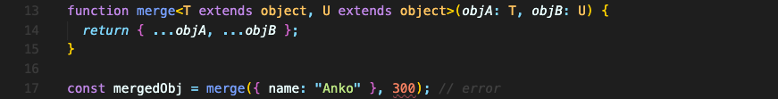

# 타입 Constraints

`merge` 함수는 `T`와 `U`의 타입을 object로 설정하고 있지는 않습니다. 그저 받아서 합칠 뿐입니다.  
그럼 넘기는 파라미터를 객체가 아닌 그냥 number로 보내면 어떻게 될까요?

아무 에러도 일어나지 않습니다. `mergedObj`는 `name` 값만 가지고 있게 됩니다. 이건 원하는 결과가 아닙니다.

이런 문제를 타입의 제약조건을 설정하는 ‘타입 constraint’로 해결할 수 있습니다.  
`merge` 함수는 `T`와 `U`의 타입 바로 뒤에 `extends` 키워드를 붙이고 타입을 써주면 됩니다.  
그럼 `T` 타입은 어떤 객체 구조도 될 수 있지만 반드시 객체여야만 하는 제약조건을 가지게 됩니다.

이전엔 오류가 나지 않았던 `number`를 넘겨주는 부분에서 오류가 생겼습니다.

이렇게 타입에 `extends` 키워드로 제약조건을 주는 것은, object 뿐만 아니라 당연히 다른 타입들과 커스텀 타입, union 타입 다 됩니다.  
그리고 모든 파라미터들이 모두 제약조건을 가지지 않아도 됩니다. 유연하게 원하는 것들에만 적용해도 됩니다.

 