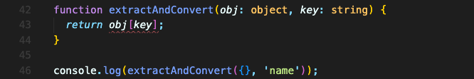
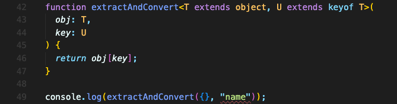
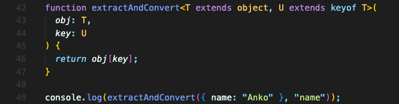

# "keyof" Constraint

예를 들어, 오브젝트와 키를 넘기면 오브젝트의 그 키에 해당하는 값을 반환해주는 함수가 있다고 가정해보겠습니다.  
파라미터로 받는 오브젝트와 키는 모두 타입표시도 해 줬습니다. 그럼에도 에러가 발생하게 됩니다.

에러는, 오브젝트 안에 해당 키 값이 없을 수도 있기 때문에 발생합니다.

키 값이 오브젝트 안의 키 값이라고 어떻게 알려줄 수 있을까요?  
`keyof` 키워드로 제약조건을 주면 됩니다.

먼저 이렇게 제네릭 타입으로 바꾼 다음,

`T`는 object로 확장하고, `U`는 `T` 객체의 키 라는 의미에서 `keyof` 키워드를 써서 확장하면 됩니다.

그럼 기존의 에러가 사라집니다. 에러는 맨 아래 `extractAndConvert` 함수를 사용하는 곳에서 발생했는데, 이 에러는 첫번째 인수로 보내는 객체에 두번째 인수인 `"name"` 키 값이 없기에 발생합니다.  
`"name"` 키 값이 있으면 오류는 자연스럽게 사라집니다.

 