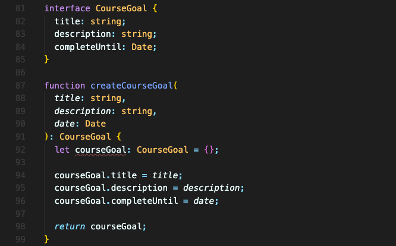
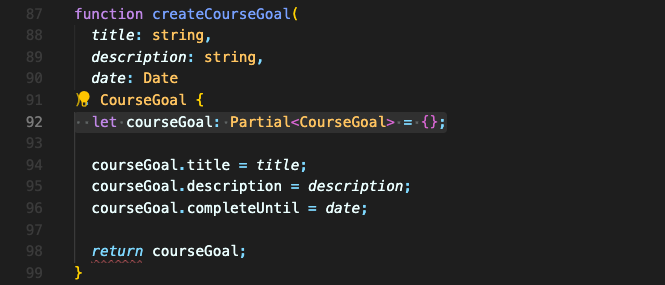
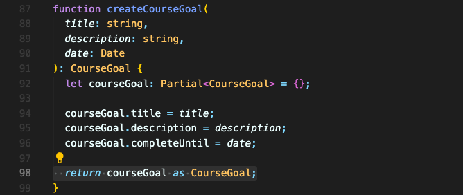
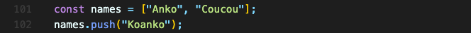
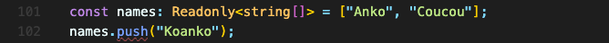

# 제네릭 유틸리티 타입 (Generic Utility Types)

제네릭 유틸리티 타입들은 타입스크립트에만 존재하며, 컴파일시 사라집니다.  

 

### Partial 타입

아래 코드를 보면, 함수 `createCourseGoal`는 받은 파라미터를 모두 `courseGoal` 객체에 모아 반환합니다.

하지만 `courseGoal` 변수를 선언하는 시점에서는 빈 객체이기 때문에 구조 및 타입이 맞지 않아 에러가 발생합니다.

이 때 Partial 타입을 쓰기 좋습니다.

Partial 타입은 부분적임을 나타냅니다. 위의 경우에서는  `CourseGoal` 타입의 부분적인 타입이라고 말한 것입니다. 한마디로, `CourseGoal` 타입들로 가는 중이라는 겁니다.

마지막 `courseGoal`을 반환하는 부분에 생긴 에러는, 아직 `courseGoal`이 반환해야하는 `CourseGoal` 타입이 아니라 지정해뒀던 `Partial<CourseGoal>` 타입이라고 인식해 나오는 에러입니다.  
따라서 완성이 됐다면 타입 캐스팅으로 `CourseGoal` 타입이라고 말해주면 됩니다.

 

### Readonly 타입

수정하지 못하게 하려면 Readonly 타입을 쓰면 됩니다.  
만약 아래 코드와 같이, 배열을 변경하는 코드가 있다면,

`Readonly` 타입을 써서 변경하지 못하도록 만들 수 있습니다.

`Readonly` 타입은 1개의 인수를 받기에 지정한 값의 타입을 써줘야 합니다.

 

### 더 많은 유틸리티 타입
더 많은 유틸리티 타입을 알아보려면 [공식문서](https://www.typescriptlang.org/docs/handbook/utility-types.html)를 참고할 수 있습니다.

 