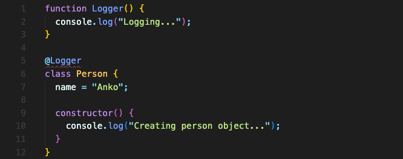
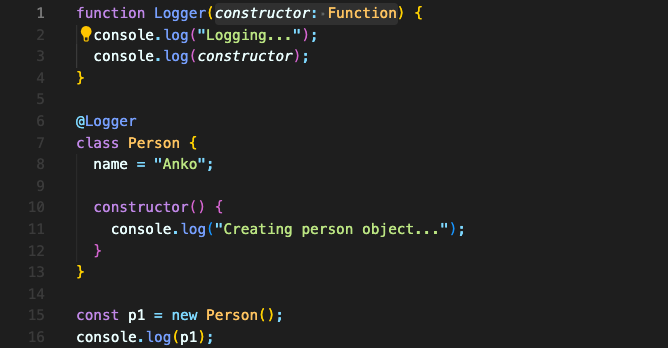
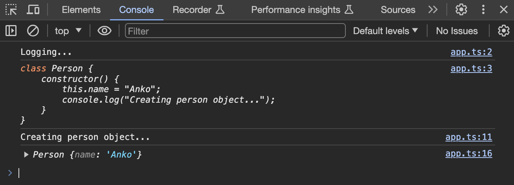

# 데코레이터(Decorator)

데코레이터는 메타 프로그래밍에 아주 유용한 기능입니다.

메타 프로그래밍은, 페이지를 방문하는 사용자에게 직접적으로 영향을 주기 위해서 데코레이터를 사용하지 않는다는 겁니다. 데코레이터는 사용자에게는 필요 없지만, 다른 개발자가 사용하기 쉬운 코드를 작성하는데 적합한 도구가 될 겁니다.

즉 유저에게 보여지는 건 아니지만, 클래스의 메서드가 올바르게 사용되도록 보장하거나 숨겨진 변환 같은 걸 할 수 있습니다.

## 데코레이터 클래스 만들기

데코레이터를 추가하기 위해 가장 먼저 해야 할 일은 tsconfig.js 파일을 설정하는 것입니다.

- compilerOptions > target 값을 “ES6”로 설정
- compilerOptions > experimentalDecorators 값을 true로 설정

이렇게 설정한 다음, `Person` 이라는 클래스에 데코레이터를 추가해보겠습니다.

클래스 위에 데코레이터를 정의합니다. 데코레이터 작성하는 방법은 특별하지 않습니다. 데코레이터는 결국엔 그냥 함수입니다. 클래스에 어떤 것을 특정 방식으로 적용하는 함수일 뿐입니다.

`Logger` 함수를 작성합니다. 함수는 소문자로 시작해도 되지만, 많은 패키지에서 대문자로 시작하기에 여기서도 대문자로 관리하겠습니다.

이 함수를 `Person` 클래스의 데코레이터로 사용하고 싶다고 말해주면 됩니다.  
클래스 위에 `@`를 쓰고 바로 붙여서 함수 이름을 쓰면 됩니다. 실행시키지 말고요.

데코레이터는 인수를 받습니다. 그렇기에 위에서 오류가 난 겁니다.  
클래스에 데코레이터를 사용했으니 `constructor` 함수가 인수로 받아집니다.

오류가 사라졌습니다.  
위의 코드를 실행해보면 이렇게 콘솔로그가 나옵니다.

line3에서 출력된 `constructor` 함수가 마치 클래스처럼 보입니다. 사실 이건 `constructor` 함수가 보여주는 syntatic sugar일 뿐입니다. 클래스를 넘겨 받은 것은 아닙니다.

우리는 여기서, `constructor` 함수가 `Person` 객체가 생성되기 전에 먼저 프린트 된다는 점에 주목해야 합니다.

 **데코레이터는 클래스가 정의될 때 실행됩니다.**

  