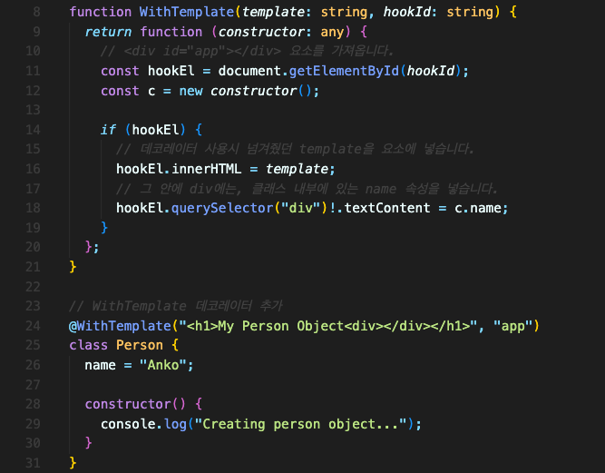

# 데코레이터 공장(Decorator Factories)

일반적인 데코레이터를 만드는 것 외에도 데코레이터 공장을 만들 수도 있습니다.  
함수가 데코레이터를 반환하게 만들면 됩니다.

이 방법의 장점은, 데코레이터 함수에서 사용할 값을 전달할 수 있다는 것입니다.  
데코레이터 공장을 사용하면 데코레이터가 내부적으로 수행하는 작업을 더 많은 기능과 가능성으로 채울 수 있습니다.

## 더 유용한 데코레이터 만들기

데코레이터를 이용해 더 정교하고 유용한 작업도 할 수 있습니다.  
예시를 들기 위해, HTML에 이런 요소를 추가했습니다.

`Person` 클래스에 `WithTemplate` 라는 데코레이터를 새로 설정했습니다.

크게 살펴보면,

1. HTML에 추가한 `div` 요소에 새로 넣을 값과, 그 요소를 가져오기 위한 `Id` 값을 데코레이터 함수는 받습니다.
2. 데코레이터 함수 내부에서 받은 값들과 `constructor` 함수를 사용해 작업을 합니다.

이런 식으로 데코레이터를 사용할 수도 있습니다.