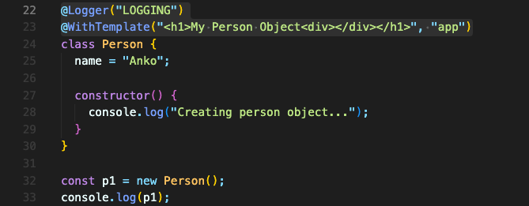
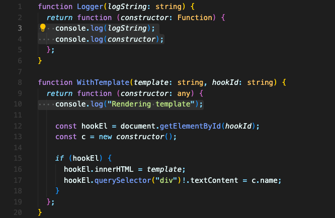
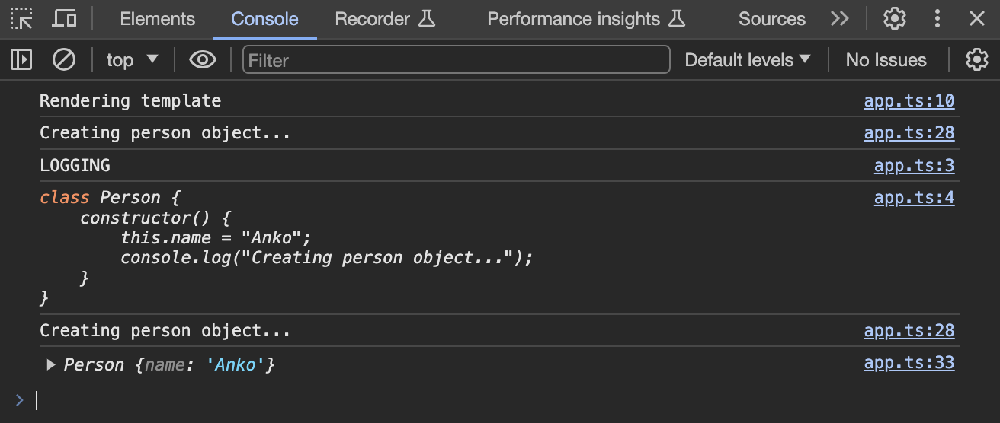
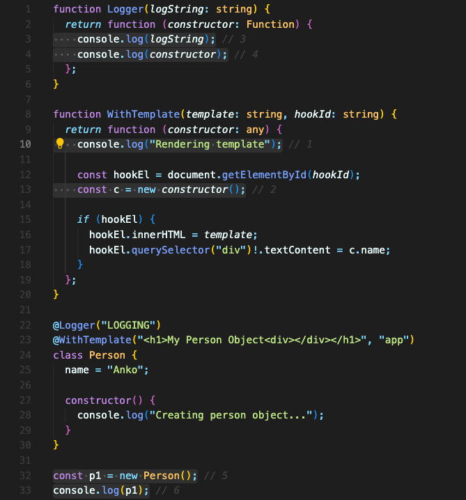
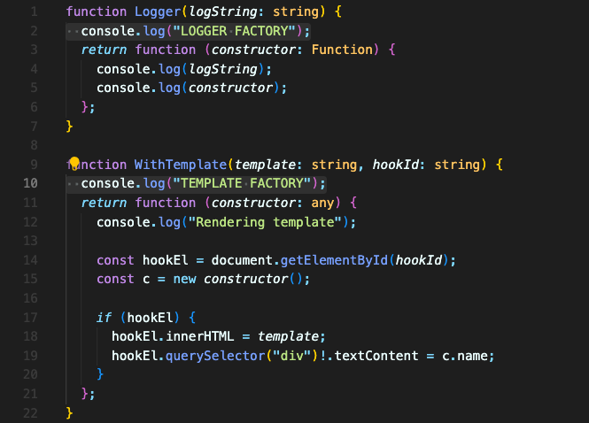
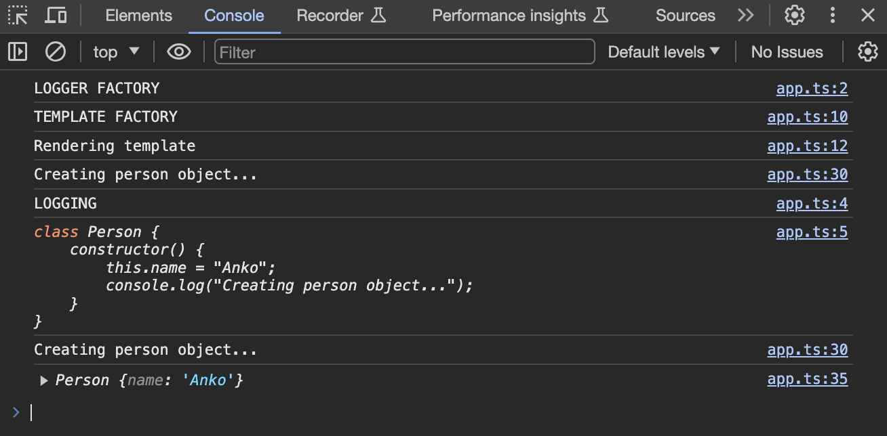

# 여러개의 데코레이터 추가하기

데코레이터를 여러 개 달 수도 있습니다.

아래 코드에서는 `Person` 클래스에 `Logger`, `WithTemplate` 이렇게 두 개의 데코레이터를 달았습니다.

각각의 데코레이터는 실행 순서를 확인하기 위해 콘솔로그를 달아줬습니다.

아래와 같이 콘솔로그가 찍혔습니다.

총 6개의 로그가 찍혔는데요, 어떤 순서로 불려졌는지 코드에서 전체적으로 확인해보겠습니다.

데코레이터 함수는 아래에서 위로 방향으로 불려집니다.

따라서, 위 코드에서는

1. `WithTemplate` 내부 (1, 2번째 콘솔로그)
2. `Logger` 내부 (3, 4번째 콘솔로그)
3. 인스턴스 생성시 클래스 내부의 `constructor` (5번째 콘솔로그)
4. 생성된 인스턴스 콘솔로그 (6번째 콘솔로그)

이렇게 로그가 찍혔습니다.

중요한 점이 있습니다.  
**데코레이터 함수는 아래에서 위로 방향으로 불려진다고 했는데, 이건 실제 데코레이터 함수 부분에 대한 말입니다.**  
**실제 데코레이터 함수가 아닌 데코레이터 팩토리 자체는 더 빨리 불려집니다.**

만약 아래와 같이 데코레이터 팩토리에 콘솔로그를 더하면,

위쪽에 추가한 데코레이터인 `Logger` 데코레이터가 먼저 출력됨을 볼 수 있습니다.

**정리하면, 데코레이터 팩토리 자체는 실행되는 순서대로 즉, 데코레이터가 적힌 순서대로 실행되지만, 실제 데코레이터 함수는 바텀업으로 실행됩니다.**

 