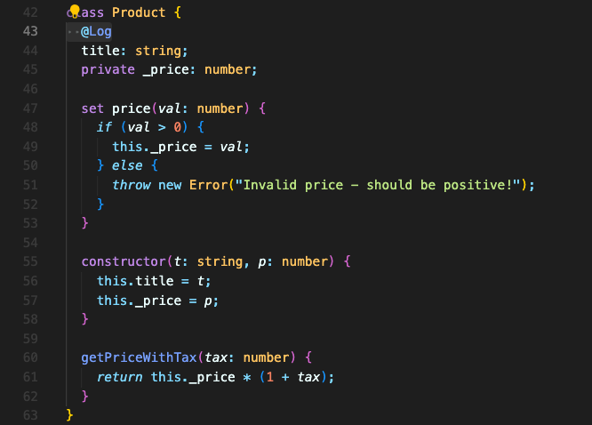
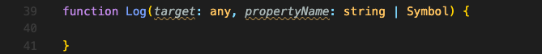
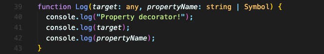
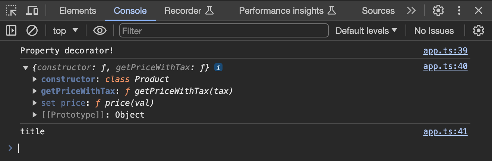

# 속성 데코레이터(Property Decorators)

속성에도 데코레이터를 추가할 수 있습니다.

데코레이터를 추가하고자 하는 속성 바로 위에 @표시와 함께 데코레이터 이름을 쓰면 됩니다.

속성 데코레이터는 두개의 인수를 받습니다.

첫번째 파라미터로는 '속성의 대상'을 받습니다. 여기선 `target` 파라미터로 받겠습니다. 보통 속성은 인스턴스의 프로토타입을 가리키게 될 거고, `static` 속성인 경우는 `constructor` 함수를 참조할 겁니다. 따라서 타입은 any로 두겠습니다.  
두번째 파라미터로는 '속성 이름'을 받습니다. string이 될 수도 있고 Symbol이 될 수도 있으니 이렇게 타입을 설정합니다.

그리고 이 파라미터들을 콘솔로그로 찍어보면,

이렇게 나옵니다.

이 데코레이터는 언제 실행될까요?

위에서 이 `Product` 클래스를 인스턴스화 한 적이 없는데도 로그가 찍혔듯이, 기본적으로 **클래스 정의 자체가 등록되었을 때 실행**됩니다.

 